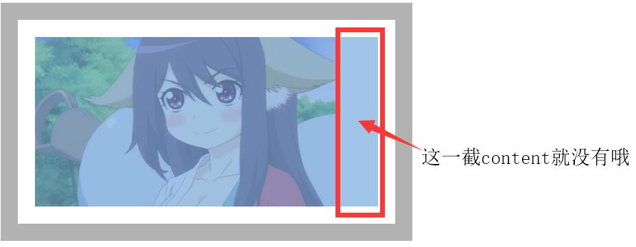
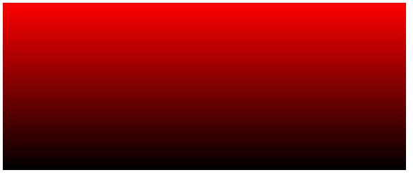
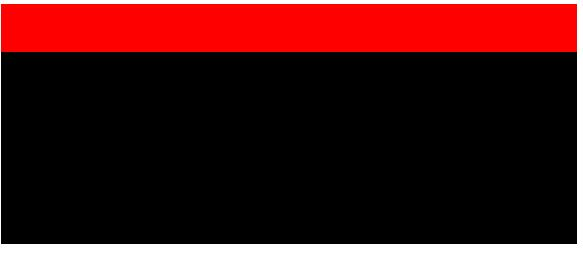
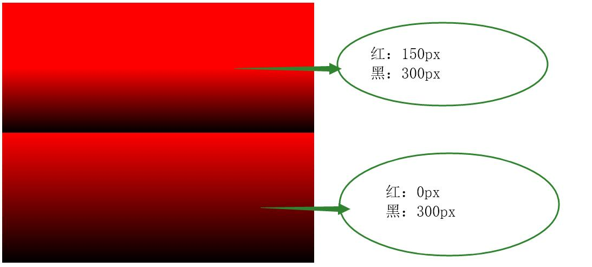

# CSS3新增样式

- 会渐变的背景图片非要用图片？
- 你以为背景铺设区域是padding的左上角？
- 特殊字体非要截图？
- 边框只能用纯色？

---

##### CSS3伪类

- **empty**
  - **empty**{ sRules }
  - 匹配没有任何子元素（包括text节点）的元素E。
  - 内容为空时，执行这个伪类{}里面的代码

##### 1. 背景新增样式


###### background-clip 背景裁切 

>  兼容 - (IE9+)

- border-box（默认）背景从`border` 区域开始出现（出现重复的背景），而背景图片的左上角是从padding出现

  

  **所以背景其实是从 `border` 的地方就开始的，看这个效果的时候 不能加 `no-repeat`**

  ```CSS
  div{
      padding:20px;
      border: 20px solid rgba(0, 0, 0, 0.3);
  }
  ```

- padding-box 背景从`padding`区域开始

  

  在`padding`边缘区域，`咔嚓`一剪刀

  ```css
  div{
      border: 20px solid rgba(0, 0, 0, 0.3);
      padding: 20px;
      background-clip: padding-box;
  }
  ```

  

- content-box 背景从`content`区域开始

  

  在`content`边缘区域，`咔嚓`一剪刀，对比下和`padding-box` 会发现图片不完整了

  ```css
  div{
      border: 20px solid rgba(0, 0, 0, 0.3);
      padding: 20px;
      background-clip: content-box;
  }
  ```

  

###### background-origin 背景原点

> 兼容 -  (IE9+)

- `padding-box`默认
   图片的`（0，0）`点，出现在`padding`的左上位置

  

  **边框下面的都是`repeat`出来的，所以不`repeat`之后，图片大小有限，边框就看着没背景**

  ```css
  div{
      border: 20px solid rgba(0, 0, 0, 0.3);
      padding: 50px;
  }
  ```

  

- `border-box` 背景图片的`（0，0）`点，出现在`border`左上位置

  

  ```css
  div{
      border: 20px solid rgba(0, 0, 0, 0.3);
      padding: 50px;
      background-origin: border-box;
  }
  ```

- `content-box `背景图片的`（0，0）`点，出现在`content`左上位置

  

  ```css
  div{
      border: 20px solid rgba(0, 0, 0, 0.3);
      padding: 50px;
      background-origin: content-box;
  }
  ```


###### 案例：美化表单

> 利用clip，可以很好的控制背景颜色显示在content位置

```CSS
<style>
        label{
            display: inline-block;
            width: 50px;
            height: 50px;
            border: 5px solid lightseagreen;
            border-radius: 50%;
            padding: 10px;
            box-sizing: border-box;
            
        }
        input:checked + label{
            background: red;
            background-clip: content-box;
        }

    </style>
</head>
<body>
    <input type="radio" name="sex" id="sex1">
    <label for="sex1"></label>
    <input type="radio" name="sex" id="sex2">
    <label for="sex2"></label>
</body>
```


###### 来个超酷的文字裁切

- -webkit-background-clip:text;  把文字作为裁切背景的依据


​	超级帅的效果~~!! 

​	当然 **因为文字是黑色的~ 所以 你看不到这个酷的效果**。需要把文字变透明

- -webkit-text-fill-color 给文字填充颜色

  ```css
  div{
      -webkit-background-clip: text;
      -webkit-text-fill-color: transparent;
  }
  ```

  也可以设置 `color`

  ```css
  div{
      -webkit-background-clip: text;
      color: transparent;
  }
  ```

  > 虽然是`-webkit-`前缀的，但是同样可以在 `firefox`使用，`IE`不行

  选择`color`的理由

  - `color`兼容性更好
  - `-webkit-text-fill-color` 优先级高于 `color`，后期不好修改颜色

```CSS
<style>
        div{
            background: url('img/sky.jpg') no-repeat;
            width: 1056px;
            height: 594px;
            font: bold 60px/594px "微软雅黑";
            text-align: center;
            -webkit-background-clip: text;
            /*-webkit-text-fill-color: transparent;*/
            color: transparent;
            /* -webkit-text-fill-color: red;
            color: blue; */
            transition: 1s;
        }
        div:hover{
            background-position: left -200px;
        }
    </style>
</head>
<body>
    <div>Web入门课程</div>
</body>
```


###### 带裁切、原点的复合样式

```css
background: url(yaya.jpg) 20px 20px content-box padding-box;
```

1. 前面：background-origin 
2. 后面：background-clip
3. 如果只写一个，默认该值同时设置： 原点 & 裁切
4. `background-position`是根据：当前设置的背景原点`background-origin`位置来计算的
5. `background-color`也受到`background-clip`限制


###### background-size 背景大小

- 单位：

  - px

    

    ```css
    background-size: 200px auto;
    ```

    - 接受两个值，分别为宽 、高
    - 如果只给一个值，设置宽度，高度`auto`（和`img`是一样的，等比）
    - 默认：图片本身大小

  - %

    ```css
    background-size: 50% auto;
    ```

    - 基于图片本身宽高进行计算百分比

- 关键词

  - auto 自动

    - 默认状态

  - cover 

    - 铺满整个页面，图片会显示不全，宽、高，谁的数值更大，就设置谁的尺寸，另一个auto

      

      当宽度特别宽，高度不变的情况下，小姐姐的胸不见啦~

      ```css
      background-size: cover;
      ```

  - contain 

    - 完整可以放下图片的情况下，按照可以显示的最大情况

    


###### 背景带size的复合样式


```css
background: url(bb1.jpg) no-repeat 0px 0px / 50% content-box;
```

- 以 `/`进行分割`position` 和 `size`


###### 多背景图设置

**通过 `,`进行间隔，设置多个背景图片**


- 写在前面的在上，写在后面的在下

- 每个图片都可以有自己的定位、大小等控制

  ```css
  div{
      width: 720px;
      height: 439px;
      background: url(bb2.jpeg) no-repeat 50% ,
          	    url(bb1.jpg) no-repeat 50% ;
  }
  ```

  

##### 2. 背景新增样式

> 渐变部分属于`background-image`的样式），所以也可以设置多背景图效果


###### 线性渐变

- 基础线性渐变

  - 需设置两个及两个以上的颜色

  - 颜色之间用`,`间隔

  - 颜色会平均分配

  - 根据设置颜色的顺序，进行渐变

    

    ```css
    div{
        background: linear-gradient(red,black);
    }
    ```

- 进阶线性渐变（可控制每个颜色的渐变区域）

  - 距离跟随在颜色后面,可以是`px`或`%`

  - 如：第一个距离 和 第二个距离是重叠区域，将没有过渡效果

  - 最后一个颜色值，会填满后续所有距离

  - 如果第一个数值不是从`0px`开始，则从你设置的位置才开始进行颜色过渡

    

  ```css
  background: linear-gradient(red 20%,black 30%);
  ```

  

  ```css
  background: linear-gradient(red 20%,black 20%);
  ```



```css
div{
    width: 720px;
    height: 300px;
}
div:nth-child(1){
    background: linear-gradient(red 150px,black 300px);
}
div:nth-child(2){
    background: linear-gradient(red 0px ,black 300px);
}
```

- 高级线性渐变（可设置渐变方向） - 默认：从上至下

  - 关键词

    - 写在颜色前面`,`间隔

    - `to` 指向，后面跟上指定方向

    - `left`、`right`、`top`、`bottom` 随机组合

      - `to left` 从 右 至 左

      - `to right` 从 左 至 右

      - `to top` 从 下 至 上

      - `to bottom`从 上 至 下  - 默认

      - `to left top` 从 右下 至 左上

      - `to left bottom` 从 右上 至 左下

      - `to right top` 从 左下 至 右上

      - `to right bottom` 从 左上 至 右下

        ```css
        background: linear-gradient(to left top,red 150px,black 300px);
        ```

        

        **记忆方法：从对面到你设置的指定位置，最后一个颜色，一定是处于你设置的这个方向**

  - 指定角度（单位：deg）

    - `0deg` 对应的是 `to top`从 下 至 上，也就是`180deg`
    - 角度正负
      - 正数（顺时针旋转）
      - 负数（逆时针旋转）

    ```css
    background: linear-gradient(90deg,red 150px,black 300px);
    ```

- 终极线性渐变（重复线性渐变）

  > 用来写方虚线，真是极好的

  - repeating-linear-gradient() - 重复线性渐变

    ```css
    div{
        width: 720px;
        height: 300px;
        background: repeating-linear-gradient(0deg,red 0px,red 50px,black 50px ,black 100px);
    }
    ```

    

  利用线性渐变可以做出很好好玩的东西，例如制定大小的方虚线

###### 案例：方虚线 （利用渐变绘制出下列信封边框）

​	 

```CSS
<style>
        div{
            width: 500px;
            height: 500px;
            padding: 50PX;
            background: 
            repeating-linear-gradient(
                45deg,
                red 0px,
                red 10px,
                transparent 10px,
                transparent 20px,
                blue 20px,
                blue 30px,
                transparent 30px
            );
        }
    </style>
</head>
<body>
    <div></div>
</body>
```


```CSS
<style>
        div{
            width: 500px;
            height: 100px;
            /* border-bottom: 5px dashed #000; */
            background: 
            linear-gradient(white 90px,transparent 90px),
            repeating-linear-gradient(
                to right,
                black 0px,
                black 10px,
                white 10px,
                white 15px,
                black 15px,
                black 25px,
                white 25px,
                white 30px
            )
        }
    </style>
</head>
<body>
    <div></div>
</body>
```


###### 径向渐变

- 基础径向渐变

  - 需设置两个及两个以上的颜色
  - 颜色之间用`,`间隔
  - 颜色会平均分配
  - 根据设置颜色的顺序，进行渐变

  ```css
  background: radial-gradient(red,black);
  ```

  

- 进阶径向渐变

  - 距离跟随在颜色后面,可以是`px`或`%`

  - 如：第一个距离 和 第二个距离是重叠区域，将没有过渡效果

  - 最后一个颜色值，会填满后续所有距离

  - 如果第一个数值不是从`0px`开始，则从你设置的位置才开始进行颜色过渡

  - 数值是圆的水平半径，垂直半径跟随水平自动计算

    

    ```css
    background: radial-gradient(red 250px,black 20px);
    ```

  - 可以指定形状 - 不同的形状，垂直半径的计算方式不一样

    - 添加在颜色前

    - 以`,`进行间隔

      ```css
      background: radial-gradient(circle,red 250px,black 20px);
      ```

      

  - 还可以直接输入垂直、水平的半径，更好的控制圆的形状

    - 具体数值

      **如果设置的值，小于颜色后面的半径值，则参考颜色后半径**

      ```css
      background: radial-gradient(100px 100px,red 50px,black 100px,green);
      ```

    - 关键词（没啥用）

      - `farthest-corner` 半径是圆心到最远角

        

      - `farthest-side` 半径是圆心到最远边

        

      - `closest-corner` 半径是圆心到最近角

      - `closest-side` 半径是圆心到最近边

      ```css
      background: radial-gradient( farthest-side at left top ,red 50px,black 50px);
      ```

- 高级进阶径向渐变

  > 线性渐变是有方向的，从左到右等等，但是圆是一圈一圈的，圆的颜色从 **圆心**扩散，所以，径向渐变我们通过改变圆心位置，达到控制方向。

  - 写在颜色前面`,`间隔

  - at，调整点的位置，后面跟上中心点位置

  - `left`、`right`、`top`、`bottom` 、`center`随机组合

    ```css
    background: radial-gradient(at left top,red 250px,black 20px);
    ```

- 终极圈圈套圈圈

  - repeating-radial-gradient

  ```css
  background: repeating-radial-gradient(red 10px,yellow 20px);
  ```


##### 3. font-face 自定义字体

​	转换字体网址：<https://www.fontke.com/tool/fontface/>

- 语法：

  ```css
  @font-face{
      font-family:''; /**给你的字体起个名字**/
      src:url(font.ttf); /**引入字体**/
  }
  ```

- 兼容

  ```css
  @font-face {
    font-family: "font";
    src: url("font.woff2") format("woff2"), /** chrome 36+ firefox 35+ opera 23+ Android 37+ **/
         url("font.woff") format("woff"), /**chrome 5+ Safari 5.1+ Firefox 3.6+ Opera	 11.50+ IE 9+ Android 4.4+ iOS 5.1+**/
         url("font.ttf") format("truetype"),/**Chrome	3.5+ Safari 3+ Firefox 3.5+ Opera 10.1+ IE 9+ Android 2.2+ iOS 4.3+**/
         url("font.eot") format("embedded-opentype"),/** IE6+ **/
         url("font.svg") format("svg"),/** Chrome3.5+ Safari 3.2+ iOS3.1+ **/
         url("font.otf") format("opentype");/** Chrome4.0+ Safari3.2+ Firefox3.5+ iOS 4.3+**/
    font-weight: normal;
    font-style: normal;
  }
  ```

  为了能达到兼容效果，所以我们需要引入很多字体包，并对其格式进行设置

##### 4. 自定义字体图标

	> 这个之前其实已经说过了，不过还是再强调一下好了

字体图标库地址：<http://fontawesome.dashgame.com/>

1. 引入css，需要css和font文件

   ```html
   <link rel="stylesheet" href="css/font-awesome.min.css">
   ```

2. 使用直接添加class名字

   ```html
   <i class="fa fa-address-book"></i>
   ```


5，文字排版、border-image

1、文字排版(可以反转文字)
    1)、direction属性

```
       ltr：表示从左往右的顺序阅读

       rtl：表示从右往左的顺序阅读

      inherit：表示文本流的值不可继承
2)、unicode-bidi

       bidi-override：表示按照direction属性的值重排序

       normal：表示为默认值

       embed：作用与inline元素，表示对象打开附件的嵌入层
```

2、mask（使用透明的图片或渐变遮罩元素的背景）

[注意]IE浏览器不支持，webkit内核的浏览器(包括chrome、safari、IOS、android)需要添加-webkit-前缀，firefox浏览器也支持webkit-mask属性
    1)、mask-image

```
　　默认值为none，值为透明图片，或透明渐变

2)、mask-repeat

　　默认值为repeat，可选值与background-repeat相同

3)、mask-position

　　默认值为0 0，可选值与background-position相同

4)、mask-clip

　　默认值为border-box，可选值与background-clip相同

5)、mask-origin

　　默认值为border-box，可选值与background-origin相同

6)、mask-size

　　默认值为auto，可选值与background-size相同
```

3、border-image(给border添加背景图像)

```
1)、border-image-source	

    用于指定要用于绘制边框的图像的位置，border-image的背景图使用url()调用

2)、border-image-slice	

    图片剪裁位置，默认单位px，支持百分比值，百分比值大小是相对于边框图片的大小
```

```
3)、border-image-repeat	

用于设置图像边界是否应重复（repeat）、拉伸（stretch）或铺满（round），默认值是stretch。
```

```
4)、border-image-width

    边框背景的宽度，默认是边框的宽度，用来限制相应区域背景图的范围

    length 带 px, em, in … 单位的尺寸值
    percentage 百分比
    number 不带单位的数字；它表示 border-width 的倍数
    auto 使用 auto， border-image-width 将会使用 border-image-slice 的值

5)、border-image-outset	

     用于指定在边框外部绘制（扩散），相当于把原来的贴图位置向外延伸，不能为负值
```

### 扩展

---

##### 1. transition 过渡	

​	用来做动画时间控制的

​	只对数值样式有效

- transition-duration 过渡持续时间 （单位：s 秒 / ms 毫秒）

  - 默认 0s，没有过渡

  ```css
  div{
      transition-duration:2s;
  }
  ```

- transition-property 想要执行过渡的样式

  - 默认 all
  - 只支持数值类型的值，而且，必须是同一个样式，从一个数值，过渡到另一个样式

  ```css
  div{
      transition-property:width;
  }
  ```

- transition-delay 过渡延迟时间（单位：s 秒 / ms 毫秒）

  - 默认 0s

  ```css
  div{
      transition-delay:1s;
  }
  ```

- transition-timing-function 过渡执行动画

  - linear 匀速
  - ease 慢快慢 - 默认
  - ease-in 开始慢
  - ease-out 结束慢
  - ease-in-out 开始和结束慢
  - cubic-bezier 贝塞尔曲线 <https://cubic-bezier.com/#.17,.67,.83,.67>

  ```css
  div{
      transition-timing-function:linear;
      transition-timing-function:cubic-bezier(.17,.67,.88,1.94);
  }
  ```

- 复合写法：

  ```css
  transition：property样式 duration执行时间 timing-function动画效果 delay延迟时间；
  ```

  - 延迟时间一定在后，执行时间在前

##### 2. transform

> 不脱离文档流，不改变页面结构


- translate（x，y） 位移
  - 如果只有一个值的情况下，设置的是`x`
  - `x`和`y`同时移动
  - 百分比数值，基于自己本身计算（未知宽高的居中特别好用）
- rotate（180deg）旋转
  - 角度（单位：deg）
  - 圈数（单位：turn）

- scale（x，y）缩放
  - 单位：倍数
  - 如果只有一个值的情况下，同时设置`x`和`y`
  - `x`和`y`同时缩放
- skew（x，y）斜切
  - 单位（deg）
  - 如果只有一个值的情况下，设置的是`x`

##### 3. 变化原点

- transform-origin 变化原点
  - 关键词`left`、`right`、`top`、`bottom`
  - 数值（px）
  - 默认 center center

##### 4.轮播图

```CSS
<style>
        #box{
            width: 600px;
            height: 300px;
            border: 10px solid #000;
            position: relative;
            overflow: hidden;
        }
        ul{
            padding: 0;
            margin: 0;
            list-style: none;
            height: 100%;
            width: 400%;
            position: absolute;
            left: 0px;
            transition: 1s;
        }
        /* ul::after{
            content: '';
            display: block;
            clear: both;
            
        } */
        li{
            width: 600px;
            height: 300px;
            float: left;
        }
        li:nth-of-type(1){
            background: red;
        }
        li:nth-of-type(2){
            background: yellow;
        }
        li:nth-of-type(3){
            background: green;
        }
        li:nth-of-type(4){
            background: blue;
        }
        input{
            position: absolute;
            z-index: 99;
        }
        input:nth-of-type(2){
            left: 50px;
        }
        input:nth-of-type(3){
            left: 100px;
        }
        input:nth-of-type(4){
            left: 150px;
        }
        input:nth-of-type(1):checked ~ ul{
            left: 0px;
        }
        input:nth-of-type(2):checked ~ ul{
            left: -600px;
        }
        input:nth-of-type(3):checked ~ ul{
            left: -1200px;
        }
        input:nth-of-type(4):checked ~ ul{
            left: -1800px;
        }
    </style>
</head>
<body>
    <div id="box">
        <input type="radio" name="swiper" id="swiper1">
        <input type="radio" name="swiper" id="swiper2">
        <input type="radio" name="swiper" id="swiper3">
        <input type="radio" name="swiper" id="swiper4">
        <ul>
            <li></li>
            <li></li>
            <li></li>
            <li></li>
        </ul>
    </div>
</body>
```


### 总结

---

1. 背景新增样式
   1. 背景裁切，可以控制背景出现的位置，还可以根据文字进行裁切（美得很~）
   2. 背景原点，可以设置背景图（0,0）点对应的位置
   3. 复合样式新增上述成员，组合要求
      1. 背景定位 / 背景尺寸 这两个属性要 `/`，否则默认为 定位
      2. 背景原点设置在前，背景裁切设置在后
   4. 多背景图设置，注意：写在前面的在上
   5. 线性渐变
   6. 径向渐变
2. 自定义字体
   1. 需要设置font-family
   2. 引入字体包时候，记得处理兼容问题
   3. 使用时候，用自己定义的font-family
3. 过渡
   1. 只可以加个数值类型的值
   2. 过渡时间 在 延迟时间 前
   3. 过度时间是必填值
