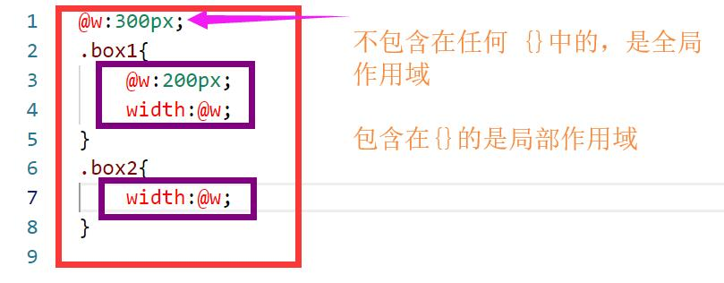

#### less简介

###### 带来的好处

1. 代码更简洁
1. 不需要考虑前缀
1. 结构更清晰
1. 更容易修改

###### 还有什么常用的 CSS 预处理器

- less
- sass
  - scss - 新版
  - sass - 老版

#### less基础语法

###### 变量

存储数据的容器

**语法：**

```less
@变量名：变量值;
```

@毕加索:巴勃罗

@毕

通过`@`声明变量。

使用变量时，直接用变量名 替代 变量值：

```less
@w:100px;

.box{
    width:@w;
}
------------------------
.box {
  width: 100px;
}
```

**更多的变量使用方案**

- 属性值

- 插值

  - 针对于属性值的，例如：图片引入地址

    ```less
    @imgurl:"../images";
    
    .box1{
        background: url('@{imgurl}/1.jpg');
    }
    --------------------------------------------
    .box1 {
      background: url('../images/1.jpg');
    }
    ```
    
    > 作为插入到一部分内容的变量，要包含在`{}`
    
  - 针对选择器的
  
    ```less
    @box:box_one;
    
    .@{box}{
        width: 100px;
    }
    ------------------
    .box_one {
      width: 100px;
    }
    ```

  - 针对属性名的
  
    ```less
    @bgColor:background-color;
    
    .box{
        width: 200px;
        height: 200px;
        @{bgColor}:red;
    }
    --------------------
    .box {
      width: 200px;
      height: 200px;
      background-color: red;
    }
    ```
  
- 用变量定义变量

  ```less
  @txt:"i am teacher";
  @a:"txt";
  
  div::before{
      content: @@a;
  }
  ---------------------
  div::before {
    content: "i am teacher";
  }
  ```

  - `@a` - `"txt"`
  - `@txt`-`"i am teacher"` 


**变量使用注意事项**

1. 变量的声明不是必须在使用前

   ```less
   div{
       width: @w;
   }
   @w:200px;
   ----------------------
   div {
     width: 200px;
   }
   ```

2. 变量名同作用域下不能重复，否则会被更改掉

   ```less
   @w:200px;
   @w:300px;
   div{
       width: @w;
   }
   -----------------------
   div {
     width: 300px;
   }
   ```

###### 作用域

less中，是有作用域的，作用域会影响当前的变量，在什么范围内是有效的，是否会替换

```less
1. @w:300px;
2. .box1{
3.     @w:200px;
4.     width:@w;
5. }
6. .box2{
7.     width:@w;
8. }
9. ---------------------------
10. .box1 {
11.  width: 200px;
}
12. .box2 {
13.   width: 300px;
14. }
```

这里的第`1`行 和 第`3`行，声明了同一个变量`@w`，但是可以看到，下面的`box1`的值和`box2`的值是不一样的，并没有像上面我们说的那样发生替换，原因就是，这里的作用域



红色是全局作用域范围，紫色是局部作用域范围，变量只在当前画出来的作用域内有效

当局部作用局找不到变量，会向外查找，一直到全局作用域，**如果全局作用域也没有，编译会报错**

**同一个作用域的时候，以最后一次出现为准**

```less
.box1{
    @w:200px;
    width:@w;
    @w:300px;
    @w:400px;
}
-------------------
.box1 {
  width: 400px;
}
```

###### 注释

- 单行注释

  ```less
  //这是单行注释
  ```

  这个注释的内容，不会被解析到`css`文件内

- 多行注释

  ```less
  /*
  	这是多行注释
  */
  ```

  这个注释内容，会被解析到`css`文件内

###### 运算

`css`预处理器的强大，不止在于变量，还有超级好用的运算。

案例：在不使用怪异盒模型的情况下，设置一个padding为`50`，可视宽高为`800 * 800`的盒子

```less
.box{
    width:800px - 50 * 2;
    height:800px - 50 * 2;
    padding:50px;
}
---------------------------
.box {
  width: 700px;
  height: 700px;
  padding: 50px;
}
```


- 运算符使用注意事项(加减乘除)

  - 运算符的左右，都保留空格

  - 运算的时候，最好包裹在`()`内

    - font 复合样式容易有问题哦

      ```less
      font: 100px - 20px "微软雅黑";
      ---------------------------------------
      font: 100px - 20px "微软雅黑";
      
      ```

      这里的内容被认为是不可以做减法的，所以没有进行计算

  - 当运算数值具有单位时，需要注意：

    - 一个单位：最终结果根据唯一的这个单位
    - 两个单位：看运算符，`*`为最后一个单位，`+ - /` 为第一个单位

- 有哪些内容可以参与运算

  - 数值

  - 变量

    ```less
    @wa:100px;
    .box{
        width: @wa - 20px;
    }
    ----------------------------
    .box {
      width: 80px;
    }
    ```

  - 颜色值

    ```less
    @c:#006622;
    .box{
        width: @c / 2;
    }
    -----------------------------
    .box {
      width: #003311;
    }
    ```

###### 忽略内容

有些样式中，本身就带有`/`，而且并不是用于计算的，例如font：

波浪号加引号

```less
.box{
    font: (100px - 20px) ~'/' (200px - 20px) "微软雅黑";
}
------------------------------------------------------
.box {
  font: 80px / 180px "微软雅黑";
}
```

> 除了font，bacground的复合样式也经常会用到

###### 嵌套

类似于html的结构，通过嵌套，来表现父子级关系，不建议嵌套过多层（包含选择器：不推荐超过三层）

```less
.box{
    .nav{
        border: 1px solid #000;
    }
}
--------------------------------------
.box .nav {
  border: 1px solid #000;
}
```

###### 父选择器

```less
.clearfix{
    &::after{
        content: '';
        display: block;
        clear: both;
    }
}
----------------------------------
.clearfix::after {
  content: '';
  display: block;
  clear: both;
}
```

`&`表示父级的意思

```less
.box{
    .warp &{
        width: 200px;
    }
}
----------------------------------
.warp .box {
  width: 200px;
}
```

###### 混合

混合是个更好用的东西，就是把另一个东西，混合进来

- 无参数混合

```less
.box{
    height: 200px;
    background: red;
}
.content{
    .box;//也可以是 .box()
}
----------------------------------------
.box {
  height: 200px;
  background: red;
}
.content {
  height: 200px;
  background: red;
}
```

混合分为两种形式，一种叫无参数，就是上面这种，另一种叫传参混合，无参数混合的时候，可以混合某个子级样式

```less
.box{
    height: 200px;
    width: 200px;
    .a{
        color: red;
    }
}
.box1{
    .box .a;
}
---------------------------------
.box {
  height: 200px;
  width: 200px;
}
.box .a {
  color: red;
}
.box1 {
  color: red;
}

```

- 传参混合（数值方面更加自由）

```less
.box(@a,@b){
    height: @a;
    background: @b;
}
.content{
    .box(200px,red);
}
-------------------------
.content {
  height: 200px;
  background: #ff0000;
}
```

**这种方式，对于数值方面更加自由，但是也有缺点，加了`()`的那个样式，会发现在css中没有出现**

**而且，如果使用的时候，不传入参数，会编译失败，这时候我们可以设置默认值**

- 默认值设置

```less
.box(@a:200px,@b:red){
    height: @a;
    background: @b;
}
.content{
    .box;
}
-------------------------------
.content {
  height: 200px;
  background: #ff0000;
}
```

- arguments

当你发现，所有的传入参数都是加给一个样式的时候，就可以使用啦~

```less
.border(@w:2px,@s:solid,@c:red){
    border: @arguments;
}
.box{
    .border;
}
----------------------------------
.box {
  border: 2px solid #ff0000;
}
```

- 在有默认值的情况下，如果只想修改其中一个值，一定要指定修改的变量名

```less
.border(@w:2px,@s:solid,@c:red){
    border: @arguments;
}
.box{
    .border(@c:blue);
}
-----------------------------------
.box {
  border: 2px solid #0000ff;
}
```

否则在正常情况下，传入的值和接受的位置是一一对应的。

###### 继承

继承是less中的一个伪类，它可以匹配当前继承中的所有样式

如果用混合，操作以下css样式

```less
.box{
    width: 200px;
    height: 200px;
    .a{
        color: red;
    }
}
.box1{
    .box;
}
---------------------------------
.box {
  width: 200px;
  height: 200px;
}
.box .a {
  color: red;
}
.box1 {
  width: 200px;
  height: 200px;
}
.box1 .a {
  color: red;
}
```

混合中，也同样给.box1 下面的 .a添加了样式，但其实我想要的只是.box1

**利用继承可以做到**

```less
.box{
    width: 200px;
    height: 200px;
    .a{
        color: red;
    }
}
.box1:extend(.box){

}
--------------------------------------------
.box,
.box1 {
  width: 200px;
  height: 200px;
}
.box .a {
  color: red;
}
```

这样就没有.a的样式干扰啦~

当然如果你想要所有的，也可以用`all`

```less
.box{
    width: 200px;
    .a{
        color: red;
    }
}
.box{
    background: red;
}
.box1:extend(.box all){

}
-------------------------------
.box,
.box1 {
  width: 200px;
}
.box .a,
.box1 .a {
  color: red;
}
.box,
.box1 {
  background: red;
}
```

和混合的最终结果是一样的，但是在显示上面是有差别的，这里最终的显示会用群组选择器

1. less是不能直接在浏览器使用的，需要通过一些方法，编译为css再引入使用
1. 当less的样式中没有任何样式，则不会被编译
1. 想要显示注释要是用`css`注释`/* */`
1. 变量的使用可以有以下几种：
   1. 属性值
   1. 插值
      1. 属性值中的某一部分
      1. 选择器中的某一部分
      1. 属性中的某一部分
   1. 变量定义变量
1. 作用域
   1. 全局作用域
   1. 局部作用（可访问全局作用域声明的变量，当在自己作用域找不到的情况下）
1. 注释
   1. `//`
   1. `/* */`
1. 运算
   1. 最好放在括号内
   1. 注意单位
   1. 运算符左右空格

8. 嵌套&父选择器
   1. 类似html的格式
   1. `&`表示父级

9. 混合
   1. 不带参数
   1. 带参数
   1. 参数默认值
   1. arguments
9. 继承
   1. 只继承当前指定选择器下的样式
   1. `all`获取指定选择器下全部样式（包括子级）
   1. 比混合的结果，样式上更少
   1. 但是不能传参

