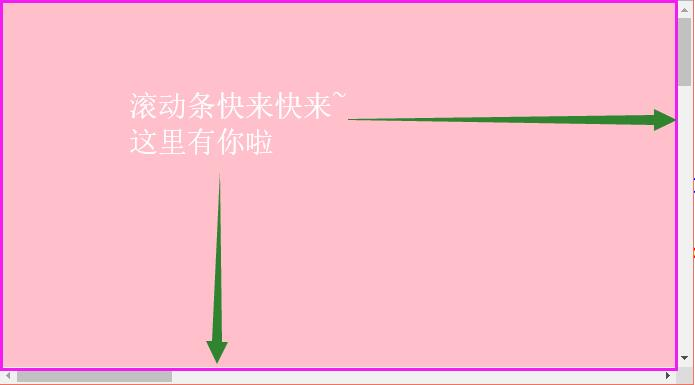
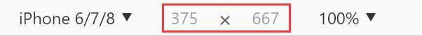
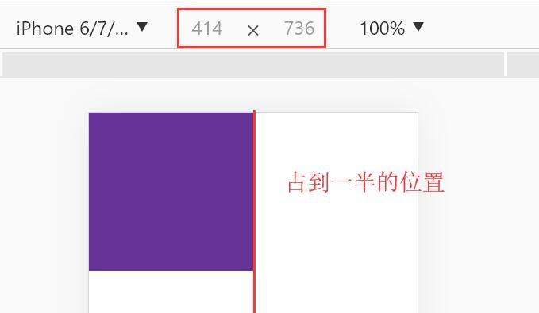
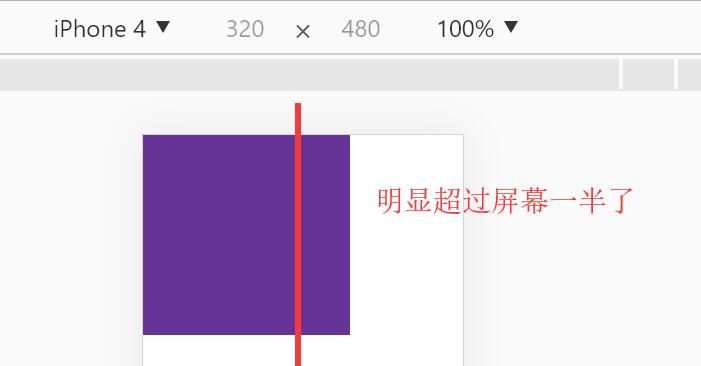

# 移动端布局

### 百分比（不适合）

- 百分比可以兼容所有页面
- 子级的百分比是根据父级来计算的，不是根据页面计算，父级固定，子级也固定，达不到适配

```JS
.box{
    width: 300px;
    .left{
        width: 50%;
        height: 50px;
        background: blue;
        float: left;
    }
    .right{
        width: 50%;
        height: 50px;
        background: red;
        float: right;
    }
}
```


### rem（适合工作使用）

- 改变宽度，改变html的font-size
- 元素直接使用rem单位，通过JS改变html的font-size来改变宽度，达到兼容适配

```JS
<script>
        // 找到跟元素
        var html = document.documentElement;
        // 获取宽度
        var width = window.innerWidth;
        // 设置根元素的宽度
        html.style.fontSize = width/10 + "px";
    </script>
```


```JS
.box{
    width: 10rem;
    .left{
        width: 50%;
        height: 50px;
        background: blue;
        float: left;
    }
    .right{
        width: 50%;
        height: 50px;
        background: red;
        float: right;
    }
}
```


### VW

- 设置好直接使用，但是兼容性查

```JS
html{
    // 1vw 是页面宽度的百分之一 ，10vw 是十分之一
    font-size: 10vw;
}
```


### 计算

```JS
width: 10rem;
    // 750/10=75
    .left{
        // 200/75=几个rem
        width: (200/75) * 1rem;
        height: (100/75) * 1rem;
        background: blue;
        float: left;
    }
```

#### 利用函数

```JS
@function rem ($num){
    @return ($num/75) * 1rem;
}   

.box{
    width: 10rem;
    // 750/10=75
    .left{
        // 200/75=几个rem
        // width: (200/75) * 1rem;
        // height: (60/75) * 1rem;
        width: rem(200);
        height: rem(60);
        background: blue;
        float: left;
    }
}
```

#### 利用变量

```JS
$re: 75;

.box{
    width: 10rem;
    .left{
        width: 200rem/$re;
        background: blue;
        float: left;
    }
}
```

- 把写好的px替换成 rem/$re 

### 字体图标（推荐使用）

- 字体图标在访问其他页面时已经加载进去了，而且体积小。背景图片每次都要请求，体积大

- 保存图标为 svg 格式
- 上传阿里图标库，去除颜色提交，添加到购物车，添加到项目，选择下载到本地，放到项目文件夹中
- icon.css放到css文件夹中，字体文件放到字体文件夹中，不包括js和json
- 更改引入图标的路径
- html引入icon.css文件
- 使用字体图标，通过class，iconfont 加icon名字

```JS
<div class="box">
        <div class="left">
            <i class="iconfont icon-1"></i>
        </div>
        <div class="right"></div>
    </div>
```

- 修改字体图标大小，先去除iconfont.css中设置的font-size，再设置font-size

```JS
.box{
    width: 10rem;
    .left{
        width: 200rem/$re;
        background: blue;
        float: left;
        line-height: 60rem/$re;
        color: #fff;
        font-size: 30rem/$re;
    }
}
```

###### 视口概念

视口可以细分为三种：布局视口、视觉视口、理想视口，那分别是什么呢~ 来看看吧

- 布局视口

  布局视口：是网页布局的基准窗口，在这里只考虑布局，也就是不会有非布局的内容，例如滚动条，例如菜单栏。

  而在移动端，布局视口有一个默认值`980px`，这保证了PC网站可以在手机上显示（尽管丑丑的）。

  在 js 中可以通过`document.documentElement.clientWidth`来获取布局视口大小

  

- 视觉视口

  视觉视口：用户视觉上看到的真实区域，包括滚动条。

  在 js 中可以通过`window.innerWidth`

  

- 理想视口

  其实就是我们说的设备独立像素，不过当布局视口和视口一致的时候，那结果就是一样的了。

  在 js 中利用`window.screen.width`可以获取到

  

###### 适配

**视口设置**

想要更改布局视口，利用`meta`标签的`viewport`来进行设置，除此之外，还可以进行页面的缩放等操作。

**`viewport`相关配置**

| 属性          | 值                      | 描述                                 |
| ------------- | ----------------------- | ------------------------------------ |
| width         | 正整数 或 device-width  | 以像素为单位，定义布局视口的宽度     |
| height        | 正整数 或 device-height | 以像素为单位，定义布局视口的高度     |
| initial-scale | 允许是小数              | 定义页面初始缩放比例                 |
| minimum-scale | 0.0 - 10.0              | 定义缩放的最小值                     |
| maximum-scale | 允许是小数              | 定义缩放的最大值（ios10&ios10+无效） |
| user-scalable | yes / no                | 设置是否允许缩放，同上无效           |


initial-scale = 设备独立像素 / 视觉视口宽度

视觉视口宽度 = 设备独立像素 / initial-scale


**注意事项：**

1. ios10 及 ios10+ 设置最大缩放值无效
1. initial 和 width 是有冲突的
1. initial 和 最小值 是一致的
1. 部分安卓机型，不接受width = 具体数值 这样的操作

正常情况下，我们会把初始、最小 、最大都设置为1，不允许用户缩放页面。但是因为maximum无效，后期，我们会通过 js 来禁止缩放

视口设置：

```html
<meta name="viewport" content="initial-scale=1.0,minimum-scale=1.0,maximum-scale=1.0,user-scalable=no" />
```


**根据像素比进行适配**

这种方式，采用的是，直接写物理像素，还是以 iphone6 为例

| iphone6      |            |
| ------------ | ---------- |
| 物理像素     | 750 * 1334 |
| 像素比       | 2          |
| 设备独立像素 | 375 * 667  |

布局视口 = 物理像素

```html
<script>
    var meta = document.createElement('meta');
    var scale = 1 / window.devicePixelRatio;
    meta.name = "viewport";
    meta.content="initial-scale="+ scale +",minimum-scale="+ scale+",maximum-scale="+ scale+",user-scalable=no";
    document.head.appendChild(meta);
</script>
```

> 缺点：非常明显，在写的时候必须要写 物理像素，但实际我们设计图上拿到的，都是css像素

像素的处理是完成了，但是移动端的适配可没有这么简单哦~ 为什么呢？





**rem适配**

什么是`rem`？ 不觉得 它 和 `em `  长的很像么？

**回顾 em**

公式：1em = 1 font-size大小

```css
<style>
    body{
        font-size: 20px;
    }
    div{
        font-size: 15px;
        width: 5em;
        height: 5em;
        background: rebeccapurple;
    }
</style>
```

缺点：font-size 经常会修改，em是根据当前自身的font-size进行计算的，很容易宽高就发生变化。

基于这个问题，我们就要来学习一个新的单位了，叫做 `rem`

`rem -> root em`  其实翻译过来就是根据 根节点计算em，这里的根节点指的是`<html></html>`

```css
<style>
    html{
        font-size: 20px;
    }
    div{
        font-size: 15px;
        width: 5em;
        height: 5em;
        background: rebeccapurple;
    }
</style>
```

width = 20* 5 = 100px;

但是好像~ 并改变不了我们上面提到的问题啊.....别着急！ 那是因为你还没有让`font-size`变化起来

利用`js`动态设定`font-size`

```css
<script>
    var html = document.documentElement;
    var widths = html.clientWidth;
    var num = 10;
    html.style.fontSize = widths / num + 'px';
</script>
```

这样的话，你就只要关心`rem`写多少就好了


###### JS获取数值：

```CSS
<style>
        div{
            width: 300px;
            height: 2000px;
            background: red;
        }
    </style>
</head>
<body>
    <div></div>
    <script>
        // alert(window.devicePixelRatio);  获取像素比
        // alert(document.documentElement.clientWidth);     获取布局视口大小
        // alert(window.innerWidth);            获取视觉视口大小
        alert(window.screen.width);             获取理想视口大小
    </script>
</body>
```
