#### 调试检查

模拟器可代替不了真机~ 起码肯定是模拟不出来刘海的~

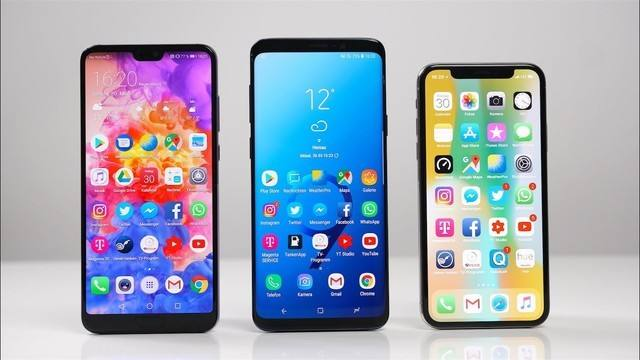

所以呢~ 我们在制作网站的时候，可以把模拟器的状态作为参考，但是做完后，还是要通过真机检测，是否存在问题~ 那么如何检测把网站放到手机上进行检测呢？

**检测步骤**

1. 下载`XAMPP`：<https://sourceforge.net/projects/xampp/files/>
   但是下载起来，特别慢，如果自己下载，推荐使用迅雷（我下载它告诉我要一天！！），所以提供了安装包到课件。

   > `XAMPP`是一个集成了很多功能的软件，这里我们使用`Apache`模块，它是WEB服务器软件，功能是让别的设备在浏览器上输入它的地址时，它能把相应的网页文件、媒体文件发送给浏览器。`（注意连接同一个网络）`

1. 安装：打开

1. 找到`Apache`点击`start`开启服务

   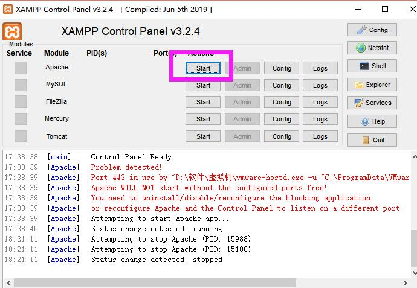  

   **注意：**

   有的同学可能在这一步会发生错误，下面会提示这样的文字

   

   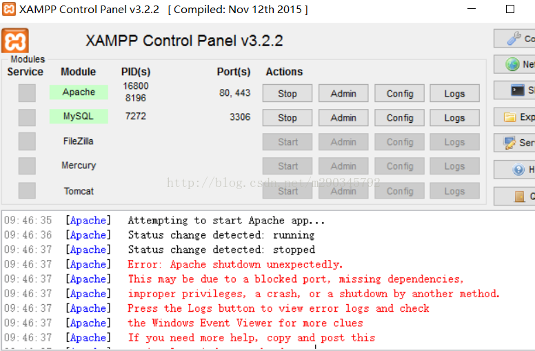  

   

   一般来说，产生原因是端口为其他程序占用，修改下端口就好，修改端口：

   > **httpd-ssl.conf 文件**
   >
   > ​	所有 443 => 444（自定义端口）
   >
   > **httpd.conf 文件**
   >
   > ​	所有 80=> 88（自定义端口）
   >
   > 关闭软件重新启动 

4. 找到防火墙，添加`Apache HTTP Server`允许使用专用 or 公用网络（否则还是会访问失败）

4. 保证 手机 和 电脑连接同一个网络

4. 找到当前电脑`IP`地址

   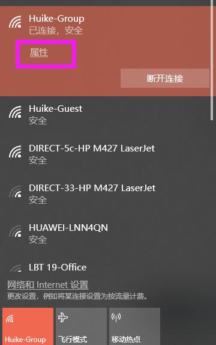  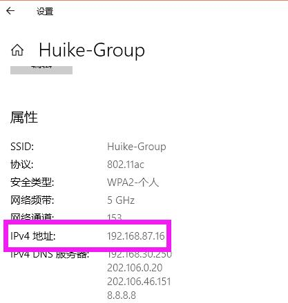

4. 手机浏览器，输入`IP`地址

4. 这时我们就可以访问到页面啦~ 如果想要访问到自己写的页面，做如下操作

   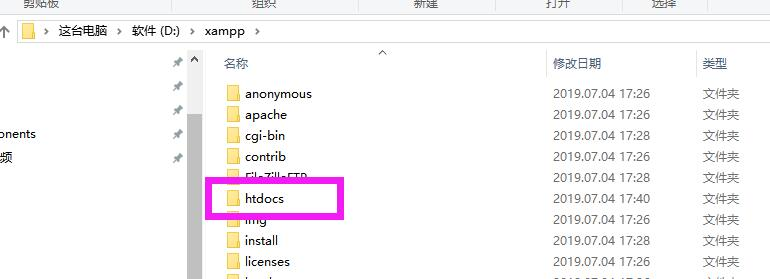  

   把你想要查看的页面放到`htdocs`文件夹内，就可以看到啦~

   > 这里为了给大家展示效果，我下载了一个投屏软件：`AirServer`
   >
   > 但是对于大家开发来说，是没有什么实际用处的，所以并不需要下载，该软件针对苹果设备


**调试辅助工具**

`vConsole`是一个可以帮助我们在手机上进行调试的工具，我们可以通过它看html的结构以及`JS报错`等内容，使用方法如下：

1. 下载`vConsole`，`npm install vconsole`

2. 若不希望普通用户看到面板，请不要在生产环境中引入 vConsole 模块。 

3. 在需要使用的页面中，引入上面的`JS`文件

4. 添加代码

   ```js
   var vConsole = new VConsole();
   ```


4. 但是很可惜，没有办法看到元素的样式哦~

```JS
<script src="http://wechatfe.github.io/vconsole/lib/vconsole.min.js?v=3.2.0"></script>
    <script>
        // init vConsole
        var vConsole = new VConsole();
        console.log('Hello world');
    </script>
```


#### 适配方案

`rem` 适配代码：

```html
<script>
    var html = document.documentElement;
    var widths = html.clientWidth;
    var num = 10;
    html.style.fontSize = widths / num + 'px';
</script>
```

这是我们上节课已经说过的适配方案~ 但是呢，并不是所有人都会写`JS`的，有没有什么方案，我们可以不写`JS`

呢？还是真的有，我们来看下

**新的单位：`vw`、`vh`**

>兼容：IE9及以上，IOS 6.1+ ，安卓4.4+

这两个单位都是根据视口屏幕来进行计算的，所以PC的时候，要注意滚动条哦~

我们来看下，下面的图

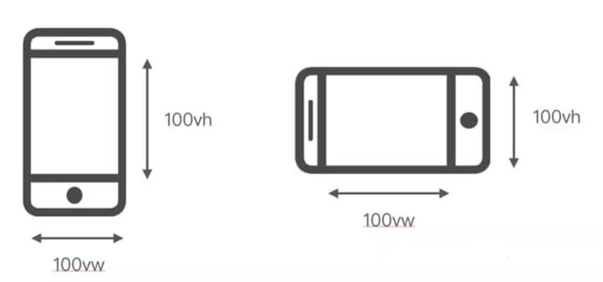

注意哦：不管设备是横屏还是竖屏，`vw`指的都是水平方向的，`vh`指的都是垂直方向的

它和百分比不一样，不会受到父级宽度的影响，这样我们通过`css`就可以获取到当前的视口宽度了，利用**获取到的视口宽度 / 100vw **

```css
html{
    font-size: 10vw;
}
/* 因为整个屏幕是 100vw ，这里我们分成 10 个格子，一个格子是 10vw 的 font-size */
```

这样的话，因为屏幕的宽度发生变化，html 上的`font-size`也会动态发生变化

```css
div{
    width:5rem;
    height:5rem;
}
```

以上和我们原来写`JS`达到的效果是一样的，当然我们也可以直接用vw的单位，例如：

```css
div{
    width:50vw;
    height:50vw;
}
```

> 除了上面说到的 `vw` 和 `vh `以外，还有 `vmin`和 ` vmax`
>
> `vmin`：选取 `vw `和` vh` 中较小的
>
> `vmax`：选取 `vw`和 `vh` 中较大的

**当然，这个方案也不是十全十美的，因为在计算的过程中也会出现小数点**

```CSS
<style>
        html{
            font-size: 10vw;
        }
        div{
            width: 5rem;
            width: 2vw;
            height: 5rem;
            background: pink;

        }
        /* 
        
            750 / 100 = 1vw = 7.5
            750 / 10 = 75 = 1rem = 10vw

            75 / 7.5 = 10vw

         */
    </style>
</head>
<body>
    <div></div>
</body>
```


#### 横竖屏适配

利用`JS`和`CSS`都可以做到，这里我们说下`CSS`怎么做

```css
@media screen and (orientation:portrait){
    #box{
        background: red;
    }
}
@media screen and (orientation:landscape){
    #box{
        background: green;
    }
}
```

- screen 屏幕
- orientation 方向
- portrait 竖向
- landscape 横向


#### 适配iPhoneX

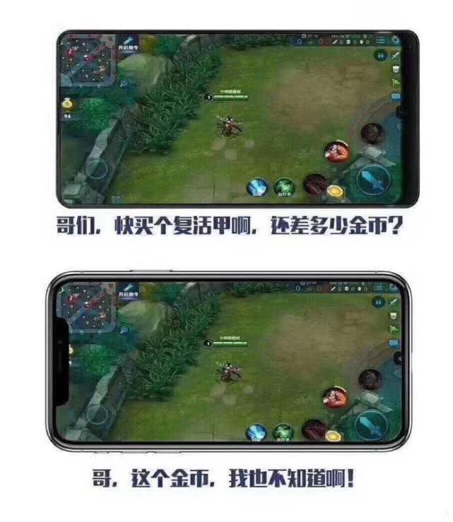

`iphoneX`首先提出刘海屏概念的时候，打了所有软件一个措手不及，例如上面的王者荣耀，完全看不见金币有多少，也很难点击到，如果我对面有个`iphoneX`的对手，那简直就是福利局。

所以起初，我们如何适配`iphoneX`就是个很头疼的问题了。

不过毕竟iphoneX是个主流手机，为了更好的支持它，软件商纷纷拿出自己的方案，一直到现在，其实iphoneX的刘海在我们只做网站的时候，已经不会产生太大的影响了。

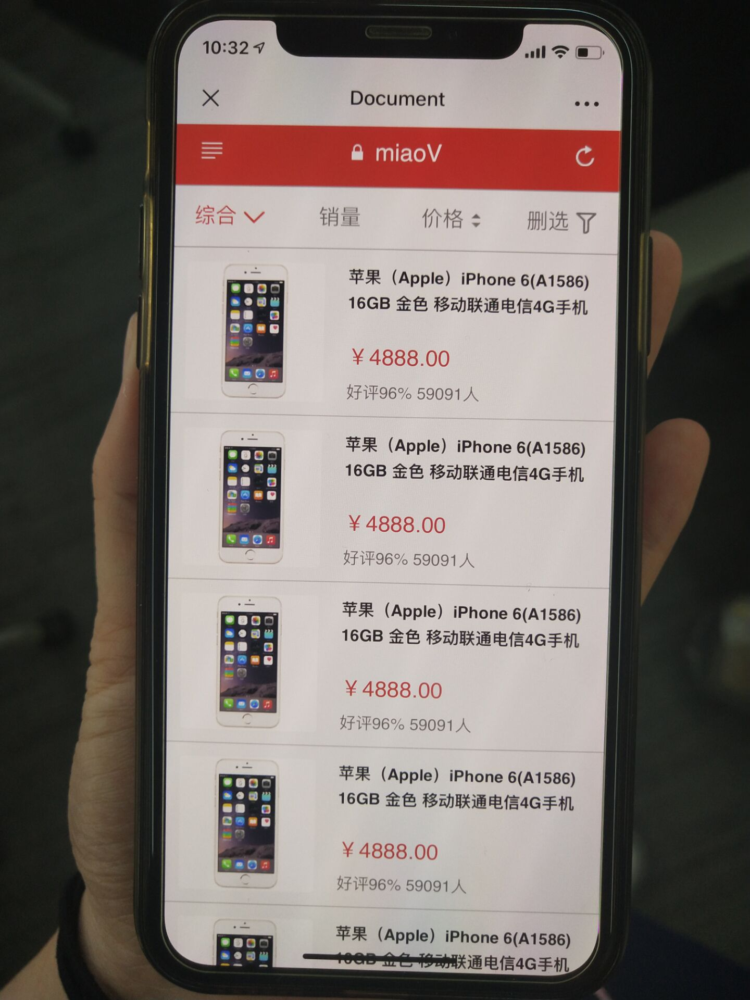  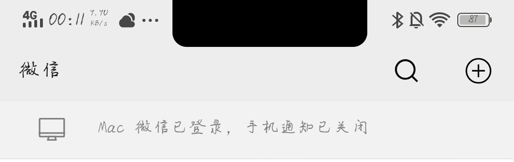

左侧：`iphoneX`，同事哒，所以没法给你们演示，只能截个图啦~ 有设备的同学自己可以试试

右侧：`vivo`，这个是微信的界面，可以看到，也遮挡不到我们的内容

所以对于移动端来说，顶部的适配，我们已经不需要去处理啦，但是底部以及左右两侧，我们就要考虑下了

**安全区**

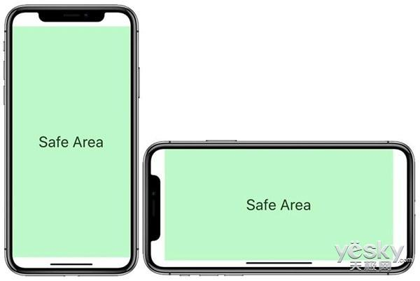

上面这个图，就是我们的安全区，保证内容是在安全区内进行显示的，会比较好，不容易发生遮挡、显示不全等问题。

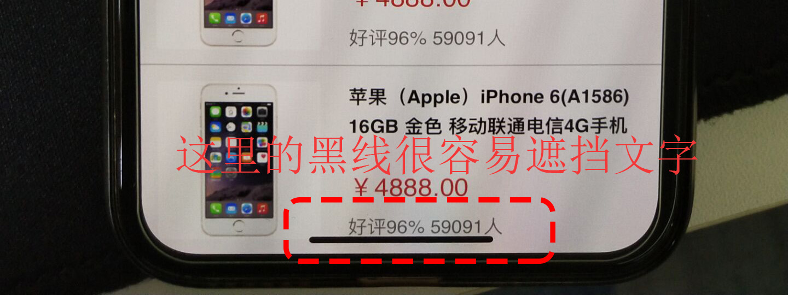


利用`iphoneX`专属样式`viewport-fit`属性，他会对网页设置安全区

```html
<meta name="viewport" content="viewport-fit=cover>
```

- cover      全部显示
- contain   默认没有安全区

**配合css方法**

```css
body{
    padding-bottom:constant(safe-area-inset-bottom);
    padding-bottom:env(safe-area-inset-bottom);
}
```

- constant：小于IOS11.2版本生效
- env：大于IOS11.2版本生效

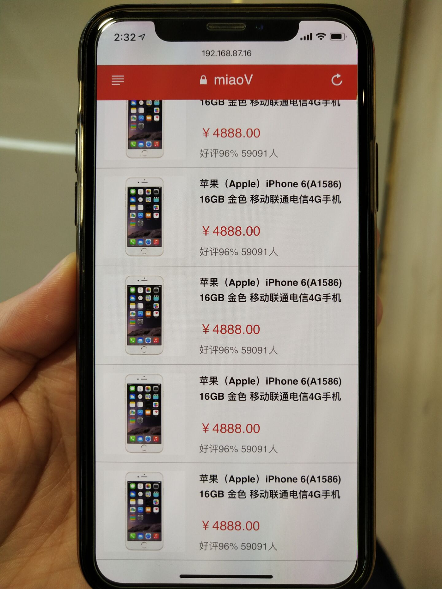

可以看到下面出现了一块内容，这次黑色的这条线，就不会挡住我们的文字或其它内容了。

- safe-area-inset-lef 设置左侧安全区
- safe-area-inset-right 设置右侧安全区
- safe-area-inset-top 设置顶部安全区
- safe-area-inset-bottom 设置底部安全区


#### 1px适配方案

某些时候，设计人员希望 `1px`在手机显示的就是`1px`，这也是....闲的，但是我们也要满足他们的需求，

这时候我们可以利用缩放来达到目的

根据像素比来缩放1px

```css
.border_1px:before{
    content: '';
    position: absolute;
    top: 0;
    height: 1px;
    width: 100%;
    background-color: #000;
    transform-origin: 0% 0%;  动画变化原点 左上角 0 0
}
@media only screen and (-webkit-min-device-pixel-ratio:2){
    .border_1px:before{
        transform: scaleY(0.5);
    }
}
@media only screen and (-webkit-min-device-pixel-ratio:3){
    .border_1px:before{
        transform: scaleY(0.33);
        缩放原点默认往中间，设置缩放的方向
    }
}

```

设置一个专门的`class`来处理`1px`的问题，利用伪类给其添加

- -webkit-min-device-pixel-ratio 获取像素比
- transform: scaleY(0.5) 垂直方向缩放，后面的数字是倍数


#### 图片模糊问题

```css
.avatar{
    background-image: url(conardLi_1x.png);
}
@media only screen and (-webkit-min-device-pixel-ratio:2){
    .avatar{
        background-image: url(conardLi_2x.png);
    }
}
@media only screen and (-webkit-min-device-pixel-ratio:3){
    .avatar{
        background-image: url(conardLi_3x.png);
    }
}
```

根据不一样的像素比，准备不一样的图片，正常来说是`1px图片像素` 对应`1px物理像素`，图片的显示就不会模糊啦，但是这样的情况不多，不是非常重要，特殊需求的图，我们不这么做


#### 滚动穿透问题

移动端的网站，我们是经常会有一些弹出框出现的，这样的弹出框，在上面滑动，会导致我们后面的整个页面发生移动，这个问题怎么解决呢？？

```css
body{
    position:fixed;
    width:100%;
}
```

给body添加`position:fixed`就可以使滚动条失效，这里弹框的显示和隐藏，我们利用`JS`进行控制，而且添加上`position:fixed`的一瞬间，可以看到页面一下回到`0,0`的位置，因为`fixed`是根据可视区定位的。

```CSS
<style>

        #alerta{
            position: fixed;
            width: 100vw;
            height: 100vh;
            background: rgba(0,0,0,.5);
            left: 0;
            top: 0;
            display: none;

        }
        #txt{
            background: orange;
            color: #fff;
            /* position: fixed; */
            
        }
    </style>
</head>
<body>
    <div id="txt">
        这是内容这是内容这
        <div id="alerta"></div>
    </div>
    <script>
        var btn = document.querySelector('#btn');
        var alerta = document.querySelector('#alerta');
        var txt = document.querySelector('#txt');

        btn.onclick = function(){
            alerta.style.display = 'block';
            txt.style.position = 'fixed';
            // txt.style.position = 'static';
        }
    </script>
</body>
```


#### 键盘唤起

```css
main{
    padding: 2rem 0;
    /* height: 2000px; */
    position: absolute;
    top: 60px;
    bottom: 60px;
    overflow-y: scroll;
    width: 100%;
    -webkit-overflow-scrolling: touch;
}
```

当底部根据页面进行`fixed`定位的时候，键盘弹出一瞬间，`fixed`会失效，变成类似`absoult`，让`main`的内容无滚动，就不会连带`fixed`一起动了

并且为了保证如丝般顺滑：

- -webkit-overflow-scrolling: touch;

```CSS
<style>
        #txt{
            /* height: 2000px; */
            position: absolute;
            bottom: 60px;
            top: 20px;
            overflow-y: scroll;
             -webkit-overflow-scrolling: touch;
        }
        footer{
            height: 60px;
            background: pink;
            position: fixed;
            left: 0;
            bottom: 0;
            width: 100%;
        }
        a,button,input,textarea{-webkit-tap-highlight-color: rgba(0,0,0,0)}
        button{
            -webkit-appearance: none;
            border-radius: 0;
        }
        html{
            -webkit-text-size-adjust: 100%;
        }
    </style> 
</head>
<body>
    <div id="txt">
        <button>按钮</button>
        <a href="">这是链接文字</a>
        12345678912 这是内容这是内容这是内容这是内容这是内容这是内容这是内容这是内容这是内容这是内容这是内容这是内容这是内容这是内容这是内容这是内容这是内容这是内容这是内容这是内容这是内容这是内容这是   <a href="tel:12345678912">12345678912</a>   内容这是内容这是内容这是内容这是内容这是内容这是内容这是内容这是内容这是内容这是内容这是内容这是内容这是内容这是内容这是内容这是内容这是内容这是内容<a href="sms:13300000000">13300000000</a>这是内容这是内容这是内容这是内容这是内容这是内容这是内容这是内容这是内容这是内容这是内容这是内容这是内容这是内容这是内容这是内容 <a href="mailto:854121000@qq.com">发送邮件</a> 这是内容这是内容这是内容这是内容这是内容这是内容这是内容这是内容这是内容这是内容这是内容内容这是内容这是内容这是内容
    </div>
    <footer>
        <input type="text">
    </footer>
</body>
```


#### 移动端的神奇操作 

`IOS`下的一些设置 和 安卓下的一些设置

**添加到主屏幕后的标题**

```html
<meta name="apple-mobile-web-app-title" content="标题"> 
```

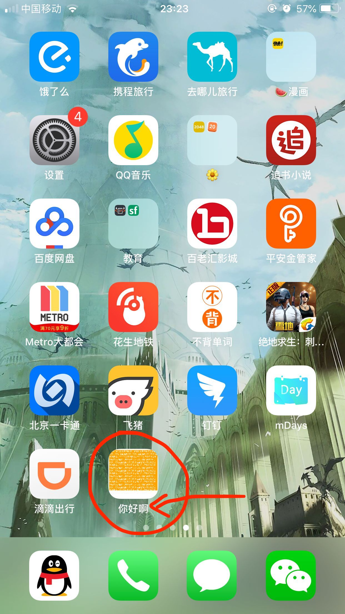. 


**添加到主屏后的APP图标**

```html
<link href="short_cut_114x114.png" rel="apple-touch-icon-precomposed">
```

- 一般我们只需要提供一个`114*114`的图标即可


**启用`webApp`全屏模式**

```html
<meta name="apple-mobile-web-app-capable" content="yes" /> 
<meta name="apple-touch-fullscreen" content="yes" /> 
```

- apple-mobile-web-app-capable

  删除默认的苹果工具栏和菜单栏，默认为no

- apple-touch-fullscreen

  全屏显示

**移动端手机号码识别**

```html
<meta name="format-detection" content="telephone=no" />
```

- `safari`会对一些可能是手机号码的数字，进行识别，我们可以利用上面的方式，禁止识别

**手动开启拨打电话功能**

```html
<a href="tel:13300000000">13300000000</a>
```

- 在手机上点击这个链接，可以直接拨打电话

**手动开启短信功能**

```html
<a href="sms:13300000000">13300000000</a>
```

- 在手机上点击这个链接，可以跳转去短信页面，给该手机号发送消息

**移动端邮箱识别**

```html
<meta name="format-detection" content="email=no" /> 
```

**手动开启邮箱发送功能**

```html
<a href="mailto:854121000@qq.com">发送邮件</a>
```

- 调用邮箱发送功能

**优先启用最新版本IE和chrome**

```html
<meta http-equiv="X-UA-Compatible" content="IE=edge,chrome=1" /> 
```


#### 移动端默认样式

- 移动端默认字体

  1. 数字 和 英文字体 可使用`Helvetica `字体，IOS 和 Android都有这个字体
  1. 手机系统都有自己默认的字体，直接使用默认的

  ```css
  body{
      font-family:Helvetica；
  }
  ```

- 字体大小

  如果只是适配手机，可以使用px

- IOS系统中，链接、按钮等点击会有灰色遮罩

  ```css
  a,button,input,textarea{-webkit-tap-highlight-color: rgba(0,0,0,0)}
  ```

- 去除圆角

  ```css
  button,input{
      -webkit-appearance:none;
      border-radius: 0;
  }
  ```

- 禁止文本缩放

  ```css
  html{
       -webkit-text-size-adjust: 100%;
  }
  ```


#### 移动端好用的插件

1. better-scroll（js）

2. animate.css 动画库

3. swiper 滑屏工具

    

#### lib-flexible

一个用于做rem适配的工具，里面的代码，其实和我们写的rem适配是一致的

下载地址：<https://github.com/amfe/lib-flexible>


1. 适配方案上，大家可以根据兼容问题，自己选择是`rem` 还是 `vw`

1. 大部分的问题还是需要依靠`js`来解决

1. 移动端默认样式需要清除高亮、圆角、禁止文本缩放、字体设置

1. 调试检查`xampp`，重点，同一网络

1. `iphoneX`大部分的软件已经做了头部适配

1. 因为像素比问题，我们有时候需要处理`1px`和`图片模糊`问题

    