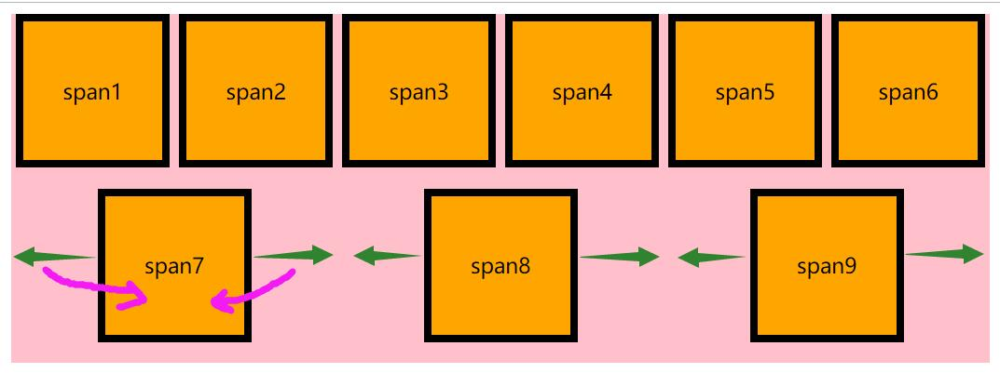

- 子级里面用到了 *display*: inline-block;

- 父级行高要清零

- *flex*: 1;

  - flex 属性是 flex-grow、flex-shrink 和 flex-basis 属性的简写属性。
  - 让所有弹性盒模型对象的子元素都有相同的长度，且忽略它们内部的内容

- 把段落的最后一行向右对齐

- text-align-last 属性规定如何对齐文本的最后一行。

  - ```JS
    p
    {
        text-align: justify;两端对齐文本效果
        text-align-last: right;
        -moz-text-align-last: right; } /* 针对 Firefox 的代码 */
    }
    ```

    

---

#### flex盒模型基本概念


**flex布局元素划分**

外面的叫做，`flex`容器

被`flex`包裹的子级叫`flex`项目

元素的排列依据两条轴：主轴、交叉轴

`start`是主轴和交叉轴的起始位置

`end`是主轴和交叉轴的结束位置

根据 容器 以及 项目 ，我们分为 容器属性 和 项目属性

#### 容器属性

- flex-direction 控制主轴的方向

  - row：主轴为水平方向，起点为左端 （默认值）

    

    - 统一向左排列
    - 从左至右

  - row-reverse：主轴为水平方向，起点为右端

    

    - 统一向右排列
    - 从右至左

  - column：主轴为垂直方向，起点为上端

    

    - 统一顶部对齐
    - 从上至下

  - column-reverse：主轴为垂直方向，起点为下端

    

    - 统一底部对齐
    - 从下至上
    
    ```CSS
    <style>
            div{
                width:1000px;
                height: 600px;
                background: pink;
                display: flex;
                /* flex-direction: row; */
                /* flex-direction: row-reverse; */
                /* flex-direction: column; */
                flex-direction: column-reverse;
            }
    ```
    
    

- flex-wrap 决定项目是否换行

  默认情况依据主轴一排显示，不换行

  - nowrap：不换行（默认）

    

    - 添加超出父级宽度的内容，内容是不会自动换行的
    - 项目的`width/height`根据内容真实占据的空间，宽高会被压缩，在父级空间允许的情况下，遵从`width/height`设置

  - wrap：换行，第二行在第一行的下面

    

    - 当父级宽度不够的情况下，子级内容会换行
    - 子级宽高根据`width/height`
    - 第二行在第一行的下面
    - 默认贴着顶部对齐

  - wrap-reverse：换行，第二行在第一行的上面

    

    - 当前父级宽度不够的情况下，子级内容会换行
    - 子级宽高根据`width/height`
    - 第二行在第一行的上面（排列从下至上）
    - 默认贴着底部对齐
    
    ```CSS
    <style>
            div {
                width: 1000px;
                height: 600px;
                background: pink;
                display: flex;
                /* flex-direction: row; */
                flex-wrap: nowrap;
                /* flex-wrap: wrap; */
                /* flex-wrap: wrap-reverse; */
            }
    ```
    
    

- flex-flow ：同时控制 主轴方向（flex-direction）和 是否换行（flex-wrap）

  ```css
  div{
      flex-flow: column wrap;
  }
  ```

  

  - 同时添加`flex-direction` 和`flex-wrap`
  - 不是必填项，可以只写`flex-direction`
  - 两个值之间以`空格`进行间隔
  - 主轴不管是 水平 还是 垂直 都会换行
  - 默认值（row nowrap）

  ```CSS
  <style>
          div {
              width: 1000px;
              height: 600px;
              background: pink;
              display: flex;
              /* flex-direction: row; */
              /* flex-wrap: nowrap; */
              /* flex-wrap: wrap; */
              /* flex-wrap: wrap-reverse; */
              /* flex-direction: column;
              flex-wrap: wrap; */
              flex-flow:column wrap;
              flex-flow: wrap;
              flex-flow: column;
          }
  ```

  

- justify-content：定义 主轴方向 项目排列方向

  - flex-start：子级都左对齐（默认值）

    

    根据主轴的start位置进行对齐

  - flex-end：子级都右对齐

    

    根据主轴的end位置进行对齐

  - center：子级居中对齐

    

    根据主轴的位置居中对齐

  - space-between：子级平均分配空间在元素和元素之间，主轴的左侧和右侧 对应 第一排/第一列 和 最后一排/最后一列，横向平均分布

    

  - space-around：子级平均分配空间分配在元素的左右两边

    
    
    ```CSS
    <style>
            div {
                width: 1000px;
                height: 600px;
                background: pink;
                display: flex;
                flex-flow: row wrap;
                /* justify-content: flex-start; */
                /* justify-content: flex-end; */
                /* justify-content: center; */
                /* justify-content: space-between; */
                justify-content: space-around;
    
            }
    ```
    
    

- align-items：定义 交叉轴 项目对齐方式

  - flex-start：交叉轴上起点对齐

  - flex-end：交叉轴上终点对齐

    

  - center：交叉轴居中对齐

    

  - stretch：拉伸，根据交叉轴撑满（默认）

    

    - 设置上面一定要注意，子级item的宽高不能固定，可以auto，或者不写

  - baseline：基线对齐，根据交叉轴文字基线进行对齐

    
    
    ```CSS
     <style>
            div {
                width: 1000px;
                height: 600px;
                background: pink;
                display: flex;
                flex-flow: row wrap;
                /* align-items: flex-end; */
                /* align-items: center; */
                /* align-items: stretch; */
                align-items: baseline;
    
            }
    ```
    
    

##### 案例：是时候来个垂直居中了

```css
div{
    width: 500px;
    height: 300px;
    background: pink;
    display: flex;
    justify-content: center;
    align-items: center;
}
span{
    width: 200px;
    height: 200px;
    background: black;
}
```


利用主轴、交叉轴时候分别居中，及其好用~ 也没有计算问题啦~

- align-content：多轴线的对齐方式

  如果只有一根主轴，则设置无效，一根主轴，根据`flex-wrap:nowrap`来决定

  - flex-start：交叉轴的起点对齐

    

  - flex-end：交叉轴的终点位置

    

  - center：交叉轴的居中位置

    

  - space-between：元素和元素之间平均分配空间，纵向平均分布

    

  - space-around：平均分配在元素左右/上下

    

  - stretch：占满，注意：这里会根据设定的align-items
  
  ```CSS
  <style>
          div {
              width: 1000px;
              height: 600px;
              background: pink;
              display: flex;
              /* flex-wrap: nowrap; */
              flex-flow: row wrap;
              /* align-content:flex-start ; */
              /* align-items: flex-start; */
              /* align-content: flex-start; */
              /* align-content: flex-end; */
              /* align-content: center; */
              /* align-content: space-between; */
              /* align-content: space-around; */
              align-items: stretch;
  
          }
  ```
  
  

#### 项目属性

- order：定义项目排列顺序，数值越小，排列越靠前，默认为0，接受负值

  

  ```css
  span:nth-of-type(2){
      order: -1;
  }
  ```

##### order案例


```CSS
<style>
        ul{
            margin: 0;
            list-style: none;
            
        }
        li{
            display: flex;
        }
        span{
            width: 200px;
            height: 200px;

        }
        span:nth-of-type(1){
            background: red;
        }
        span:nth-of-type(2){
            background: lightblue;
        }
        li:nth-of-type(even) span:nth-of-type(1){
            order: 10;
        }
    </style>
</head>
<body>
    <ul>
        <li>
            <span>span1</span>
            <span>span2</span>
        </li>
        <li>
            <span>span1</span>
            <span>span2</span>
        </li>
        <li>
            <span>span1</span>
            <span>span2</span>
        </li>
        <li>
            <span>span1</span>
            <span>span2</span>
        </li>
    </ul>
</body>
```

- flex-grow：定义项目放大比例，默认为`0`

  如果有剩余空间的话，把剩余内容进行等分，然后按照`flex-grow`的份数，进行分配

  

  ```css
  div{
      width: 500px;
      height: 250px;
      background: pink;粉色
      display: flex;
      justify-content: space-between;
  }
  span{
      font-size: 25px;
      line-height: 100px;
      width: 100px;
      height: 100px;
      background: orange;橘色
  }
  span:nth-of-type(1){
      flex-grow: 2;
  }
  span:nth-of-type(2){
      flex-grow: 1;
  }
  span:nth-of-type(3){
      flex-grow: 1;
  }
  ```

  > 上面的计算公式：
  >
  > div的宽（500px） - 元素已经使用宽度（100px * 3 ） = 剩余空间 （200px）
  >
  > flex-grow 一共分为 4 份，把剩余空间分为4份
  >
  > 1份 = 50px
  >
  > 放大数据： 50px * flex-grow
  >
  > 最终的宽度 =  width + 放大数据

- flex-shrink：定义元素缩放比例，默认为`1`，如果空间不足，将缩小该项目

  ```css
  span{
      flex-shrink: 0;
  }
  ```

  ```CSS
  <style>
          div {
              width: 1000px;
              height: 600px;
              background: pink;
              display: flex;
              /* flex-flow: row wrap; */
          }
  
          span {
              width: 200px;
              height: 200px;
              background: orange;
              font-size: 25px;
              border: 5px solid #000;
              
          }
  
          span:nth-of-type(1) {
              flex-shrink: 0;     （不缩小）
          }
  
          span:nth-of-type(2) {
              
          }
  
          span:nth-of-type(3) {
              
          }
      </style>
  ```

##### 利用flex-shrink 和 flex-grow来一个两列布局

```css
span:nth-of-type(1){
    width: 200px;
    background: pink;粉色
    flex-shrink: 0;
}
span:nth-of-type(2){
    width: 800px;
    background: orange;橘色
    flex-grow: 1;
}
```

```CSS
<style>
        html{
            height: 100%;
        }
        body{
            height: 100%;
            margin: 0;
        }
        div{
            height: 100%;
            display: flex;
            align-items: stretch;
        }
        span:nth-of-type(1){
            width: 200px;
            background: lightblue;
            flex-shrink: 0;
            flex-basis: 300px;
            
        }
        span:nth-of-type(2){
            background: lightcoral;
        }

    </style>
</head>
<body>
    <div>
        <span>左侧固定宽度</span>
        <span>右侧根据屏幕自适应宽度<br>
        
        内容内容</span>
    </div>
</body>
```


##### 再来个圣杯布局

```css
div{
    height: 100%;
    background: pink;
    display: flex;
}
span{
    align-items: stretch;
}
span:nth-of-type(1),span:nth-of-type(3){
    width: 200px;
    background: orange;橘色
    flex: 0 0 auto;
}
span:nth-of-type(2){
    flex: 1;
    background: red;红色
}
```

```CSS
<style>
        html{
            height: 100%;
        }
        body{
            height: 100%;
            margin: 0;
        }
        div{
            height: 100%;
            display: flex;
            align-items: stretch;
        }
        span:nth-of-type(1){
            width: 200px;
            background: lightblue;
            flex-shrink: 0;
            
        }
        span:nth-of-type(2){
            background: lightcoral;
        }
        span:nth-of-type(3){
            width: 200px;
            background: lightblue;
            flex-shrink: 0;
        }
    </style>
</head>
<body>
    <div>
        <span>左侧固定宽度</span>
        <span>
        内容内容</span>
        <span>右侧固定宽度</span>
            
    </div>
</body>
```


- flex-basis：项目占有固定空间，默认值是宽度的`auto`（用于修改固定宽度，可以直接改宽度，没有什么用）

- flex：flex-grow flex-shrink flex-basis      （放大、缩放、占有空间）

  默认：0 1 auto

  **建议使用这个flex，因为浏览器会自动推算相关值**

- align-self：属性允许单个项目 和 其他项目有不一样的对齐方式

  默认值为：auto，可覆盖align-items

  所有属性值与align-item一致

  

  ```CSS
   <style>
          div {
              width: 1000px;
              height: 600px;
              background: pink;
              display: flex;
              flex-flow: row wrap;
          }
  
          span {
              width: 200px;
              height: 200px;
              background: orange;
              font-size: 25px;
              border: 5px solid #000;
          }
          span:nth-of-type(even){
              align-self: flex-end;
          }
      </style>
  </head>
  
  <body>
      <div>
  
          <span>span1</span>
          <span>span2</span>
          <span>span3</span>
          <span>span4</span>
          <!-- <span>span5</span>
          <span>span6</span> -->
      </div>
  </body>
  
  ```
  
  
  
  

#### 弹性盒模型兼容


> IE10+，所以可以说是兼容性相当不好啦~ 如果考虑兼容的话，建议还是不要使用啦，移动端倒是可以用起来~


#### display:box 和 display:flex的差别

- display：flex；是css3新出的，盒模型语法，也是未来浏览器支持的趋势，大部分浏览器也开始实现

- display：box；是2009年时候的盒模型写法，兼容很差，使用的时候要加上前缀

  ```css
  display: -webkit-box;
  display: -moz-box;
  display: flex; 
  ```

#### display:box下的盒模型样式

**老版容器属性**

- box-orient：horizontal || vertical  水平还是垂直排列，类似flex-direction
- box-direction：normal || reverse 是否颠倒顺序，类似flex-direction：row-severse
- box-pack：start || end || center || justify  主轴方向对齐，类似justify-content
- box-align：start || center || end 交叉轴方向对齐，类似align-items

**老版项目属性**

- box-flex：number  类似 flex-grow
- box-ordinal-group：number 类似于 order

**记得加上前缀，以上样式不在任何浏览器支持，必须使用前缀，-webkit- 、 -moz-，IE可以放起来**

```CSS
<style>
        div{
            height: 600px;
            /* display: box; */
            display: -webkit-box;
            /* box-orient:horizontal; */
            /* box-orient:vertical; */
            -webkit-box-orient: horizontal;
            /* -webkit-box-orient: vertical; */
            /* -webkit-box-direction: reverse; */
            -webkit-box-pack: start;
            -webkit-box-align:end;
        }
        p{
            width: 200px;
            height: 200px;
            background: red;
            -webkit-box-flex: 1;

        }
        p:nth-of-type(1){
            -webkit-box-ordinal-group: 2;
        }

    </style>
</head>
<body>
    <div>
        <p>span1</p>
        <p>span2</p>
    </div>
</body>
```

---

1. 老版本的一定要加前缀（-webkit-，-moz-）
1. 新版本的`IE10+`
1. align-content 针对多轴，如果只有一条轴，则失效，是否一条轴，根据flex-wrap
1. 建议使用flex复合样式

  

