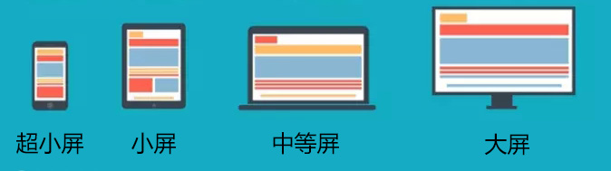

### 使用bootstrap

- 页面基本组成

```js
<head>
    // 编码方式
    <meta charset="utf-8">
        
    // 启用最新的IE引擎进行页面的渲染 
    <meta http-equiv="X-UA-Compatible" content="IE=edge">
        
    // 移动设备视口设置 
    <meta name="viewport" content="width=device-width, initial-scale=1">
        
    // 上述3个meta标签*必须*放在最前面，任何其他内容都*必须*跟随其后！
        
    <title>Bootstrap 101 Template</title>

    // 引用Bootstrap
    <link href="https://cdn.jsdelivr.net/npm/bootstrap@3.3.7/dist/css/bootstrap.min.css" rel="stylesheet">

    // HTML5 shim 和 Respond.js 是为了让 IE8 支持 HTML5 元素和媒体查询（media queries）功能 
    // 警告：通过 file:// 协议（就是直接将 html 页面拖拽到浏览器中）访问页面时 Respond.js 不起作用 
    <!--[if lt IE 9]>
    <script src="https://cdn.jsdelivr.net/npm/html5shiv@3.7.3/dist/html5shiv.min.js"></script>
    <script src="https://cdn.jsdelivr.net/npm/respond.js@1.4.2/dest/respond.min.js"></script>
    <![endif]-->
</head>
```

- bootstrap规则：

  - 把整个页面分成12个格子

  - 列必须在行内，行必须在布局容器内

  - xs,sm,md,lg改变列的宽度和数量

    ​	

- container

  - 固定宽度布局容器：固定宽度在中间显示

```js
<div class="container">
        <h1>你好，世界！</h1>
    </div>
```


- container-fluid
  - 流体布局容器：100%显示

```js
<div class="container-fluid">
        <h1>你好，世界！</h1>
    </div>
```


- 屏幕区分
  - xs是超小屏幕
  - sm小屏幕
  - md中等屏幕
  - lg大屏幕


- 改变 列 占的宽度，改变列的数量
  - 共有12个格，一个格子占3格，一行就有4个格子
  - 在md有1个格子，在sm有4个格子（12/3）

```js
            <div class="col-md-1 col-sm-3"></div>
```

- 列偏移（控制列所在的位置）
  - 在sm偏移3个格，就是偏移一个格子，偏移的格子没有消失，保留了位置

```js
<div class="col-md-1 col-sm-3 col-sm-offset-3"></div>
```


- 列排序（控制元素交换位置）

- 交换1和3的位置

  - .col-md-push-*  推
  - 往后推6格，就是2个格子

  ```js
              <div class="col-md-1 col-sm-3 col-sm-push-6">1</div>
  ```

  

  - .col-md-pull-*    拉
  - 往前推6个，2个格子

  ```js
              <div class="col-md-1 col-sm-3 col-sm-pull-6">3</div>
  ```

  

### bootstrap框架缺点

- 大部分的网站尺寸不能按照格子划分（小数位格子）
- 框架中自带了很多默认样式（padding、border、颜色等）
- 灵活性差，需要根据框架自定义的尺寸进行变化
- 载入样式体积庞大，很多用不上


- 解决方案
  - 开发属于自己的响应式框架

### CSS3媒询

- 根据当前媒体设备（媒体特征），显示媒询内的对应样式


#### 什么是响应式？

一个网站，根据浏览设备的不同，屏幕尺寸的不同，显示不同的样式，做到不论是大屏，还是小屏，都可以正常显示网站内容。

一般需要考虑的设备：

- PC 笔记本和超大屏
- ipad 横竖屏
- 手机横竖屏

**运用响应式开发的网站**

UE：<http://www.uedna.com/>

jQuery：https://jquery.com/

当然还有很多很多的网站，都是利用响应式进行开发的，所以响应式也是我们开发网站时候，必须要掌握的一个开发技巧。


#### 响应式开发需要具备的技术栈

- @media - css3媒询（`核心内容`）

- 移动端开发知识点

  因为多设备都可以正常显示，所以在这里，需要用到移动端适配知识点（视口设置）

- less、sass（可选内容，不一定必须用，但是不用的话，写起来比较麻烦）

  --------

- 弹性盒模型

- 百分比
- rem

> 以上的三种布局方案（弹性盒模型、百分比、rem），都可以运用在响应式中。


#### 媒询

在 对应的设备 和 规定尺寸 下，才会显示该条件内的样式

**媒体设备**

- `all `所有类型的设备
- `screen` 彩屏设备
- handheld 手持设备
- print 打印预览
- braille 盲文触觉设备

- speech 屏幕阅读器

- tv 电视类设备

  

**关键词**

- and - 和，在多个条件的时候，可以用 and 连接，表示以上条件都满足就加载样式

  ```css
  @media screen and (max-width:1100px) and (orientation:portrait){
      div{
          background: green;
      }
  }
  ```

- not - 不，表示只要不是某一个条件的情况下，其他条件都可以加载样式

  ```css
  @media not screen and (min-width:1100px){
      div{
          background: green;
      }
  }
  ```

  这里的`not`表示的不是：不可以是screen设备

  表示：排除 **彩屏** 并且 **最小宽度符合1100px(意思就是小于1100px的不符合)** 的

- only - 只有，表示只有在某个条件下，才可以加载样式

  ```css
  @media only screen and (orientation:portrait){
      div{
          background: green;
      }
  }
  ```

- `,` - 或，表示只要满足其中一个条件，就可以加载样式

  ```css
  @media  (min-width:1000px) , (max-width:500px){
      div{
          background: green;
      }
  }
  ```

  

**媒体特征**

- 宽度
  - min / max - width 最小 / 最大宽度
  - min / max - device - width 设备最小 / 最大宽度
- 横竖屏
  - orientation
    - portrait  竖屏
    - landscape 横屏
- 像素比
  - -webkit-min-device-pixel-ratio: 2


**媒询的语法**

语法：

```css
@media screen and (orientation:landscape){
	//当满足 彩色屏幕 并且 横屏状态下，就添加这里的样式
}
```

根据上面的 媒体设备 及 媒体特征，我们可以在不同状态及不同设备下显示不同的样式


**媒询的不同引入方式**

1. 通过link设定条件引入

   ```html
   <link rel="stylesheet" href="1.css" media="screen and (min-width:1000px)">
   ```

   通过`media`设置媒询设备及媒询特征

1. 通过import 设定条件引入

   ```css
   @import url('1.css') all and (min-width:600px);
   ```

   必须是写在样式表的最前面，所以**不推荐使用**,可以写到样式表第一个

   ```CSS
   <style>
           
           div {
               width: 200px;
               height: 200px;
               border: 5px solid #000;
               background: pink;
           }
       </style>
       <style>
           @import url('1.css') all and (min-width:500px);
           @import url('2.css') all and (min-width:800px);
       </style>
   ```

   

1. 直接在写样式的时候设定条件

   ```css
   @media screen and (min-width:600px){	}
   ```


#### 响应式开发技巧

1. 根据不同分辨率设备，设置不同留白

   这里的不同分辨率设备，其实我们有一个比较通用的，分为大屏、中等屏幕、小屏幕、超小屏

   

   |          |        大屏        |    中等屏    | 小屏幕  | 超小屏 |
   | :------: | :----------------: | :----------: | :-----: | :----: |
   | 对应设备 | 大屏显示器（台机） | 笔记本显示屏 |  ipad   |  手机  |
   | 对应尺寸 |      >=1200px      |   >=992px    | >=768px | <768px |
   | 显示尺寸 |       1170px       |    970px     |  750px  |  auto  |

   在格式变化的时候，不可能是正好贴边的情况，所以这时候，我们就要预留一些空间，`对应的尺寸`和`显示尺寸`上会有一定偏差

   > 根据这四个尺寸，我们在做响应式开发的时候，就会有四个设计图，根据四个设计图，分别写出对应大屏、中等屏、小屏幕、超小屏的样式

2. 基于大屏还是小屏开发

   **从大屏开始**

   ```css
   div{
       width: 1170px;
       height: 50px;
       background: pink;
       margin: 0 auto;
   }
   
   @media screen and (max-width:1200px){
       div{
           width: 970px;
       }
   }
   @media screen and (max-width:992px){
       div{
           width: 750px;
       }
   }
   @media screen and (max-width:768px){
       div{
           width: 100%;
       }
   }
   ```

   **从小屏开始**

   ```css
   div{
       width: 100%;
       height: 80px;
       background: pink;
       margin: 0 auto;
   }
   @media screen and (min-width:768px){
       div{
           width: 750px;
       }
   }
   @media screen and (min-width:992px){
       div{
           width: 970px;
       }
   }
   @media screen and (min-width:1200px){
       div{
           width: 1170px;
       }
   }
   ```

   > - 从小屏开始的话，更亲和移动端，而且大屏幕下肯定是永远能显示小屏幕的内容的，不会出现内容超出的问题
   >
   > - 但是实际开发中，大屏幕开始会更简单一点，因为页面中不是所有的内容都需要显示，如果先写小屏幕，大屏幕在变化的时候，需要增加结构，很容易出现问题

2. 左右布局变成上下布局

   利用宽度，当父级宽度不够显示元素的时候，元素自然会掉下去

```CSS
<style>
        #box{
            width: 800px;
            color: #fff;
            font-size: 30px;
            /* height: 300px; */
            background: lightblue;
        }
        #box div{
            width: 50%;
            height: 200px;
            background: pink;
            border: 5px solid #000;
            box-sizing: border-box;
            float: left;

        }
        @media screen and (max-width:810px){
            #box{
                width: 500px;
            }
            #box div{
                width: 100%;
            }
        }

    </style>
</head>
<body>
    <div id="box">
        <div>1</div>
        <div>2</div>
    </div>
</body>
```


#### 开发响应式常用框架

- `bootstrap`
- Semantic-UI
- Element UI


#### 栅格系统

> 布局方案，操作有点类似于移动端开发，我们把页面分成格子，只不过在这里，我们主要用于布局，并且是通过class操作，灵活性比较强

```JS
引用CSS
<link rel="stylesheet" href="https://cdn.jsdelivr.net/npm/bootstrap@3.3.7/dist/css/bootstrap.min.css" integrity="sha384-BVYiiSIFeK1dGmJRAkycuHAHRg32OmUcww7on3RYdg4Va+PmSTsz/K68vbdEjh4u" crossorigin="anonymous">
    
引用JS
<script src="https://cdn.jsdelivr.net/npm/bootstrap@3.3.7/dist/js/bootstrap.min.js" integrity="sha384-Tc5IQib027qvyjSMfHjOMaLkfuWVxZxUPnCJA7l2mCWNIpG9mGCD8wGNIcPD7Txa" crossorigin="anonymous"></script>
```


- 容器

  - continue 固定宽度容器 
  - continue-fluid自适应宽度容器

- 行

  - row
    - 清除浮动

- 列（是加了浮动的）

  - col-xx-n
    - xx 尺寸
    - n 占用位置


- 列嵌套（父子级嵌套）

- 列偏移

  - col-xx-offset-n，n是一格的大小

    利用margin，让元素向后位移

- 列排序

  - col-xx-push-n 推（往后）

  - col-xx-pull-n 拉（往前）

    利用推和拉交换位置

```JS
<style>
        .container-fluid{
            height: 100px;
            background: green;
        }
        div[class|="col"]{
            height: 100px;
            border: 5px solid #000;
            font-size: 30px
            
        }
    </style>
</head>
<body>
    <div class="container">
        <div class="row">
            <div class="col-xs-12 col-sm-6 col-md-4 ">
                <div class="row">
                    <div class="col-xs-6 col-xs-push-6">1</div>
                    <div class="col-xs-6 col-xs-pull-6">2</div>
                </div>
            </div>
            <div class="col-xs-12 col-sm-6 col-md-4 col-sm-offset-1"></div>
            <div class="col-xs-12 col-sm-6 col-md-4 "></div>
            <div class="col-xs-12 col-sm-6 col-md-4 "></div>
        </div>
    </div>
    
    <!-- <div class="container-fluid"></div> -->
</body>
```


#### 兼容

`@media`是css3新增样式，兼容到IE9+，但是并不是说，我们不能让低版本浏览器支持

这里需要引入两个文件：

```html
<script src="https://cdn.bootcss.com/html5shiv/3.7.3/html5shiv.min.js"></script>
<script src="https://cdn.bootcss.com/respond.js/1.4.2/respond.min.js"></script>
```

- html5shiv：用 JS 创建H5标签，让低版本浏览器支持
- respond：支持响应，利用JS判断屏幕尺寸是否发生变化


### 写一个栅格系统

```html
<head>
    <meta charset="UTF-8">
    <meta name="viewport" content="width=device-width, initial-scale=1.0">
    <meta http-equiv="X-UA-Compatible" content="ie=edge">
    <link rel="stylesheet" href="css/index.css">
    <title>Document</title>
    <style>
    
        div[class|="col"]{
            height: 100px;
            border: 5px solid #000;
            box-sizing: border-box;
            font-size: 35px;
        }
    </style>
</head>
<body>
    <div class="container">
        <div class="row">
            <div class="col-xs-12 col-sm-6 col-md-4 col-md-push-4">1</div>
            <!-- <div class="col-xs-12 col-sm-6 col-md-4 col-md-offset-4"></div> -->
            <div class="col-xs-12 col-sm-6 col-md-4 col-md-pull-4">2</div>
            <div class="col-xs-12 col-sm-6 col-md-4">3</div>
        </div>
    </div>
</body>
```


```JS
//不同屏幕样式
.container{
    padding: 0 15px;
    
    @media screen and (min-width:768px) {
        width: 750px;
        margin: 0 auto;
    }
    @media screen and (min-width:992px){
        width: 970px;
    }
    @media screen and (min-width:1200px){
        width: 1170px;
    }
}

// 行清除浮动
.row::after{
    content: '';
    display: block;
    clear: both;
}


//循环设置不同屏幕对应的不同样式
.loop(@s,@num) when (@num > 0){
    .loop(@s,@num - 1);
    .col-@{s}-@{num}{
        width: 100% / 12 * @num;
        float: left;
    }
    // 列偏移
    .col-@{s}-offset-@{num}{
        margin-left: 100% / 12 * @num;
    }
    // 列排序
    .col-@{s}-push-@{num}{
        position: relative;
        left: 100% / 12 * @num;
    }
    .col-@{s}-pull-@{num}{
        position: relative;
        left: -100% / 12 * @num;
    }
}

//不同屏幕尺寸
.loop(xs,12);
@media screen and (min-width:768px){
    .loop(sm,12);
}
@media screen and (min-width:992px){
    .loop(md,12);
}
@media screen and (min-width:1200px){
    .loop(lg,12);
}

```


### 总结

---

1. 响应式用于一个网页，适应多个尺寸的设备展示
1. 媒询：根据媒体设备以及媒体特性来控制样式是否加载显示

3. 从小屏开始开发更好，但是实际开发中，大屏幕开始会更简单一点

3.  不使用兼容js的情况下，可以兼容到`IE9+`

   

