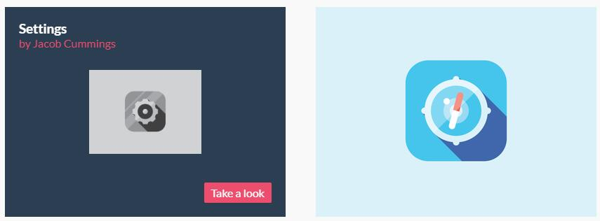

# 动画、重绘回流、css hack

### 

***\*- CSS3 transition 过渡\****	

 控制一段时间内属性的值如何变为另一个值，使属性的值逐渐变化，不会太突兀

\- transition-duration 过渡持续时间 （单位：s 秒 / ms 毫秒）

\- 默认 0s，没有过渡

\- transition-property 想要执行过渡的样式

\- 默认 all

\- 只支持数值类型的值，而且，必须是同一个样式，从一个数值，过渡到另一个样式

\- transition-delay 过渡延迟时间（单位：s 秒 / ms 毫秒）

\- 默认 0s

\- transition-timing-function 过渡执行动画

\- linear 整个过程保持相同的速度

\- ease 慢速开始，然后加速，在慢下来，结束时特别慢（默认值）

\- ease-in 慢速开始，然后加速

\- ease-out 快速开始，然后减速

\- ease-in-out 与ease类似，中间较快，两端很慢但不同速

\- cubic-bezier  三次方贝塞尔曲线cubic-bezier(x1,y1,x2,y2)

<https://cubic-bezier.com/#.17,.67,.83,.67>

 

\- 复合写法：

transition：property  duration  timing-function  delay；

\- 在过渡中，持续时间和延迟值的顺序很重要，解析为时间的第一值设定的是持续时间（执行时间在前，延迟时间一定在后）

 

\- transform-origin 变化原点

\- 关键词left、right、top、bottom

\- 数值（px）

\- 默认 center center

 

​	 ***\*- transform 3D\****

\- transform-style(preserve-3d) 建立3D空间

\- perspective  景深

\- perspective-origin  景深基点

 

​	***\*- CSS3\****  ***\*animation\**** ***\*动画\****

​	  - animation-name  绑定到选择器的 keyframe 名称

  	- keyframes 规定动画

\- animation-duration  完成动画所花费的时间，以秒或毫秒计

\- 默认值是0

 

\- animation-timing-function  规定动画的速度曲线

\- linear	动画从头到尾的速度是相同的。

\- ease	默认。动画以低速开始，然后加快，在结束前变慢。	

\- ease-in	动画以低速开始。	

\- ease-out	动画以低速结束。	

\- ease-in-out	动画以低速开始和结束。

\- cubic-bezier(n,n,n,n)	在 cubic-bezier 函数中自己的值。可能的值是从 0 到 1 的数值。

 

\- animation-delay  动画开始之前的延迟时间，默认值是0

 

\- animation-iteration-count  动画播放的次数

\- n	定义动画播放次数的数值。	

\- infinite	规定动画应该无限次播放。

 

\- animation-direction  是否应该轮流反向播放动画

\- normal	默认值。动画应该正常播放。

\- alternate	动画应该轮流反向播放。

 

## ***\*总结\****

1、transition过渡

2、transform变换

3、animation 动画

---

#### transform

> 含义：变化
>
> 特性：
>
>  	1. 不脱离文档流
> 		2. 不改变文档大小
> 		3. 具有四种变换类别，并且允许多值书写
> 		4. 多值的时候，从后到前执行动画

##### translate（x , y）—— 位移

1. 用于移动元素，被移动的元素不会脱离文档流，不会撑大


从上面的截图，我们可以看到，绿色并没有向前，填补白色的空缺位置，也没有撑大父级（红框的高度）


2. 位移可以控制两个方向，一个x轴（距离左侧），一个y轴（距离顶部），如果两个同时填写，同时会执行（斜着）

2. 位移根据当前位置进行计算

2. 单位

   - px

   - %：百分比根据自身宽高进行计算（写未知宽高元素居中的时候特别好用）

     ```css
     .img{
      	position:absolute;
     	left:50%;
     	top:50%;
          transform:translate(-50%,-50%);
     }
     ```

5. 如果只有一个数值，默认作用在x轴

5. 可以指定方向

   ```css
   transform:translateX(); /* 控制x轴位移 */
   transform:translateY(); /* 控制y轴位移 */
   ```

##### 垂直居中

​	1.定位

​	2.flex

​	3.vertical-align:middle

```CSS
<style>
        .wrap{
            width: 800px;
            height: 800px;
            border: 5px solid #000;
            position: relative;
        }

        img{
            vertical-align: top;
            position: absolute;
            left: 50%;
            top: 50%;
            transform: translate(-50%,-50%);
        }
    </style>
</head>
<body>
    <div class="wrap">
        <!-- <div></div> -->
        
    </div>
</body>
```


##### rotate(deg) —— 旋转

1. 用于旋转元素，被旋转的元素不会脱离文档流， 不会改变文档大小

2.  单位

   - deg 旋转角度（正负值都可以）

   - trun 旋转圈数 （正负值都可以）

   - rad 弧度

     

     半径（r）：OB、OA、AB

     弧度：1rad

     1rad = r（半径）

     >计算公式：
     >
     >圆周长 = 2πr 
     >
     >圆的角度 = 360°
     >
     >整个圆由多少弧度组成？2πr / r = 2π
     >
     >360°= 2π * 1rad
     >
     >弧度转角度：1rad = 360° / 2π => 1rad = 180 ° / π
     >
     >角度转弧度360° * 1°=  2π => 1° = π / 180 

##### 旋转案例

经常看到点击一个按钮，这个按钮突然从三条杠变成了一个`×`这个要怎么做？来看看旋转怎么做的吧~

        

```CSS
<style>
        div{
            width: 200px;
            height: 200px;
            background: black;
            display: flex;  弹性盒模型
            flex-wrap: wrap;
            justify-content: center;  子项目水平方向主轴居中
            align-content: space-around; 剩余空间平均分布
        }
        span{
            flex: 0 0 180px; 放大 缩小 宽度
            height: 20px;
            background: #fff;
        }
        span:nth-of-type(1){
            transition: 0.5s; 过渡时间
            transform-origin: left bottom; 设置中心点
        }
        span:nth-of-type(3){
            transition: 0.5s;
            transform-origin: left top;
        }
        div:hover span:nth-of-type(1){
            transform: rotate(45deg); 旋转
        }
        div:hover span:nth-of-type(3){
            transform: rotate(-45deg);
        }
        div:hover span:nth-of-type(2){
            opacity: 0; 隐藏
        }
    </style>
</head>
<body>
    <div>
        <span></span>
        <span></span>
        <span></span>
    </div>
</body>
```


##### 多值书写

注意，多个效果可以写在同一个transform下，执行的顺序从前到后

```css
div{
    transform：rotate(180deg) translateY(-200px);
}
```

- 位移并不会改变元素变化中心点，变化的中心点依旧在原来的位置
- 上面的代码是先位移，再旋转


##### scale（x，y）—— 缩放

1. 用于通过缩放改变元素大小，被缩放的元素不会脱离文档流，不会改变文档大小

1. 单位：倍数（0 ~ 0+）

1. 缩放位置也是根据变化原点

1. 如果只写一个值，同时设置`x`和`y`

1. 可以设置指定方向

   ```css
   div{
       transform:scaleX(0.5); /* 水平方向缩放0.5 */
       transform:scaleY(0.5); /* 垂直方向缩放0.5 */
   }
   ```

##### 案例：缩放产品列表




##### skew（x，y）—— 斜切

1. 用于倾斜拉伸元素，被倾斜的元素，不会脱离文档流，不会改变文档大小

1. 设置一个值的时候，针对`x`进行设置

1. 可以指定方向

   ```css
   div{
       transform: skewX(-45deg); /* 水平方向的倾斜 */
       transform: skewY(-45deg); /* 垂直方向的倾斜 */
   }
   ```

### animation

#### 动画

##### 动画帧设置

```css
@keyframes 动画名称{
    form{} /* 起点 */
    to{} /* 目标点 */
}
```

```css
@keyframes 动画名称{
    0%{}
    10%{}
    20%{}
    100%{}
}
/* 设置多个动画节点 */
```

##### 使用动画帧

```css
div{
    animation:动画名称（必填） 动画时间（必填）；
}
```

- animation-name 动画名称
- animation-duration 动画执行时间
- animation-delay 动画延迟时间
- animation-timing-function 动画形式
  - linear 匀速
  - ease 快慢快
  - ease-in 开始慢
  - ease-out 结束慢
  - ease-in-out 开始慢、结束慢
  - cubic-bezier（）贝塞尔曲线
- animation-iteration-count 动画执行次数
  - number		次数
  - infinite          无限
- aniamtion-direction 轮流反向播放动画
  - normal || alternate
- animation-fill-mode 动画停留时的状态
  - none
  - forwards 停留在100%
  - backwards 一开始就在0%的位置，不走计算后样式，用在延迟动画的时候设定起始位置
  - both：添加forwards 和 backwards
- animation-play-state
  - paused 暂停动画
  - running 执行

其他样式：


**复合写法**

> animation: name duration delay  timing-function iteration-count direction fill-mode;
>
> 名字、执行时间、延迟时间、动画形式、执行次数、反向播放、停留状态
>
> 延迟时间在动画执行时候后面

**注意！！！**

优先级最高的样式 = 计算后样式

- 动画起始设置样式不必和元素保持一致
- 动画从起始样式开始执行
- 如果元素不设置0%，就以当前元素`计算后样式`执行
- 如果不设置100%，那么默认就是元素`计算后样式`
- 默认执行完后，会回到元素`计算后样式`
- 动画未开始前，元素保持`计算后样式`


##### 案例：自动轮播图

```CSS
<style>
        @keyframes move{
            0%{
                transform: translate(0px);
            }
            15%{
                transform: translate(-400px);
            }
            30%{
                transform: translate(-800px);
            }
            45%{
                transform: translate(-1200px);
            }
            60%{
                transform: translate(-1600px);
            }
            75%{
                transform: translate(-2000px);
            }
            100%{
                transform: translate(-2400px);
            }
        }
        ul{
            margin: 0;
            padding: 0;
            list-style: none;
        }
        img{
            vertical-align: top;
        }
        .box{
            width: 400px;
            height: 300px;
            border: 5px solid #000;
            overflow: hidden;
        }
        ul{
            display: flex;
            /* transition: 1s; */
            animation: move 10s infinite ;
        }
        li{
            flex: 0 0 400px;
        }
        /* .box:hover ul{
            transform: translate(-400px);
        } */
    </style>
</head>
<body>
    <div class="box">
        <ul>
            <li></li>
            <li></li>
            <li></li>
            <li></li>
            <li></li>
            <li></li>
            <li></li>
        </ul>
    </div>
</body>
```


#### 重绘回流

回流必然会引起重绘，但是重绘不一定会引起回流

**什么是回流？**

当你的某些样式发生变化的时候，影响页面中其他元素的位置，就会引发回流

浏览器在页面排版的时候采用的是流体布局，当一些元素脱离文档流后，其后面的元素就会顶上，后面的元素的变化，又会影响更后面的元素，导致页面部分文档或全部文档重新渲染，这样的过程叫做回流。

**会触发回流的操作**

1. 页面首次渲染
1. 浏览器窗口大小发生变化
1. 元素尺寸或位置发生变化
1. 字体大小变化
1. 在页面中添加 / 删除某个元素

**什么是重绘？**

字面意思，重新绘制一个元素，这个需要绘制的样式和布局结构无关，例如背景色，例如字体颜色等样式

**性能优化**

回流的操作必然会引发重绘，所以是相当消耗性能的，在可以不回流的情况下，我们尽量避免，例如：

1. 利用 `translate` 代替 `top` `left`
1. 使用`visibility:hidden;` 代替 `display:none`
1. 不要使用`table`布局

....等


#### CSS Hack

**什么是css hack？**

简单的说，hack就是只有某些特定的浏览器才能识别这段代码，是一种兼容的方式。

**css属性前缀hack**

```css
.txt{
    _color:red; /* IE6(_) */
}
.txt{
    *color:red; /* IE7 及 以下版本 */
}
.txt{
    +color:red; /* IE7 及 IE6 */
}
.txt{
    -color:red; /* IE6 */
}
```

**选择器前缀**

```css
*html,txt{
    color:red; /* 只在IE6中生效 */
}

```

所以有时候看到一些比较古老的网站还有这样的样式~ 如果看到前面带符号的样式，要知道是低版本的兼容写法哦


---

1. transform 不脱离文档流，不改变文档大小
1. 有四种变换方式
   1. 位移 translate
   1. 缩放 scale
   1. 旋转 rotate
   1. 斜切 skew
1. 可以多种变换同时添加，以`空格`进行间隔
1. transform的执行，是从后往前

5. 动画部分都在动画那里总结啦

5. CSS hack 主要用于兼容问题

5. 回流一定会触发重绘，所以比较消耗性能

   