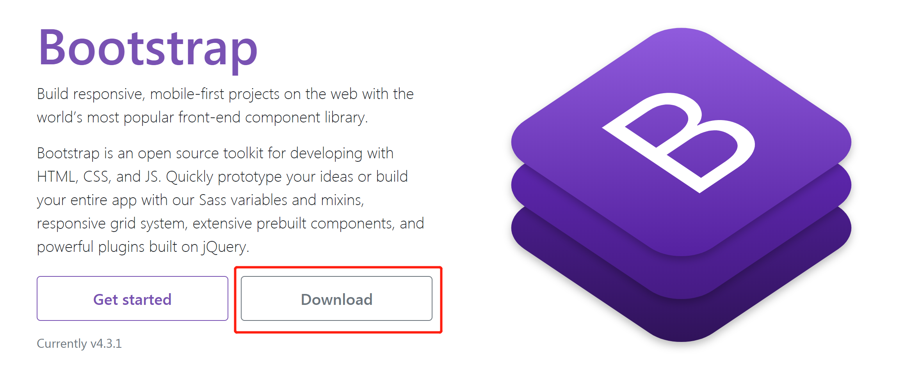
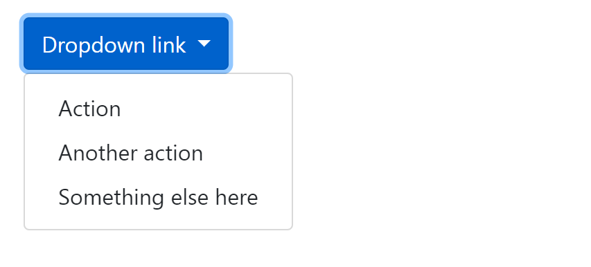
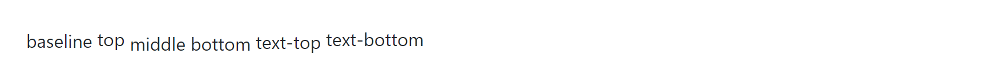

# Bootstrap4 教程

### Bootstrap4 简介

Bootstrap 是全球最受欢迎的前端组件库，用于开发响应式布局、移动设备优先的 WEB 项目，Bootstrap4 目前是 Bootstrap 的最新版本，是一套用于 HTML、CSS 和 JS 开发的开源工具集。


Bootstrap4 与 Bootstrap3 相比拥有了更多的具体的类以及把一些有关的部分变成了相关的组件，同时 Bootstrap.min.css 的体积减少了40%以上。Bootstrap4 仅仅支持 IE9 以上 以及 iOS 7 以上版本的浏览器。


### Bootstrap4 安装

我们可以通过以下两种方式来安装 Bootstrap4： 

1、从官网   [getbootstrap.com](https://getbootstrap.com) 或中文网  <http://www.bootcss.com/>  下载 Bootstrap 4。

2、使用 BootstrapCDN。


##### 	Bootstrap 下载




##### BootstrapCDN

直接使用 [BootstrapCDN](https://www.bootstrapcdn.com/) 提供的在线 JS 和 CSS 快速构建你的项目，不需要下载和部署。

```html
<link rel="stylesheet" href="https://stackpath.bootstrapcdn.com/bootstrap/4.3.1/css/bootstrap.min.css" integrity="sha384-ggOyR0iXCbMQv3Xipma34MD+dH/1fQ784/j6cY/iJTQUOhcWr7x9JvoRxT2MZw1T" crossorigin="anonymous">
<script src="https://stackpath.bootstrapcdn.com/bootstrap/4.3.1/js/bootstrap.min.js" integrity="sha384-JjSmVgyd0p3pXB1rRibZUAYoIIy6OrQ6VrjIEaFf/nJGzIxFDsf4x0xIM+B07jRM" crossorigin="anonymous"></script>
```

 

如果你正在使用我们编译的 JavaScript ，请不要忘记在它之前包含 jQuery 和 Popper.js 的CDN版本。 

```html
<script src="https://code.jquery.com/jquery-3.4.1.slim.min.js" integrity="sha384-J6qa4849blE2+poT4WnyKhv5vZF5SrPo0iEjwBvKU7imGFAV0wwj1yYfoRSJoZ+n" crossorigin="anonymous"></script>
<script src="https://cdnjs.cloudflare.com/ajax/libs/popper.js/1.15.0/umd/popper.min.js" integrity="sha384-L2pyEeut/H3mtgCBaUNw7KWzp5n9+4pDQiExs933/5QfaTh8YStYFFkOzSoXjlTb" crossorigin="anonymous"></script>
```


### Bootstrap4 容器

容器是Bootstrap中最基本的布局元素，**在使用我们的默认网格系统时，**容器是**必需的**。容器用于在其中容纳，填充和（有时）使内容居中。

Bootstrap带有三个不同的容器：

- `.container`，在每个响应断点处设置最大宽度
- `.container-fluid`，宽度在所有断点处为100％
- `.container-{breakpoint}`，`width: 100%`直到指定的断点为止

下表说明了每个容器最大宽度与原始容器`.container`以及`.container-fluid`每个断点之间的比较。


|                    | 超小设备 <576px | 平板 ≥576px | 桌面显示器 ≥768px | 大桌面显示器 ≥992px | 特大 ≥1200px |
| ------------------ | --------------- | ----------- | ----------------- | ------------------- | ------------ |
| `.container`       | 100%            | 540px       | 720px             | 960px               | 1140px       |
| `.container-sm`    | 100%            | 540px       | 720px             | 960px               | 1140px       |
| `.container-md`    | 100%            | 100%        | 720px             | 960px               | 1140px       |
| `.container-lg`    | 100%            | 100%        | 100%              | 960px               | 1140px       |
| `.container-xl`    | 100%            | 100%        | 100%              | 100%                | 1140px       |
| `.container-fluid` | 100%            | 100%        | 100%              | 100%                | 100%         |


我们的默认`.container`类是响应式，固定宽度的容器，这意味着它`max-width`在每个断点处都会发生变化

```html
<div class="container">
  <!-- Content here -->
</div>
```


使用`.container-fluid`了全宽的容器，跨越视口的整个宽度。

```html
<div class="container-fluid">
  ...
</div>
```


### Bootstrap4 栅格系统

Bootstrap 提供了一套响应式、移动设备优先的流式网格系统，随着屏幕或视口（viewport）尺寸的增加，系统会自动分为最多 12 列。

我们也可以根据自己的需要，定义列数：


 Bootstrap 4 的网格系统是响应式的，列会根据屏幕大小自动重新排列。


##### 网格类

Bootstrap 4 网格系统有以下 5 个类:

- .col- 针对所有设备

- .col-sm- 平板 - 屏幕宽度等于或大于 576px

- .col-md- 桌面显示器 - 屏幕宽度等于或大于 768px

- .col-lg- 大桌面显示器 - 屏幕宽度等于或大于 992px

- .col-xl- 超大桌面显示器 - 屏幕宽度等于或大于 1200px

  

##### 网格系统规则

- 网格每一行需要放在设置了 `.container` (固定宽度) 或 `.container-fluid` (全屏宽度) 类的容器中，这样就可以自动设置一些外边距与内边距。

- 使用行来创建水平的列组。

- 内容需要放置在列中，并且只有列可以是行的直接子节点。

- 预定义的类如 **.row** 和 **.col-sm-4** 可用于快速制作网格布局。

- 列通过填充创建列内容之间的间隙。 这个间隙是通过 **.rows** 类上的负边距设置第一行和最后一列的偏移。

- **网格列是通过跨越指定的 12 个列来创建**。 例如，设置三个相等的列，需要使用用三个**.col-sm-4** 来设置。

- Bootstrap 3 和 Bootstrap 4 最大的区别在于 Bootstrap 4 现在使用 flexbox（弹性盒子） 而不是浮动。  Flexbox 的一大优势是，没有指定宽度的网格列将自动设置为**等宽与等高列** 。

  

  |              | 超小设备 <576px                | 平板 ≥576px | 桌面显示器 ≥768px | 大桌面显示器 ≥992px | 超大桌面显示器 ≥1200px |
  | :----------- | :----------------------------- | :---------- | :---------------- | :------------------ | ---------------------- |
  | 容器最大宽度 | None (auto)                    | 540px       | 720px             | 960px               | 1140px                 |
  | 类前缀       | `.col-`                        | `.col-sm-`  | `.col-md-`        | `.col-lg-`          | `.col-xl-`             |
  | 列数量和     | 12                             |             |                   |                     |                        |
  | 间隙宽度     | 30px （一个列的每边分别 15px） |             |                   |                     |                        |
  | 可嵌套       | Yes                            |             |                   |                     |                        |
  | 列排序       | Yes                            |             |                   |                     |                        |


##### 列的自动布局

Bootstrap 的栅格系统使用一系列容器，行和列来布局和对齐内容。 它是用 flexbox 构建的，并且完全响应


###### 创建相等宽度的列

这里有两个适用于每个设备和 viewport 的栅格布局，从 xs 到 xl。 为你需要的每个断点添加任意数量的无单位类，每列的宽度相同。


```html
<div class="container">
  <div class="row">
    <div class="col bg-success">.col</div>
    <div class="col bg-warning">.col</div>
    <div class="col bg-success">.col</div>
  </div>
</div>
```


###### 设置列宽


```html
<div class="container">
  <div class="row">
		<div class="col-4 bg-success">.col-4</div>
        <div class="col-6 bg-warning">.col-6</div>
        <div class="col-2 bg-primary">.col-2</div>
  </div>
</div>
```


###### 等宽响应式列

 如何在平板及更大屏幕上创建等宽度的响应式列。 **在移动设备上，即屏幕宽度小于 576px 时，四个列将会上下堆叠排版**


```html
<div class="container">
    <div class="row">
        <div class="col-sm-3 bg-success">.col-sm-3</div>
        <div class="col-sm-3 bg-warning">.col-sm-3</div>
        <div class="col-sm-3 bg-success">.col-sm-3</div>
        <div class="col-sm-3 bg-warning">.col-sm-3</div>
    </div>
</div>
```


###### 不等宽响应式列

在平板及更大屏幕上创建不等宽度的响应式列。 **在移动设备上，即屏幕宽度小于 576px 时，两个列将会上下堆叠排版**:


```html
<div class="container">
    <div class="row">
        <div class="col-sm-4 bg-success">.col-sm-4</div>
        <div class="col-sm-8 bg-warning">.col-sm-8</div>
    </div>
</div>
```


###### 平板和桌面显示器

 在桌面设备的显示器上两个列的宽度各占 50%，如果在平板端则左边的宽度为 25%，右边的宽度为 75%, 在移动手机等小型设备上会堆叠显示 


```html
<div class="container">
    <div class="row">
        <div class="col-sm-3 col-md-6 bg-success">col-sm-3,col-md-6</div>
        <div class="col-sm-9 col-md-6 bg-warning">col-sm-9,col-md-6</div>
    </div>         
</div>
```


###### 平板、桌面、大桌面显示器、超大桌面显示器

以下实例在平板、桌面、大桌面显示器、超大桌面显示器的宽度比例为分别为：25%/75%、50%/50%、33.33%/66.67%、16.67/83.33%, 在移动手机等小型设备上会堆叠显示。


```html
<div class="container">
    <div class="row">
    	<div class="col-sm-3 col-md-6 col-lg-4 col-xl-2 bg-success">col-sm-3,col-md-6,col-lg-4,col-xl-2</div>
    	<div class="col-sm-9 col-md-6 col-lg-8 col-xl-10 bg-warning">col-sm-9,col-md-6,col-lg-8,col-xl-10</div>
    </div>         
</div>
```


##### 对齐

使用 flexbox 对齐工具垂直和水平对齐列。

###### 垂直对齐


```html
<div class="container">
    <div class="row align-items-start" style="height: 80px;background-color: #eee;">
        <div class="col bg-success">.col</div>
        <div class="col bg-warning">.col</div>
        <div class="col bg-info">.col</div>
    </div>
    <div class="row align-items-center" style="height: 80px;background-color: #eee;margin-top: 10px;margin-bottom: 15px;">
        <div class="col bg-success">.col</div>
        <div class="col bg-warning">.col</div>
        <div class="col bg-info">.col</div>
    </div>
    <div class="row align-items-end" style="height: 80px;background-color: #eee;">
        <div class="col bg-success">.col</div>
        <div class="col bg-warning">.col</div>
        <div class="col bg-info">.col</div>
    </div>
</div>
```


```html
<div class="container">
  <div class="row" style="height:7rem;background-color:#eee">
        <div class="col align-self-start bg-success">.col</div>
        <div class="col align-self-center bg-success">.col</div>
        <div class="col align-self-end bg-success">.col</div>
  </div>
</div>
```


###### 水平对齐


```html
<div class="container" style="background-color: #eee;">
    <div class="row justify-content-start" style="margin-bottom: 10px;">
        <div class="col-4 border border-dark bg-success">.col-4</div>
        <div class="col-4 border border-dark bg-success">.col-4</div>
    </div>
    <div class="row justify-content-center" style="margin-bottom: 10px;">
        <div class="col-4 border border-dark bg-success">.col-4</div>
        <div class="col-4 border border-dark bg-success">.col-4</div>
    </div>
    <div class="row justify-content-end" style="margin-bottom: 10px;">
        <div class="col-4 border border-dark bg-success">.col-4</div>
        <div class="col-4 border border-dark bg-success">.col-4</div>
    </div>
    <div class="row justify-content-around" style="margin-bottom: 10px;">
        <div class="col-4 border border-dark bg-success">.col-4</div>
        <div class="col-4 border border-dark bg-success">.col-4</div>
    </div>
    <div class="row justify-content-between">
        <div class="col-4 border border-dark bg-success">.col-4</div>
        <div class="col-4 border border-dark bg-success">.col-4</div>
    </div>
</div>
```


##### 重新排列Order 

使用 `.order-` 类来控制内容的可视顺序。 这些类是响应式的，因此你可以通过断点设置顺序 (例如 `.order-1.order-md-2`)。 包括 `1` 到 `12` 都可以在栅格系统中受到支持。


```html
<div class="container">
  <div class="row">
      <div class="col bg-success border border-dark">.col_01</div>
      <div class="col order-12 bg-success border border-dark">.col_02</div>
      <div class="col order-1 bg-success border border-dark">.col_03</div>
  </div>
</div>
```


还有响应 `.order-first` 和 `.order-last` 类，用于更改 `order` 对元素进行 `order: -1` 或 `order: 13` (`order: $columns + 1`), 这些类也可以根据需要与编号为 `.order-*` 的类混合。


```html
<div class="container">
    <div class="row">
        <div class="col order-last bg-success border border-dark">.col_01</div>
        <div class="col bg-success border border-dark">.col_02</div>
        <div class="col order-first bg-success border border-dark">.col_03</div>
    </div>
</div>
```


##### 列偏移

你可以通过两种方式偏移栅格列：响应式 .offset- 栅格类和我们的margin工具。 


###### Offset 类

使用 `.offset-md-*` 类向右移动列，这些类将列的左边距增加 `*` 列, 例如， `.offset-md-4` 在四列上移动 `.col-md-4`。


```html
<div class="container" style="background-color: #eee;">
    <div class="row">
        <div class="col-md-4 bg-success">.col-md-4</div>
        <div class="col-md-4 offset-md-4 bg-success">.col-md-4 .offset-md-4</div>
    </div>
    <div class="row" style="margin-top: 10px;margin-bottom: 10px;">
        <div class="col-md-3 offset-md-3 bg-success">.col-md-3 .offset-md-3</div>
        <div class="col-md-3 offset-md-3 bg-success">.col-md-3 .offset-md-3</div>
    </div>
    <div class="row">
        <div class="col-md-6 offset-md-3 bg-success">.col-md-6 .offset-md-3</div>
    </div>
</div>
```


除了响应断点处的列清除外，你可能还需要重置偏移量。 


```html
<div class="container">
    <div class="row" style="margin-bottom: 10px;">
        <div class="col-sm-5 col-md-6 bg-success">.col-sm-5,.col-md-6</div>
        <div class="col-sm-5 offset-sm-2 col-md-6 offset-md-0 bg-warning">.col-sm-5,.offset-sm-2,.col-md-6,.offset-md-0</div>
    </div>
        
    <div class="row">
        <div class="col-sm-6 col-md-5 col-lg-6 bg-success">.col-sm-6,.col-md-5,.col-lg-6</div>
        <div class="col-sm-6 col-md-5 offset-md-2 col-lg-6 offset-lg-0 bg-warning">.col-sm-6,.col-md-5,.offset-md-2,.col-lg-6,.offset-lg-0</div>
    </div>
</div>
```


###### Margin 工具

你可以使用诸如 `.mr-auto` 之类的margin 工具来强制兄弟列彼此远离。


```html
<div class="container" style="background: #eee;">
    <div class="row">
        <div class="col-md-4 bg-success">.col-md-4</div>
        <div class="col-md-4 ml-auto bg-success">.col-md-4 .ml-auto</div>
    </div>
    <div class="row" style="margin-top: 10px;margin-bottom: 10px;">
        <div class="col-md-3 ml-md-auto bg-success">.col-md-3 .ml-md-auto</div>
        <div class="col-md-3 ml-md-auto bg-success">.col-md-3 .ml-md-auto</div>
    </div>
    <div class="row">
        <div class="col-auto mr-auto bg-success">.col-auto .mr-auto</div>
        <div class="col-auto bg-success">.col-auto</div>
    </div>
</div>
```


##### 嵌套

要使用默认栅格嵌套内容，请添加一个新的 `.row` 和一组 `.col-sm-*` 现有 `.col-sm-*` 列中的列。 嵌套行应包含一组最多可添加12个或更少的列（不要求你使用所有12个可用列）。


```html
<div class="container" style="background: #eee;">
    <div class="row">
        <div class="col-sm-9">
            Level 1: .col-sm-9
            <div class="row">
                <div class="col-8 col-sm-6 bg-warning border border-dark">
                    Level 2: .col-8 .col-sm-6
                </div>
                <div class="col-4 col-sm-6 bg-warning border border-dark">
                    Level 2: .col-4 .col-sm-6
                </div>
            </div>
        </div>
    </div>
</div>
```


### Bootstrap4  文字排版

##### 默认设置

Bootstrap 4 默认的 **font-size** 为 16px, **line-height** 为 1.5。

默认的 **font-family** 为 "Helvetica Neue", Helvetica, Arial, sans-serif。

此外，所有的元素 **margin-top: 0** 、 **margin-bottom: 1rem** (16px)。


##### 标题


```html
<div class="container">
    <h1>h1 Bootstrap 标题 (2.5rem = 40px)</h1>
    <h2>h2 Bootstrap 标题 (2rem = 32px)</h2>
    <h3>h3 Bootstrap 标题 (1.75rem = 28px)</h3>
    <h4>h4 Bootstrap 标题 (1.5rem = 24px)</h4>
    <h5>h5 Bootstrap 标题 (1.25rem = 20px)</h5>
    <h6>h6 Bootstrap 标题 (1rem = 16px)</h6>
</div>
```


 同时提供 .h1 到 .h6 的 类名 

```html
<div class="container">
    <p class="h1">h1 Bootstrap 标题 (2.5rem = 40px)</p>
    <p class="h2">h2 Bootstrap 标题 (2rem = 32px)</p>
    <p class="h3">h3 Bootstrap 标题 (1.75rem = 28px)</p>
    <p class="h4">h4 Bootstrap 标题 (1.5rem = 24px)</p>
    <p class="h5">h5 Bootstrap 标题 (1.25rem = 20px)</p>
    <p class="h6">h6 Bootstrap 标题 (1rem = 16px)</p>
</div>
```


##### mall副标题

在 Bootstrap4 中 HTML元素用于创建字号更小的颜色更浅的文本:


```html
<div class="container">  
    <h1>h1 标题 <small>副标题</small></h1>
    <h2>h2 标题 <small>副标题</small></h2>
    <h3>h3 标题 <small>副标题</small></h3>
    <h4>h4 标题 <small>副标题</small></h4>
    <h5>h5 标题 <small>副标题</small></h5>
    <h6>h6 标题 <small>副标题</small></h6>
</div>
```


##### Display 标题类

Bootstrap4 还提供了四个 Display 类来控制标题的样式: .display-1, .display-2, .display-3, .display-4。


```html
<div class="container">
    <h1>Display 标题</h1>
    <h1 class="display-1">Display 1</h1>
    <h1 class="display-2">Display 2</h1>
    <h1 class="display-3">Display 3</h1>
    <h1 class="display-4">Display 4</h1>
</div>
```


##### abbr标签

 Bootstrap 4 定义 HTML<abbr>元素的样式为显示在文本底部的一条虚线边框: 


```html
<div class="container">
    <p>今天<abbr title="p">天气</abbr>好晴朗，处处好风光</p>
</div>
```


##### code标签


```html
<div class="container">
    <p>以下 HTML 元素: <code>span</code>, <code>section</code>, 和 <code>div</code> 用于定义部分文档内容。</p>
</div>
```


##### 更多排版类

下表提供了 Bootstrap4 更多排版类的实例：

| 类名                    | 描述                                                         |
| :---------------------- | ------------------------------------------------------------ |
| **.font-weight-bold**   | 加粗文本                                                     |
| **.font-weight-normal** | 普通文本                                                     |
| **.font-weight-light**  | 更细的文本                                                   |
| **.font-italic**        | 斜体文本                                                     |
| **.lead**               | 让段落更突出                                                 |
| **.small**              | 指定更小文本 (为父元素的 85% )                               |
| **.text-left**          | 左对齐                                                       |
| **.text-center**        | 居中                                                         |
| **.text-right**         | 右对齐                                                       |
| **.text-justify**       | 设定文本对齐,段落中超出屏幕部分文字自动换行                  |
| **.text-nowrap**        | 段落中超出屏幕部分不换行                                     |
| **.text-lowercase**     | 设定文本小写                                                 |
| **.text-uppercase**     | 设定文本大写                                                 |
| **.text-capitalize**    | 设定单词首字母大写                                           |
| **.initialism**         | 显示在 <abbr> 元素中的文本以小号字体展示，且可以将小写字母转换为大写字母 |
| **.list-unstyled**      | 移除默认的列表样式，列表项中左对齐 ( <ul> 和 <ol> 中)。 这个类仅适用于直接子列表项 (如果需要移除嵌套的列表项，你需要在嵌套的列表中使用该样式) |
| **.list-inline**        | 将所有列表项放置同一行                                       |
| **.pre-scrollable**     | 使 <pre> 元素可滚动，代码块区域最大高度为340px,一旦超出这个高度,就会在Y轴出现滚动条 |


### Bootstrap4 颜色

##### 文本颜色

Bootstrap 4 提供了一些有代表意义的颜色类：**.text-muted**、**.text-primary**、**.text-success**、**.text-info**、**.text-warning**、**.text-danger**、**.text-secondary**、**.text-dark** 、**.text-light**、**.text-white**


```html
<div class="container">
    <p class="text-muted">柔和的文本</p>
    <p class="text-primary">重要的文本</p>
    <p class="text-success">执行成功的文本</p>
    <p class="text-info">代表一些提示信息的文本</p>
    <p class="text-warning">警告文本</p>
    <p class="text-danger">危险操作文本</p>
    <p class="text-secondary">副标题</p>
    <p class="text-dark">深灰色文字</p>
    <p class="text-light">浅灰色文本（白色背景上看不清楚）</p>
    <p class="text-white">白色文本（白色背景上看不清楚）</p>
</div>
```


##### 背景颜色

提供背景颜色的类有: **.bg-primary**、**.bg-success**、 **.bg-info**、**.bg-warning**、 **.bg-danger**、 **.bg-secondary**、**.bg-dark** 、**.bg-light**。

注意背景颜色不会设置文本的颜色，在一些实例中你需要与 **.text-\*** 类一起使用。


```html
<div class="container">
    <p class="bg-primary text-white">重要的背景颜色。</p>
    <p class="bg-success text-white">执行成功背景颜色。</p>
    <p class="bg-info text-white">信息提示背景颜色。</p>
    <p class="bg-warning text-white">警告背景颜色</p>
    <p class="bg-danger text-white">危险背景颜色。</p>
    <p class="bg-secondary text-white">副标题背景颜色。</p>
    <p class="bg-dark text-white">深灰背景颜色。</p>
    <p class="bg-light text-dark">浅灰背景颜色。</p>
</div>
```


### Bootstrap4 表格

由于表格在日历和日期选择器等第三方小部件中的广泛使用，我们设计的表格是可选择的。 只需将基类 `.table` 添加到任何 <table>，然后就可以使用自定义样式或各种包含的修饰符类进行扩展。

##### 基础表格


```html
<div class="container">
    <table class="table">
        <thead>
            <tr>
                <th>#</th>
                <th>First</th>
                <th>Last</th>
                <th>Handle</th>
            </tr>
        </thead>
        <tbody>
            <tr>
                <th>1</th>
                <td>Mark</td>
                <td>Otto</td>
                <td>@mdo</td>
            </tr>
            <tr>
                <th>2</th>
                <td>Jacob</td>
                <td>Thornton</td>
                <td>@fat</td>
            </tr>
            <tr>
                <th>3</th>
                <td>Larry</td>
                <td>the Bird</td>
                <td>@twitter</td>
            </tr>
        </tbody>
    </table>
</div>     

```


##### 黑色背景表格

你还可以使用 `.table-dark` 在深色背景上使用浅色文本反转颜色。


```html
<div class="container">
    <table class="table table-dark">
      <thead>
        <tr>
          <th>#</th>
          <th>First</th>
          <th>Last</th>
          <th>Handle</th>
        </tr>
      </thead>
      <tbody>
        <tr>
          <th>1</th>
          <td>Mark</td>
          <td>Otto</td>
          <td>@mdo</td>
        </tr>
        <tr>
          <th>2</th>
          <td>Jacob</td>
          <td>Thornton</td>
          <td>@fat</td>
        </tr>
        <tr>
          <th>3</th>
          <td>Larry</td>
          <td>the Bird</td>
          <td>@twitter</td>
        </tr>
      </tbody>
    </table>
</div>
```


##### 表头颜色

与表格和暗表类似，使用修饰符类 `.thead-light` 或 `.thead-dark` 使 显示为浅灰色或深灰色。


```html
<div class="container">
    <table class="table">
      <thead class="thead-dark">
        <tr>
          <th>#</th>
          <th>First</th>
          <th>Last</th>
          <th>Handle</th>
        </tr>
      </thead>
      <tbody>
        <tr>
          <th>1</th>
          <td>Mark</td>
          <td>Otto</td>
          <td>@mdo</td>
        </tr>
        <tr>
          <th>2</th>
          <td>Jacob</td>
          <td>Thornton</td>
          <td>@fat</td>
        </tr>
        <tr>
          <th>3</th>
          <td>Larry</td>
          <td>the Bird</td>
          <td>@twitter</td>
        </tr>
      </tbody>
    </table>

    <table class="table">
      <thead class="thead-light">
        <tr>
          <th>#</th>
          <th>First</th>
          <th>Last</th>
          <th>Handle</th>
        </tr>
      </thead>
      <tbody>
        <tr>
          <th>1</th>
          <td>Mark</td>
          <td>Otto</td>
          <td>@mdo</td>
        </tr>
        <tr>
          <th>2</th>
          <td>Jacob</td>
          <td>Thornton</td>
          <td>@fat</td>
        </tr>
        <tr>
          <th>3</th>
          <td>Larry</td>
          <td>the Bird</td>
          <td>@twitter</td>
        </tr>
      </tbody>
    </table>
</div>
```


##### 条纹表格

使用 `.table-striped` 来给 的所有行添加条纹效果。


```html
<div class="container">
    <table class="table table-striped">
      <thead>
        <tr>
          <th>#</th>
          <th>First</th>
          <th>Last</th>
          <th>Handle</th>
        </tr>
      </thead>
      <tbody>
        <tr>
          <th>1</th>
          <td>Mark</td>
          <td>Otto</td>
          <td>@mdo</td>
        </tr>
        <tr>
          <th>2</th>
          <td>Jacob</td>
          <td>Thornton</td>
          <td>@fat</td>
        </tr>
        <tr>
          <th>3</th>
          <td>Larry</td>
          <td>the Bird</td>
          <td>@twitter</td>
        </tr>
      </tbody>
    </table>
</div>
```


##### 黑色条纹表格


```html
<div class="container">
    <table class="table table-striped table-dark">
      <thead>
        <tr>
          <th>#</th>
          <th>First</th>
          <th>Last</th>
          <th>Handle</th>
        </tr>
      </thead>
      <tbody>
        <tr>
          <th>1</th>
          <td>Mark</td>
          <td>Otto</td>
          <td>@mdo</td>
        </tr>
        <tr>
          <th>2</th>
          <td>Jacob</td>
          <td>Thornton</td>
          <td>@fat</td>
        </tr>
        <tr>
          <th>3</th>
          <td>Larry</td>
          <td>the Bird</td>
          <td>@twitter</td>
        </tr>
      </tbody>
    </table>
</div>
```


##### 带边框表格

加上这个 `.table-bordered` 类可以给表格内的所有单元添加边框。


```html
<div class="container">
    <table class="table table-bordered">
      <thead>
        <tr>
          <th>#</th>
          <th>First</th>
          <th>Last</th>
          <th>Handle</th>
        </tr>
      </thead>
      <tbody>
        <tr>
          <th>1</th>
          <td>Mark</td>
          <td>Otto</td>
          <td>@mdo</td>
        </tr>
        <tr>
          <th>2</th>
          <td>Jacob</td>
          <td>Thornton</td>
          <td>@fat</td>
        </tr>
        <tr>
          <th>3</th>
          <td colspan="2">Larry the Bird</td>
          <td>@twitter</td>
        </tr>
      </tbody>
    </table>
</div>
```


##### 带边框黑色表格


```html
<div class="container">
    <table class="table table-bordered table-dark">
      <thead>
        <tr>
          <th>#</th>
          <th>First</th>
          <th>Last</th>
          <th>Handle</th>
        </tr>
      </thead>
      <tbody>
        <tr>
          <th>1</th>
          <td>Mark</td>
          <td>Otto</td>
          <td>@mdo</td>
        </tr>
        <tr>
          <th>2</th>
          <td>Jacob</td>
          <td>Thornton</td>
          <td>@fat</td>
        </tr>
        <tr>
          <th>3</th>
          <td colspan="2">Larry the Bird</td>
          <td>@twitter</td>
        </tr>
      </tbody>
    </table>
</div>
```


##### 去除表格边框

使用 `.table-borderless` 类来移除表格里的所有边框。


```html
<div class="container">
    <table class="table table-borderless">
      <thead>
        <tr>
          <th>#</th>
          <th>First</th>
          <th>Last</th>
          <th>Handle</th>
        </tr>
      </thead>
      <tbody>
        <tr>
          <th>1</th>
          <td>Mark</td>
          <td>Otto</td>
          <td>@mdo</td>
        </tr>
        <tr>
          <th>2</th>
          <td>Jacob</td>
          <td>Thornton</td>
          <td>@fat</td>
        </tr>
        <tr>
          <th>3</th>
          <td colspan="2">Larry the Bird</td>
          <td>@twitter</td>
        </tr>
      </tbody>
    </table>
</div>
```


##### 去除黑色表格边框

`.table-borderless` 还可以用在黑色模式。


```html
<div class="container">
    <table class="table table-borderless table-dark">
      <thead>
        <tr>
          <th>#</th>
          <th>First</th>
          <th>Last</th>
          <th>Handle</th>
        </tr>
      </thead>
      <tbody>
        <tr>
          <th>1</th>
          <td>Mark</td>
          <td>Otto</td>
          <td>@mdo</td>
        </tr>
        <tr>
          <th>2</th>
          <td>Jacob</td>
          <td>Thornton</td>
          <td>@fat</td>
        </tr>
        <tr>
          <th>3</th>
          <td colspan="2">Larry the Bird</td>
          <td>@twitter</td>
        </tr>
      </tbody>
    </table>
</div>    
```


##### 高亮

使用 `.table-hover` 类可以使 里的内容在获得鼠标停留时高亮显示。


```html
<div class="container">
    <table class="table table-hover">
      <thead>
        <tr>
          <th>#</th>
          <th>First</th>
          <th>Last</th>
          <th>Handle</th>
        </tr>
      </thead>
      <tbody>
        <tr>
          <th>1</th>
          <td>Mark</td>
          <td>Otto</td>
          <td>@mdo</td>
        </tr>
        <tr>
          <th>2</th>
          <td>Jacob</td>
          <td>Thornton</td>
          <td>@fat</td>
        </tr>
        <tr>
          <th>3</th>
          <td colspan="2">Larry the Bird</td>
          <td>@twitter</td>
        </tr>
      </tbody>
    </table>
</div>    
```


```html
<div class="container">
    <table class="table table-hover table-dark">
      <thead>
        <tr>
          <th>#</th>
          <th>First</th>
          <th>Last</th>
          <th>Handle</th>
        </tr>
      </thead>
      <tbody>
        <tr>
          <th>1</th>
          <td>Mark</td>
          <td>Otto</td>
          <td>@mdo</td>
        </tr>
        <tr>
          <th>2</th>
          <td>Jacob</td>
          <td>Thornton</td>
          <td>@fat</td>
        </tr>
        <tr>
          <th>3</th>
          <td colspan="2">Larry the Bird</td>
          <td>@twitter</td>
        </tr>
      </tbody>
    </table>
</div>    
```


##### 较小的表格

使用 `.table-sm` 类用于减少内边距来设置较小的表格 


```html
<div class="container">
    <table class="table table-sm">
      <thead>
        <tr>
          <th>#</th>
          <th>First</th>
          <th>Last</th>
          <th>Handle</th>
        </tr>
      </thead>
      <tbody>
        <tr>
          <th>1</th>
          <td>Mark</td>
          <td>Otto</td>
          <td>@mdo</td>
        </tr>
        <tr>
          <th>2</th>
          <td>Jacob</td>
          <td>Thornton</td>
          <td>@fat</td>
        </tr>
        <tr>
          <th>3</th>
          <td colspan="2">Larry the Bird</td>
          <td>@twitter</td>
        </tr>
      </tbody>
    </table>
</div>    
```


##### 较小的黑色表格


```html
<div class="container">
    <table class="table table-sm table-dark">
      <thead>
        <tr>
          <th>#</th>
          <th>First</th>
          <th>Last</th>
          <th>Handle</th>
        </tr>
      </thead>
      <tbody>
        <tr>
          <th>1</th>
          <td>Mark</td>
          <td>Otto</td>
          <td>@mdo</td>
        </tr>
        <tr>
          <th>2</th>
          <td>Jacob</td>
          <td>Thornton</td>
          <td>@fat</td>
        </tr>
        <tr>
          <th>3</th>
          <td colspan="2">Larry the Bird</td>
          <td>@twitter</td>
        </tr>
      </tbody>
    </table>
</div>    
```


##### 响应式表格

**.table-responsive** 类用于创建响应式表格：在屏幕宽度小于 992px 时会创建水平滚动条，如果可视区域宽度大于 992px 则显示不同效果（没有滚动条）:


```html
<div class="container">   
    <div class="table-responsive">          
    <table class="table">
        <thead>
            <tr>
                <th>#</th>
                <th>Firstname</th>
                <th>Lastname</th>
                <th>Age</th>
                <th>City</th>
                <th>Country</th>
                <th>Sex</th>
                <th>Example</th>
                <th>Example</th>
                <th>Example</th>
                <th>Example</th>
            </tr>
        </thead>
        <tbody>
            <tr>
                <td>1</td>
                <td>Anna</td>
                <td>Pitt</td>
                <td>35</td>
                <td>New York</td>
                <td>USA</td>
                <td>Female</td>
                <td>Yes</td>
                <td>Yes</td>
                <td>Yes</td>
                <td>Yes</td>
            </tr>
        </tbody>
    </table>
    </div>
</div>
```


可以通过以下类设定在指定屏幕宽度下显示滚动条：

| 类名                     | 屏幕宽度 |
| :----------------------- | :------- |
| **.table-responsive-sm** | < 576px  |
| **.table-responsive-md** | < 768px  |
| **.table-responsive-lg** | < 992px  |
| **.table-responsive-xl** | < 1200px |


## Bootstrap4 组件

### 	信息提示框

##### 提示框

提示框可以为用户提供醒目的操作提示。

 提示框可以使用 **.alert** 类, 后面加上 **.alert-success**、 **.alert-info**、 **.alert-warning**、 **.alert-danger**、**.alert-primary**、 **.alert-secondary**、**.alert-light**、 **.alert-dark** 类来实现: 


```html
<div class="container">
    <div class="alert alert-success">
        <strong>成功!</strong> 指定操作成功提示信息。
    </div>
    <div class="alert alert-info">
        <strong>信息!</strong> 请注意这个信息。
    </div>
    <div class="alert alert-warning">
        <strong>警告!</strong> 设置警告信息。
    </div>
    <div class="alert alert-danger">
        <strong>错误!</strong> 失败的操作
    </div>
    <div class="alert alert-primary">
        <strong>首选!</strong> 这是一个重要的操作信息。
    </div>
    <div class="alert alert-secondary">
        <strong>次要的!</strong> 显示一些不重要的信息。
    </div>
    <div class="alert alert-dark">
        <strong>深灰色!</strong> 深灰色提示框。
    </div>
    <div class="alert alert-light">
        <strong>浅灰色!</strong>浅灰色提示框。
    </div>
</div>
```


##### 提示框添加链接

 提示框中在链接的标签上添加 **alert-link** 类来设置匹配提示框颜色的链接： 


```html
<div class="container">
    <div class="alert alert-success">
        <strong>成功!</strong> 你应该认真阅读 <a href="#" class="alert-link">这条信息</a>。
    </div>
    <div class="alert alert-info">
        <strong>信息!</strong> 你应该认真阅读 <a href="#" class="alert-link">这条信息</a>。
    </div>
    <div class="alert alert-warning">
        <strong>警告!</strong> 你应该认真阅读 <a href="#" class="alert-link">这条信息</a>。
    </div>
    <div class="alert alert-danger">
        <strong>错误!</strong> 你应该认真阅读 <a href="#" class="alert-link">这条信息</a>。
    </div>
    <div class="alert alert-primary">
        <strong>首选!</strong> 你应该认真阅读 <a href="#" class="alert-link">这条信息</a>。
    </div>
    <div class="alert alert-secondary">
        <strong>次要的!</strong> 你应该认真阅读 <a href="#" class="alert-link">这条信息</a>。
    </div>
    <div class="alert alert-dark">
        <strong>深灰色!</strong>你应该认真阅读 <a href="#" class="alert-link">这条信息</a>。
    </div>
    <div class="alert alert-light">
        <strong>灰色!</strong> 你应该认真阅读 <a href="#" class="alert-link">这条信息</a>。
    </div>
</div>
```


##### 关闭提醒框

 我们可以在提示框中的 div 中添加 **.alert-dismissible** 类，然后在关闭按钮的链接上添加 **class="close"** 和 **data-dismiss="alert"** 类来设置提示框的关闭操作。 


```html
<div class="container">
    <div class="alert alert-success alert-dismissible">
      <button type="button" class="close" data-dismiss="alert">&times;</button>
      <strong>成功!</strong> 指定操作成功提示信息。
    </div>
    <div class="alert alert-info alert-dismissible">
      <button type="button" class="close" data-dismiss="alert">&times;</button>
      <strong>信息!</strong> 请注意这个信息。
    </div>
    <div class="alert alert-warning alert-dismissible">
      <button type="button" class="close" data-dismiss="alert">&times;</button>
      <strong>警告!</strong> 设置警告信息。
    </div>
    <div class="alert alert-danger alert-dismissible">
      <button type="button" class="close" data-dismiss="alert">&times;</button>
      <strong>错误!</strong> 失败的操作。
    </div>
    <div class="alert alert-primary alert-dismissible">
      <button type="button" class="close" data-dismiss="alert">&times;</button>
      <strong>首选!</strong> 这是一个重要的操作信息。
    </div>
    <div class="alert alert-secondary alert-dismissible">
      <button type="button" class="close" data-dismiss="alert">&times;</button>
      <strong>次要的!</strong> 显示一些不重要的信息。
    </div>
    <div class="alert alert-dark alert-dismissible">
      <button type="button" class="close" data-dismiss="alert">&times;</button>
      <strong>深灰色!</strong> 深灰色提示框。
    </div>
    <div class="alert alert-light alert-dismissible">
      <button type="button" class="close" data-dismiss="alert">&times;</button>
      <strong>浅灰色!</strong>浅灰色提示框。
    </div>
  </div>
```

 **提示:** &times; (×) 是 HTML 实体字符，来表示关闭操作，而不是字母 "x"。 


### 	徽章

##### 徽章

 徽章（Badges）主要用于突出显示新的或未读的项。如需使用徽章，只需要将 **.badge** 类加上带有指定意义的颜色类 (如 **.badge-secondary**) 添加到元素上即可。 徽章可以根据父元素的大小的变化而变化: 


```html
  <div class="container">
    <h1>h1标题 <span class="badge badge-secondary">New</span></h1>
    <h2>h2标题 <span class="badge badge-secondary">New</span></h2>
    <h3>h3标题 <span class="badge badge-secondary">New</span></h3>
    <h4>h4标题 <span class="badge badge-secondary">New</span></h4>
    <h5>h5标题 <span class="badge badge-secondary">New</span></h5>
    <h6>h6标题 <span class="badge badge-secondary">New</span></h6>
  </div>
```


##### 各种颜色类型的徽章


```html
  <div class="container">
    <span class="badge badge-primary">主要</span>
    <span class="badge badge-secondary">次要</span>
    <span class="badge badge-success">成功</span>
    <span class="badge badge-danger">危险</span>
    <span class="badge badge-warning">警告</span>
    <span class="badge badge-info">信息</span>
    <span class="badge badge-light">浅色</span>
    <span class="badge badge-dark">深色</span>
  </div>
```


##### 胶囊徽章

使用 `.badge-pill` 可以使徽章更圆润(具有较大的 `border-radius` 和 附加的水平 `padding`)。


```html
<div class="container">
    <span class="badge badge-primary badge-pill">主要</span>
    <span class="badge badge-secondary badge-pill">次要</span>
    <span class="badge badge-success badge-pill">成功</span>
    <span class="badge badge-danger badge-pill">危险</span>
    <span class="badge badge-warning badge-pill">警告</span>
    <span class="badge badge-info badge-pill">信息</span>
    <span class="badge badge-light badge-pill">浅色</span>
    <span class="badge badge-dark badge-pill">深色</span>
</div>
```


##### 徽章插入到元素内


```html
<div class="container">
    <button type="button" class="btn btn-primary">
      Messages <span class="badge badge-light">4</span>
    </button>
    <button type="button" class="btn btn-danger">
      Notifications <span class="badge badge-light">7</span>
    </button>
</div>
```


##### 链接

使用 `.badge-*` 可在<a>元素上调整 hover 和 focus 的效果。


```html
<div class="container">
    <a href="#" class="badge badge-primary">Primary</a>
    <a href="#" class="badge badge-secondary">Secondary</a>
    <a href="#" class="badge badge-success">Success</a>
    <a href="#" class="badge badge-danger">Danger</a>
    <a href="#" class="badge badge-warning">Warning</a>
    <a href="#" class="badge badge-info">Info</a>
    <a href="#" class="badge badge-light">Light</a>
    <a href="#" class="badge badge-dark">Dark</a>
</div>
```


### 	面包屑导航

面包屑导航是一种基于网站层次信息的显示方式，可以显示发布l日期、类别或标签。在导航结构中通过 CSS 自动添加分隔符号来指示当前页面的位置。


```html
<div class="container">
    <ol class="breadcrumb">
        <li class="breadcrumb-item active">Home</li>
    </ol>
    <ol class="breadcrumb">
        <li class="breadcrumb-item"><a href="#">Home</a></li>
        <li class="breadcrumb-item active">Library</li>
    </ol>
    <ol class="breadcrumb">
        <li class="breadcrumb-item"><a href="#">Home</a></li>
        <li class="breadcrumb-item"><a href="#">Library</a></li>
        <li class="breadcrumb-item active">Data</li>
    </ol>
</div>
```


 也可以不用列表形式： 


```html
<div class="container">
    <nav class="breadcrumb">
        <a class="breadcrumb-item" href="#">Home</a>
        <a class="breadcrumb-item" href="#">Library</a>
        <a class="breadcrumb-item" href="#">Data</a>
        <span class="breadcrumb-item active">Bootstrap</span>
    </nav>
</div>
```


### 	按钮

##### 按钮

使用 Bootstrap 自定义按钮样式到表单、对话框等操作，并支持多种按钮大小、状态等。


```html
<div class="container">
    <button type="button" class="btn btn-primary">主要按钮</button>
    <button type="button" class="btn btn-secondary">次要按钮</button>
    <button type="button" class="btn btn-success">成功</button>
    <button type="button" class="btn btn-danger">危险</button>
    <button type="button" class="btn btn-warning">警告</button>
    <button type="button" class="btn btn-info">信息</button>
    <button type="button" class="btn btn-light">浅色</button>
    <button type="button" class="btn btn-dark">黑色</button>
    <button type="button" class="btn btn-link">链接</button>
</div>
```


 按钮类可用于 <a>, <button>, 或 <input> 元素上: 


```html
<div class="container">
    <a href="#" class="btn btn-info" role="button">链接按钮</a>
    <button type="button" class="btn btn-info">按钮</button>
    <input type="button" class="btn btn-info" value="输入框按钮">
    <input type="submit" class="btn btn-info" value="提交按钮"> 
</div>
```


##### 按钮设置边框

用 `.btn-outline-*` 替换默认修饰用的类名，以移除任何按钮上的所有背景色及背景图。


```html
<div class="container">
    <button type="button" class="btn btn-outline-primary">主要按钮</button>
    <button type="button" class="btn btn-outline-secondary">次要按钮</button>
    <button type="button" class="btn btn-outline-success">成功</button>
    <button type="button" class="btn btn-outline-danger">危险</button>
    <button type="button" class="btn btn-outline-warning">警告</button>
    <button type="button" class="btn btn-outline-info">信息</button>
    <button type="button" class="btn btn-outline-light">浅色</button>
    <button type="button" class="btn btn-outline-dark">黑色</button>
</div>
```


##### 不同大小的按钮

想要较大或较小的按钮，可使用`.btn-lg` 或 `.btn-sm` 调整。


```html
<div class="container">
    <button type="button" class="btn btn-primary btn-lg">大号按钮</button>
    <button type="button" class="btn btn-primary">默认按钮</button>
    <button type="button" class="btn btn-primary btn-sm">小号按钮</button>
</div>
```


##### 块级按钮

增加 `.btn-block`.创建块级别的按钮（等同于外元素的宽）。


```html
<div class="container">
    <button type="button" class="btn btn-primary btn-lg btn-block">块级按钮1</button>
    <button type="button" class="btn btn-secondary btn-lg btn-block">块级按钮2</button>
</div>
```


##### 启用和禁用按钮


```html
<div class="container">
    <button type="button" class="btn btn-primary">主要按钮</button>
    <button type="button" class="btn btn-primary active">点击后的按钮</button>
    <button type="button" class="btn btn-primary" disabled>禁止点击的按钮</button>
    <a href="#" class="btn btn-primary disabled">禁止点击的链接</a>
</div>
```


### 	按钮组

##### 按钮组

使用按钮群组将一系列按钮组合在一起，将一系列的 `.btn` 包装在 `.btn-group `内。


```html
<div class="container">
    <div class="btn-group">
        <button type="button" class="btn btn-primary">Left</button>
        <button type="button" class="btn btn-primary">Middle</button>
        <button type="button" class="btn btn-primary">Right</button>
    </div>
</div>
```


##### 按钮组大小

可以使用 .btn-group-lg|sm|xs 类来设置按钮组的大小


```html
<div class="container">
    <h3>大按钮:</h3>
    <div class="btn-group btn-group-lg">
        <button type="button" class="btn btn-primary">Left</button>
        <button type="button" class="btn btn-primary">Middle</button>
        <button type="button" class="btn btn-primary">Right</button>
    </div>
    <h3>小按钮:</h3>
    <div class="btn-group btn-group-sm">
        <button type="button" class="btn btn-primary">Left</button>
        <button type="button" class="btn btn-primary">Middle</button>
        <button type="button" class="btn btn-primary">Right</button>
    </div>
</div>
```


##### 内嵌按钮组及下拉菜单

当你想要下拉菜单与群组按钮混合时，只需要将 `.btn-group` 放在另一个 `.btn-group` 中。


```html
<div class="container">
    <div class="btn-group">
        <button type="button" class="btn btn-primary">Left</button>
        <button type="button" class="btn btn-primary">Middle</button>
        <div class="btn-group">
            <button type="button" class="btn btn-primary dropdown-toggle" data-toggle="dropdown">
                Right
            </button>
            <div class="dropdown-menu">
                <a class="dropdown-item" href="#">item01</a>
                <a class="dropdown-item" href="#">item02</a>
            </div>
        </div>
    </div>
</div>
```


##### 拆分按钮下拉菜单


```html
<div class="container">
    <div class="btn-group">
        <button type="button" class="btn btn-primary">right</button>
        <button type="button" class="btn btn-primary dropdown-toggle dropdown-toggle-split" data-toggle="dropdown">
            <span class="caret"></span>
        </button>
        <div class="dropdown-menu">
            <a class="dropdown-item" href="#">item01</a>
            <a class="dropdown-item" href="#">item02</a>
        </div>
    </div>
</div>
```


##### 垂直按钮组

将一组按钮垂直堆叠而不是水平呈现。 


```html
<div class="container">
    <div class="btn-group-vertical">
        <button type="button" class="btn btn-primary">Left</button>
        <button type="button" class="btn btn-primary">Middle</button>
        <button type="button" class="btn btn-primary">Right</button>
    </div>
</div>
```


##### 垂直按钮组及下拉菜单


```html
<div class="container">
    <div class="btn-group-vertical">
        <button type="button" class="btn btn-primary">Left</button>
        <button type="button" class="btn btn-primary">Middle</button>
        <div class="btn-group">
            <button type="button" class="btn btn-primary dropdown-toggle" data-toggle="dropdown">
                    Right
            </button>
            <div class="dropdown-menu">
                <a class="dropdown-item" href="#">item01</a>
                <a class="dropdown-item" href="#">item02</a>
            </div>
        </div>
    </div>
</div>
```


### 	卡片

Bootstraps 卡片提供了一个具有多种变形和选择性的扩展容器，包含页眉和页脚的选项、各种弹性内容、背景颜色和强大的显示选项。


##### 简单的卡片


```html
<div class="container">
    <div class="card">
        <div class="card-body">简单的卡片</div>
    </div>
</div>
```


##### 卡片的头部和底部


```html
<div class="container">
    <div class="card">
        <div class="card-header">头部</div>
        <div class="card-body">内容</div> 
        <div class="card-footer">底部</div>
    </div>
</div>
```


##### 多种颜色的卡片


```html
<div class="container">
    <div class="card">
        <div class="card-body">Basic card</div>
    </div>
    <br>
    <div class="card bg-primary text-white">
        <div class="card-body">Primary card</div>
    </div>
    <br>
    <div class="card bg-success text-white">
        <div class="card-body">Success card</div>
    </div>
    <br>
    <div class="card bg-info text-white">
        <div class="card-body">Info card</div>
    </div>
    <br>
    <div class="card bg-warning text-white">
        <div class="card-body">Warning card</div>
    </div>
    <br>
    <div class="card bg-danger text-white">
        <div class="card-body">Danger card</div>
    </div>
    <br>
    <div class="card bg-secondary text-white">
        <div class="card-body">Secondary card</div>
    </div>
    <br>
    <div class="card bg-dark text-white">
        <div class="card-body">Dark card</div>
    </div>
    <br>
    <div class="card bg-light text-dark">
        <div class="card-body">Light card</div>
    </div>
</div>
```


##### 标题、文本和链接


```html
<div class="container">
    <div class="card" style="width: 18rem;">
        <div class="card-body">
            <h5 class="card-title">Card title</h5>
            <p class="card-text">Some quick example text to build on the card title and make up the bulk of the card's content.</p>
            <a href="#" class="card-link">Card link</a>
            <a href="#" class="card-link">Another link</a>
        </div>
    </div>
</div>
```


##### 标题、次标题

通过在标签中添加一个 **.card-subtitle** 来使用次标题。 如果 `.card-title` 和 `.card-subtitle` 放在 `.card-body` 中，那么卡片标题和次标题就很好地对齐了。


```html
<div class="container">
    <div class="card" style="width: 18rem;">
        <div class="card-body">
            <h5 class="card-title">Card title</h5>
            <h6 class="card-subtitle mb-2 text-muted">Card subtitle</h6>
            <p class="card-text">Some quick example text to build on the card title and make up the bulk of the card's content.</p>
            <a href="#" class="card-link">Card link</a>
            <a href="#" class="card-link">Another link</a>
        </div>
    </div>
</div>
```


##### 图片卡片

`.card-img-top` 将图像放在卡片顶部。 使用 `.card-text`, 可以将文字内容可以添加到卡片中。 `.card-text` 中的文本也可以用标准的 HTML 标签设计样式。


```html
<div class="container">
  <div class="card" style="width:18rem">
    
    <div class="card-body">
        <h5 class="card-title">Card title</h5>
        <h6 class="card-subtitle mb-2 text-muted">Card subtitle</h6>
        <p class="card-text">Some quick example text to build on the card title and make up the bulk of the card's content.</p>
        <a href="#" class="card-link">Card link</a>
        <a href="#" class="card-link">Another link</a>
    </div>
  </div>
</div>
```


##### 列表群组

建立一个包含内容的列表卡片


```html
<div class="container">
    <div class="card" style="width: 18rem;">
      <ul class="list-group list-group-flush">
        <li class="list-group-item">Cras justo odio</li>
        <li class="list-group-item">Dapibus ac facilisis in</li>
        <li class="list-group-item">Vestibulum at eros</li>
      </ul>
    </div>
</div>    
```


建立一个包含**头部**内容的列表卡片


```html
<div class="container">
    <div class="card" style="width: 18rem;">
      <div class="card-header">
        Featured
      </div>
      <ul class="list-group list-group-flush">
        <li class="list-group-item">Cras justo odio</li>
        <li class="list-group-item">Dapibus ac facilisis in</li>
        <li class="list-group-item">Vestibulum at eros</li>
      </ul>
    </div>
</div>    
```


##### 混合样式

混合并搭配多个内容形式，用来创建你所需要的卡片。以下来说是图像风格、块状、文字风格以及清单在一个固定宽度的卡片中。


```html
<div class="container">
    <div class="card" style="width: 18rem;">
        
        <div class="card-body">
            <h5 class="card-title">Card title</h5>
            <p class="card-text">Some quick example text to build on the card title and make up the bulk of the card's content.</p>
        </div>
        <ul class="list-group list-group-flush">
            <li class="list-group-item">Cras justo odio</li>
            <li class="list-group-item">Dapibus ac facilisis in</li>
            <li class="list-group-item">Vestibulum at eros</li>
        </ul>
        <div class="card-body">
            <a href="#" class="card-link">Card link</a>
            <a href="#" class="card-link">Another link</a>
        </div>
    </div>
</div>
```


##### 使用网格标记

使用网格，根据需求按行与列包装卡片。


```html
<div class="container">
    <div class="row">
        <div class="col-sm-6">
            <div class="card">
            <div class="card-body">
                <h5 class="card-title">Special title treatment</h5>
                <p class="card-text">With supporting text below as a natural lead-in to additional content.</p>
                <a href="#" class="btn btn-primary">Go somewhere</a>
            </div>
            </div>
        </div>
        <div class="col-sm-6">
            <div class="card">
            <div class="card-body">
                <h5 class="card-title">Special title treatment</h5>
                <p class="card-text">With supporting text below as a natural lead-in to additional content.</p>
                <a href="#" class="btn btn-primary">Go somewhere</a>
            </div>
            </div>
        </div>
    </div>
</div>
```


##### 文字对齐

你可以通过我们的文本对齐类更改任何卡片的整体或特定部分的文本对齐方式。


```html
<div class="container">
    <div class="card" style="width: 18rem;">
      <div class="card-body">
        <h5 class="card-title">Special title treatment</h5>
        <p class="card-text">With supporting text below as a natural lead-in to additional content.</p>
        <a href="#" class="btn btn-primary">Go somewhere</a>
      </div>
    </div>

    <div class="card text-center" style="width: 18rem;">
      <div class="card-body">
        <h5 class="card-title">Special title treatment</h5>
        <p class="card-text">With supporting text below as a natural lead-in to additional content.</p>
        <a href="#" class="btn btn-primary">Go somewhere</a>
      </div>
    </div>

    <div class="card text-right" style="width: 18rem;">
      <div class="card-body">
        <h5 class="card-title">Special title treatment</h5>
        <p class="card-text">With supporting text below as a natural lead-in to additional content.</p>
        <a href="#" class="btn btn-primary">Go somewhere</a>
      </div>
    </div>
</div>    
```


##### 卡片导航

使用 Bootstrap 导航元件向卡片的标题（或块）添加一些导览。


```html
<div class="container">
    <div class="card text-center">
      <div class="card-header">
        <ul class="nav nav-tabs card-header-tabs">
          <li class="nav-item">
            <a class="nav-link active" href="#">Active</a>
          </li>
          <li class="nav-item">
            <a class="nav-link" href="#">Link</a>
          </li>
          <li class="nav-item">
            <a class="nav-link disabled" href="#">Disabled</a>
          </li>
        </ul>
      </div>
      <div class="card-body">
        <h5 class="card-title">Special title treatment</h5>
        <p class="card-text">With supporting text below as a natural lead-in to additional content.</p>
        <a href="#" class="btn btn-primary">Go somewhere</a>
      </div>
    </div>
</div>    
```


```html
<div class="container">
    <div class="card text-center">
      <div class="card-header">
        <ul class="nav nav-pills card-header-pills">
          <li class="nav-item">
            <a class="nav-link active" href="#">Active</a>
          </li>
          <li class="nav-item">
            <a class="nav-link" href="#">Link</a>
          </li>
          <li class="nav-item">
            <a class="nav-link disabled" href="#">Disabled</a>
          </li>
        </ul>
      </div>
      <div class="card-body">
        <h5 class="card-title">Special title treatment</h5>
        <p class="card-text">With supporting text below as a natural lead-in to additional content.</p>
        <a href="#" class="btn btn-primary">Go somewhere</a>
      </div>
    </div>
</div>    
```


##### 卡片样式

包括用于自定义其背景、边框和颜色的各种选项


```html
<div class="container">
    <div class="card text-white bg-primary mb" style="max-width: 18rem;">
        <div class="card-header">Header</div>
        <div class="card-body">
            <h5 class="card-title">Primary card title</h5>
            <p class="card-text">Some quick example text to build on the card title and make up the bulk of the card's content.</p>
        </div>
        </div>
        <div class="card text-white bg-secondary mb-3" style="max-width: 18rem;">
        <div class="card-header">Header</div>
        <div class="card-body">
            <h5 class="card-title">Secondary card title</h5>
            <p class="card-text">Some quick example text to build on the card title and make up the bulk of the card's content.</p>
        </div>
        </div>
        <div class="card text-white bg-success mb-3" style="max-width: 18rem;">
        <div class="card-header">Header</div>
        <div class="card-body">
            <h5 class="card-title">Success card title</h5>
            <p class="card-text">Some quick example text to build on the card title and make up the bulk of the card's content.</p>
        </div>
        </div>
        <div class="card text-white bg-danger mb-3" style="max-width: 18rem;">
        <div class="card-header">Header</div>
        <div class="card-body">
            <h5 class="card-title">Danger card title</h5>
            <p class="card-text">Some quick example text to build on the card title and make up the bulk of the card's content.</p>
        </div>
        </div>
        <div class="card text-white bg-warning mb-3" style="max-width: 18rem;">
        <div class="card-header">Header</div>
        <div class="card-body">
            <h5 class="card-title">Warning card title</h5>
            <p class="card-text">Some quick example text to build on the card title and make up the bulk of the card's content.</p>
        </div>
        </div>
        <div class="card text-white bg-info mb-3" style="max-width: 18rem;">
        <div class="card-header">Header</div>
        <div class="card-body">
            <h5 class="card-title">Info card title</h5>
            <p class="card-text">Some quick example text to build on the card title and make up the bulk of the card's content.</p>
        </div>
        </div>
        <div class="card bg-light mb-3" style="max-width: 18rem;">
        <div class="card-header">Header</div>
        <div class="card-body">
            <h5 class="card-title">Light card title</h5>
            <p class="card-text">Some quick example text to build on the card title and make up the bulk of the card's content.</p>
        </div>
        </div>
        <div class="card text-white bg-dark mb-3" style="max-width: 18rem;">
        <div class="card-header">Header</div>
        <div class="card-body">
            <h5 class="card-title">Dark card title</h5>
            <p class="card-text">Some quick example text to build on the card title and make up the bulk of the card's content.</p>
        </div>
    </div>
</div>  
```


##### 卡片边框

使用边框工具，来改变卡片的 `border-color`。 也能设置 `.text-{color}` class 在父层的 `.card` ，或者是卡片的显示内容上。


```html
<div class="container">
    <div class="card border-primary mb-3" style="max-width: 18rem;">
        <div class="card-header">Header</div>
        <div class="card-body text-primary">
            <h5 class="card-title">Primary card title</h5>
            <p class="card-text">Some quick example text to build on the card title and make up the bulk of the card's content.</p>
        </div>
        </div>
        <div class="card border-secondary mb-3" style="max-width: 18rem;">
        <div class="card-header">Header</div>
        <div class="card-body text-secondary">
            <h5 class="card-title">Secondary card title</h5>
            <p class="card-text">Some quick example text to build on the card title and make up the bulk of the card's content.</p>
        </div>
        </div>
        <div class="card border-success mb-3" style="max-width: 18rem;">
        <div class="card-header">Header</div>
        <div class="card-body text-success">
            <h5 class="card-title">Success card title</h5>
            <p class="card-text">Some quick example text to build on the card title and make up the bulk of the card's content.</p>
        </div>
        </div>
        <div class="card border-danger mb-3" style="max-width: 18rem;">
        <div class="card-header">Header</div>
        <div class="card-body text-danger">
            <h5 class="card-title">Danger card title</h5>
            <p class="card-text">Some quick example text to build on the card title and make up the bulk of the card's content.</p>
        </div>
        </div>
        <div class="card border-warning mb-3" style="max-width: 18rem;">
        <div class="card-header">Header</div>
        <div class="card-body text-warning">
            <h5 class="card-title">Warning card title</h5>
            <p class="card-text">Some quick example text to build on the card title and make up the bulk of the card's content.</p>
        </div>
        </div>
        <div class="card border-info mb-3" style="max-width: 18rem;">
        <div class="card-header">Header</div>
        <div class="card-body text-info">
            <h5 class="card-title">Info card title</h5>
            <p class="card-text">Some quick example text to build on the card title and make up the bulk of the card's content.</p>
        </div>
        </div>
        <div class="card border-light mb-3" style="max-width: 18rem;">
        <div class="card-header">Header</div>
        <div class="card-body">
            <h5 class="card-title">Light card title</h5>
            <p class="card-text">Some quick example text to build on the card title and make up the bulk of the card's content.</p>
        </div>
        </div>
        <div class="card border-dark mb-3" style="max-width: 18rem;">
        <div class="card-header">Header</div>
        <div class="card-body text-dark">
            <h5 class="card-title">Dark card title</h5>
            <p class="card-text">Some quick example text to build on the card title and make up the bulk of the card's content.</p>
        </div>
    </div>
</div>
```


### 	轮播

  轮播是一个一个幻灯片组件，用来循环显示图片元素，或者滚动的文字 


##### 轮播图

这是一个只有幻灯片的轮播。 请注意在轮播图像上存在 `.d-block` 和 `.w-100` 属性以修正浏览器预设的图像对齐。


```html
<div class="container">
    <div id="carouselExampleSlidesOnly" class="carousel slide" data-ride="carousel">
        <div class="carousel-inner">
            <div class="carousel-item active">
            	
            </div>
            <div class="carousel-item">
            	
            </div>
            <div class="carousel-item">
            	
            </div>
        </div>
    </div>
</div>
```


##### 带左右箭头


```html
<div class="container">
    <div id="carouselExampleControls" class="carousel slide" data-ride="carousel">
        <div class="carousel-inner">
            <div class="carousel-item active">
            
            </div>
            <div class="carousel-item">
            
            </div>
            <div class="carousel-item">
            
            </div>
        </div>
        <a class="carousel-control-prev" href="#carouselExampleControls" role="button" data-slide="prev">
            <span class="carousel-control-prev-icon" aria-hidden="true"></span>
            <span class="sr-only">Previous</span>
        </a>
        <a class="carousel-control-next" href="#carouselExampleControls" role="button" data-slide="next">
            <span class="carousel-control-next-icon" aria-hidden="true"></span>
            <span class="sr-only">Next</span>
        </a>
    </div>
</div>
```


##### 带左右箭头和导航按钮


```html
<div class="container">
    <div id="carouselExampleIndicators" class="carousel slide" data-ride="carousel">
        <ol class="carousel-indicators">
            <li data-target="#carouselExampleIndicators" data-slide-to="0" class="active"></li>
            <li data-target="#carouselExampleIndicators" data-slide-to="1"></li>
            <li data-target="#carouselExampleIndicators" data-slide-to="2"></li>
        </ol>
        <div class="carousel-inner">
            <div class="carousel-item active">
            
            </div>
            <div class="carousel-item">
            
            </div>
            <div class="carousel-item">
            
            </div>
        </div>
        <a class="carousel-control-prev" href="#carouselExampleIndicators" role="button" data-slide="prev">
            <span class="carousel-control-prev-icon" aria-hidden="true"></span>
            <span class="sr-only">Previous</span>
        </a>
        <a class="carousel-control-next" href="#carouselExampleIndicators" role="button" data-slide="next">
            <span class="carousel-control-next-icon" aria-hidden="true"></span>
            <span class="sr-only">Next</span>
        </a>
    </div>
</div>
```


##### 包含字幕

在`.carousel-item` 中使用 `.carousel-caption` 添加字幕到你的幻灯片。 它们会隐藏在较小的 viewport 上，我们最初用`.d-none` 隐藏它们，并将它们显示在中型的设置上 （使用 `.d-md-block`）。


```html
<div class="container">
    <div id="carouselExampleCaptions" class="carousel slide" data-ride="carousel">
        <ol class="carousel-indicators">
            <li data-target="#carouselExampleCaptions" data-slide-to="0" class="active"></li>
            <li data-target="#carouselExampleCaptions" data-slide-to="1"></li>
            <li data-target="#carouselExampleCaptions" data-slide-to="2"></li>
        </ol>
        <div class="carousel-inner">
            <div class="carousel-item active">
            	
                <div class="carousel-caption d-none d-md-block">
                    <p>第一张图片</p>
                </div>
            </div>
            <div class="carousel-item">
            	
                <div class="carousel-caption d-none d-md-block">
                    <p>第二张图片</p>
                </div>
            </div>
            <div class="carousel-item">
                
                <div class="carousel-caption d-none d-md-block">
                    <p>第三张图片</p>
                </div>
            </div>
        </div>
        <a class="carousel-control-prev" href="#carouselExampleCaptions" role="button" data-slide="prev">
            <span class="carousel-control-prev-icon" aria-hidden="true"></span>
            <span class="sr-only">Previous</span>
        </a>
        <a class="carousel-control-next" href="#carouselExampleCaptions" role="button" data-slide="next">
            <span class="carousel-control-next-icon" aria-hidden="true"></span>
            <span class="sr-only">Next</span>
        </a>
    </div>
</div>
```


### 	下拉菜单

Bootstrap4 下拉菜单依赖于 popper.min.js，下拉菜单是可切换的，是以列表格式显示链接的上下文菜单。


##### 按钮下拉菜单

任何一个 `.btn` 可以变成带有一些标记的下拉式切换。以下是使用 <button>元素：


```html
<div class="container">                                        
    <div class="dropdown">
        <button class="btn btn-primary dropdown-toggle"  data-toggle="dropdown">
            Dropdown button
        </button>
        <div class="dropdown-menu">
            <a class="dropdown-item" href="#">Action</a>
            <a class="dropdown-item" href="#">Another action</a>
            <a class="dropdown-item" href="#">Something else here</a>
        </div>
    </div>
</div>
```


**.dropdown** 类用来指定一个下拉菜单。

我们可以使用一个按钮或链接来打开下拉菜单， 按钮或链接需要添加 **.dropdown-toggle** 和 **data-toggle="dropdown"** 属性。

div元素上添加 .dropdown-menu 类来设置实际下拉菜单，然后在下拉菜单的选项中添加 .dropdown-item 类。

我们也可以在 **<a>**标签中使用：



```html
<div class="container">  
    <div class="dropdown">
      <a class="btn btn-primary dropdown-toggle" href="#" role="button" id="dropdownMenuLink" data-toggle="dropdown" aria-haspopup="true" aria-expanded="false">
        Dropdown link
      </a>

      <div class="dropdown-menu">
        <a class="dropdown-item" href="#">Action</a>
        <a class="dropdown-item" href="#">Another action</a>
        <a class="dropdown-item" href="#">Something else here</a>
      </div>
    </div>
</div>    
```


##### 下拉菜单中的分割线


```html
<div class="container">  
    <div class="btn-group">
      <button type="button" class="btn btn-danger dropdown-toggle" data-toggle="dropdown" aria-haspopup="true" aria-expanded="false">
        Action
      </button>
      <div class="dropdown-menu">
        <a class="dropdown-item" href="#">Action</a>
        <a class="dropdown-item" href="#">Another action</a>
        <a class="dropdown-item" href="#">Something else here</a>
        <div class="dropdown-divider"></div>
        <a class="dropdown-item" href="#">Separated link</a>
      </div>
    </div>
</div>    
```


##### 下拉菜单弹出方向设置

###### 向上弹出的上拉菜单

通过给添加父元素 `.dropup`，达到向上弹出的上拉菜单。


```html
<div class="container">
    <div class="btn-group dropup">
        <button type="button" class="btn btn-secondary dropdown-toggle" data-toggle="dropdown" aria-haspopup="true" aria-expanded="false">
            Dropup
        </button>
        <div class="dropdown-menu">
            <a class="dropdown-item" href="#">Action</a>
            <a class="dropdown-item" href="#">Another action</a>
        </div>
    </div>
    
    <div class="btn-group dropup">
        <button type="button" class="btn btn-secondary">
            Split dropup
        </button>
        <button type="button" class="btn btn-secondary dropdown-toggle dropdown-toggle-split" data-toggle="dropdown" aria-haspopup="true" aria-expanded="false">
            <span class="sr-only">Toggle Dropdown</span>
        </button>
        <div class="dropdown-menu">
            <a class="dropdown-item" href="#">Action</a>
            <a class="dropdown-item" href="#">Another action</a>
        </div>
    </div>
</div>
```


###### 向右弹出的下拉菜单

加入 `.dropright` 到父元素上来切换向右侧的选单。


```html
<div class="container">
    <div class="btn-group dropright">
        <button type="button" class="btn btn-secondary dropdown-toggle" data-toggle="dropdown" aria-haspopup="true" aria-expanded="false">
            Dropup
        </button>
        <div class="dropdown-menu">
            <a class="dropdown-item" href="#">Action</a>
            <a class="dropdown-item" href="#">Another action</a>
        </div>
    </div>
    <div class="btn-group dropright">
        <button type="button" class="btn btn-secondary">
            Split dropup
        </button>
        <button type="button" class="btn btn-secondary dropdown-toggle dropdown-toggle-split" data-toggle="dropdown" aria-haspopup="true" aria-expanded="false">
            <span class="sr-only">Toggle Dropdown</span>
        </button>
        <div class="dropdown-menu">
            <a class="dropdown-item" href="#">Action</a>
            <a class="dropdown-item" href="#">Another action</a>
        </div>
    </div>
</div>
```


###### 向左弹出的下拉菜单

加入 `.dropleft` 到父元素上来切换向左侧的选单。


```html
<div class="container">
    <div class="btn-group dropleft">
        <button type="button" class="btn btn-secondary dropdown-toggle" data-toggle="dropdown" aria-haspopup="true" aria-expanded="false">
            Dropup
        </button>
        <div class="dropdown-menu">
            <a class="dropdown-item" href="#">Action</a>
            <a class="dropdown-item" href="#">Another action</a>
        </div>
    </div>
    <div class="btn-group dropleft">
        <button type="button" class="btn btn-secondary">
            Split dropup
        </button>
        <button type="button" class="btn btn-secondary dropdown-toggle dropdown-toggle-split" data-toggle="dropdown" aria-haspopup="true" aria-expanded="false">
            <span class="sr-only">Toggle Dropdown</span>
        </button>
        <div class="dropdown-menu">
            <a class="dropdown-item" href="#">Action</a>
            <a class="dropdown-item" href="#">Another action</a>
        </div>
    </div>
</div>
```


##### 下拉菜单中的可用项与禁用项

增加 `.active`、 `.disabled` 到下拉列表中的项目，将它们设为可用项、禁用项


```html
<div class="container">                                        
    <div class="dropdown">
        <button class="btn btn-primary dropdown-toggle"  data-toggle="dropdown">
            Dropdown button
        </button>
        <div class="dropdown-menu">
            <a class="dropdown-item" href="#">Action</a>
            <a class="dropdown-item  active" href="#">Another action</a>
            <a class="dropdown-item disabled" href="#">Something else here</a>
        </div>
    </div>
</div> 
```


### 	表单

 表单元素 **<input>**, **<textarea>**, 和 **<select>** 元素，在使用 **.form-control** 类名的时候，宽度为100% 


##### 堆叠表单

 使用两个输入框，一个复选框，一个提交按钮来创建堆叠表单:


```html
<div class="container">
  <form>
    <div class="form-group">
      <label for="email">Email:</label>
      <input type="email" class="form-control" id="email" placeholder="Enter email">
    </div>
    <div class="form-group">
      <label for="pwd">Password:</label>
      <input type="password" class="form-control" id="pwd" placeholder="Enter password">
    </div>
    <div class="form-check">
      <label class="form-check-label">
        <input class="form-check-input" type="checkbox"> Check me out
      </label>
    </div>
    <button type="submit" class="btn btn-primary">Submit</button>
  </form>
</div>
```


##### 内联表单

所有内联表单中的元素都是左对齐的，内联表单需要在 **<from>** 元素上添加 **.form-inline**类。

**注意：在屏幕宽度小于 576px 时为垂直堆叠，如果屏幕宽度大于等于576px时表单元素才会显示在同一个水平线上。**

使用两个输入框，一个复选框，一个提交按钮来创建内联表单：


```html
<div class="container">
  <form class="form-inline">
    <label for="email">Email:</label>
    <input type="email" class="form-control" id="email" placeholder="Enter email">
    <label for="pwd">Password:</label>
    <input type="password" class="form-control" id="pwd" placeholder="Enter password">
    <div class="form-check">
      <label class="form-check-label">
        <input class="form-check-input" type="checkbox"> Remember me
      </label>
    </div>
    <button type="submit" class="btn btn-primary">Submit</button>
  </form>
</div>
```


### 表单控件

Bootstrap4 支持以下表单控件：

- input

- textarea

- checkbox

- radio

- select

  

##### input 表单

Bootstrap 支持所有的 HTML5 输入类型: text、password、datetime、datetime-local、date、month、 time、week、number、email、url、search、tel、以及 color。


```html
<div class="container">
    <form>
        <div class="form-group">
        <label for="usr">用户名:</label>
        <input type="text" class="form-control" id="usr">
        </div>
        <div class="form-group">
        <label for="pwd">密码:</label>
        <input type="password" class="form-control" id="pwd">
        </div>
    </form>
</div>
```


##### textarea 多行输入框


```html
<div class="container">
    <form>
        <div class="form-group">
        <label for="comment">评论:</label>
        <textarea class="form-control" rows="5" id="comment"></textarea>
        </div>
    </form>
</div>
```


##### checkbox 复选框

复选框用于让用户从一系列预设置的选项中进行选择，可以选一个或多个。

 以下实例包含了三个选项。最后一个是禁用的： 


```html
<div class="container">
    <form>
        <div class="form-check">
        <label class="form-check-label">
            <input type="checkbox" class="form-check-input" value="">Option 1
        </label>
        </div>
        <div class="form-check">
        <label class="form-check-label">
            <input type="checkbox" class="form-check-input" value="">Option 2
        </label>
        </div>
        <div class="form-check disabled">
        <label class="form-check-label">
            <input type="checkbox" class="form-check-input" value="" disabled>Option 3
        </label>
        </div>
    </form>
</div>
```

 

使用 **.form-check-inline** 类可以让选项显示在同一行上： 


```html
<div class="container">
    <div class="container">
        <form>
            <div class="form-check form-check-inline">
            <label class="form-check-label">
                <input type="checkbox" class="form-check-input" value="">Option 1
            </label>
            </div>
            <div class="form-check form-check-inline">
            <label class="form-check-label">
                <input type="checkbox" class="form-check-input" value="">Option 2
            </label>
            </div>
            <div class="form-check form-check-inline disabled">
            <label class="form-check-label">
                <input type="checkbox" class="form-check-input" value="" disabled>Option 3
            </label>
            </div>
        </form>
    </div>
</div>
```


##### radio 单选框

单选框用于让用户从一系列预设置的选项中进行选择，只能选一个。

以下实例包含了三个选项。最后一个是禁用的：


```html
<div class="container">
    <form>
        <div class="radio">
        <label><input type="radio" name="optradio">1</label>
        </div>
        <div class="radio">
        <label><input type="radio" name="optradio">2</label>
        </div>
        <div class="radio disabled">
        <label><input type="radio" name="optradio" disabled>3</label>
        </div>
    </form>
</div>
```


 使用 **.radio-inline** 类可以让选项显示在同一行上： 


```html
<div class="container">
    <form>
        <label class="radio-inline"><input type="radio" name="optradio">1</label>
        <label class="radio-inline"><input type="radio" name="optradio">2</label>
        <label class="radio-inline"><input type="radio" name="optradio" disabled>3</label>
    </form>
</div>
```


##### select 下拉菜单

当您想让用户从多个选项中进行选择，但是默认情况下只能选择一个选项时，则使用选择框。

以下实例包含了两个下拉菜单：


```HTML
<div class="container">
    <form>
        <div class="form-group">
            <label for="sel1">单选下拉菜单:</label>
            <select class="form-control" id="sel1">
                <option>1</option>
                <option>2</option>
                <option>3</option>
                <option>4</option>
            </select>
            <br>
            <label for="sel2">多选下拉菜单(按住 shift 键，可以选取多个选项):</label>
            <select multiple class="form-control" id="sel2">
                <option>1</option>
                <option>2</option>
                <option>3</option>
                <option>4</option>
                <option>5</option>
            </select>
        </div>
    </form>
</div>
```


### 	输入框组

我们可以使用 **.input-group** 类来向表单输入框中添加更多的样式，如图标、文本或者按钮。

使用 **.input-group-prepend** 类可以在输入框的的前面添加文本信息， **.input-group-append** 类添加在输入框的后面。

最后，我们还需要使用 **.input-group-text** 类来设置文本的样式。


```html
<div class="container mt-3"> 
    <form>
        <div class="input-group mb-3">
            <div class="input-group-prepend">
                <span class="input-group-text">@</span>
            </div>
            <input type="text" class="form-control" placeholder="Username" id="usr" name="username">
        </div>

        <div class="input-group mb-3">
            <input type="text" class="form-control" placeholder="Your Email" id="mail" name="email">
            <div class="input-group-append">
                <span class="input-group-text">@runoob.com</span>
            </div>
        </div>
        <button type="submit" class="btn btn-primary">Submit</button>
    </form>
</div>
```


##### 输入框大小

将相对表单大小调整类添加到 `.input-group`本身，内容将自动调整大小 -，不需要在每个元素上重复表单控件大小类。


```html
<div class="container mt-3">
    <form>
        <div class="input-group mb-3 input-group-sm">
            <div class="input-group-prepend">
                <span class="input-group-text">Small</span>
            </div>
            <input type="text" class="form-control">
        </div>
    </form>
    <form>
        <div class="input-group mb-3">
            <div class="input-group-prepend">
                <span class="input-group-text">Default</span>
            </div>
            <input type="text" class="form-control">
        </div>
    </form>
    <form>
        <div class="input-group mb-3 input-group-lg">
            <div class="input-group-prepend">
                <span class="input-group-text">Large</span>
            </div>
            <input type="text" class="form-control">
        </div>
    </form>
</div>
```


##### 多选框和单选框

将任何复选框或单选选项放在输入框组而不是文本中。


```html
<div class="container">
    <div class="input-group mb-3">
        <div class="input-group-prepend">
            <div class="input-group-text">
            	<input type="checkbox" aria-label="Checkbox for following text input">
            </div>
        </div>
        <input type="text" class="form-control" aria-label="Text input with checkbox">
        </div>
        
        <div class="input-group">
            <div class="input-group-prepend">
                <div class="input-group-text">
                	<input type="radio" aria-label="Radio button for following text input">
                </div>
            </div>
            <input type="text" class="form-control" aria-label="Text input with radio button">
    </div>
</div>
```


##### 多个输入框和文本框


```html
<div class="container mt-3">
    <form>
        <div class="input-group mb-3">
            <div class="input-group-prepend">
                <span class="input-group-text">Person</span>
            </div>
            <input type="text" class="form-control" placeholder="First Name">
            <input type="text" class="form-control" placeholder="Last Name">
        </div>  
    </form>
    
    <form>
        <div class="input-group mb-3">
            <div class="input-group-prepend">
                <span class="input-group-text">One</span>
                <span class="input-group-text">Two</span>
                <span class="input-group-text">Three</span>
            </div>
            <input type="text" class="form-control">
        </div>
    </form>
</div>
```


##### 输入框添加按钮组


```html
<div class="container mt-3">
    <div class="input-group mb-3">
        <div class="input-group-prepend">
        	<button class="btn btn-outline-secondary" type="button">Basic Button</button> 
        </div>
        <input type="text" class="form-control" placeholder="Some text">
    </div>
    
    <div class="input-group mb-3">
        <input type="text" class="form-control" placeholder="Search">
        <div class="input-group-append">
        	<button class="btn btn-success" type="submit">Go</button>  
        </div>
    </div>
    
    <div class="input-group mb-3">
        <input type="text" class="form-control" placeholder="Something clever..">
        <div class="input-group-append">
            <button class="btn btn-primary" type="button">OK</button>  
            <button class="btn btn-danger" type="button">Cancel</button>  
        </div>
    </div>
</div>
```


##### 设置下拉菜单


```html
<div class="container mt-3">
    <form>
        <div class="input-group mt-3 mb-3">
            <div class="input-group-prepend">
                <button type="button" class="btn btn-outline-secondary dropdown-toggle" data-toggle="dropdown">
                选择网站
                </button>
                <div class="dropdown-menu">
                    <a class="dropdown-item" href="https://www.google.com">GOOGLE</a>
                    <a class="dropdown-item" href="https://www.runoob.com">RUNOOB</a>
                    <a class="dropdown-item" href="https://www.taobao.com">TAOBAO</a>
                </div>
            </div>
            <input type="text" class="form-control" placeholder="网站地址">
        </div>
    </form>
</div>
```


##### 输入框组标签

 在输入框组通过在输入框组外围的 label 来设置标签，标签的 for 属性需要与输入框组的 id 对应，点击标签后可以聚焦输入框： 


```html
<div class="container mt-3">
    <form>
        <label for="demo">这里输入您的邮箱:</label>
        <div class="input-group mb-3">
        	<input type="text" class="form-control" placeholder="Email" id="demo" name="email">
            <div class="input-group-append">
                <span class="input-group-text">@runoob.com</span>
            </div>
        </div>
    </form>
</div>
```


### 	导航

##### 水平导航

 如果你想创建一个简单的水平导航栏，可以在 <ul>元素上添加 **.nav**类，在每个<li>选项上添加 **.nav-item** 类，在每个链接上添加 **.nav-link** 类: 


```html
<div class="container">
    <ul class="nav">
      <li class="nav-item">
        <a class="nav-link active" href="#">Active</a>
      </li>
      <li class="nav-item">
        <a class="nav-link" href="#">Link</a>
      </li>
      <li class="nav-item">
        <a class="nav-link" href="#">Link</a>
      </li>
      <li class="nav-item">
        <a class="nav-link disabled" href="#">Disabled</a>
      </li>
    </ul>
</div>
```


##### 导航对齐方式

 **.justify-content-center** 类设置导航居中显示， **.justify-content-end** 类设置导航右对齐。 


```html
<div class="container">
    <p>左对齐导航 (默认):</p>
    <ul class="nav">
        <li class="nav-item">
        	<a class="nav-link" href="#">Link</a>
        </li>
        <li class="nav-item">
        	<a class="nav-link" href="#">Link</a>
        </li>
        <li class="nav-item">
        	<a class="nav-link" href="#">Link</a>
        </li>
        <li class="nav-item">
        	<a class="nav-link disabled" href="#">Disabled</a>
        </li>
    </ul>
    
    <p class="text-center">居中对齐导航:</p>
    <ul class="nav justify-content-center">
        <li class="nav-item">
        	<a class="nav-link" href="#">Link</a>
        </li>
        <li class="nav-item">
        	<a class="nav-link" href="#">Link</a>
        </li>
        <li class="nav-item">
        	<a class="nav-link" href="#">Link</a>
        </li>
        <li class="nav-item">
        	<a class="nav-link disabled" href="#">Disabled</a>
        </li>
    </ul>
        
    <p class="text-right">右对齐导航:</p>
    <ul class="nav justify-content-end">
        <li class="nav-item">
        	<a class="nav-link" href="#">Link</a>
        </li>
        <li class="nav-item">
        	<a class="nav-link" href="#">Link</a>
        </li>
        <li class="nav-item">
        	<a class="nav-link" href="#">Link</a>
        </li>
        <li class="nav-item">
        	<a class="nav-link disabled" href="#">Disabled</a>
        </li>
    </ul>
</div>
```


##### 垂直导航

通过使用 `.flex-column` 工具更改 flex 项目的轴项。如果在特定 viewports 需要堆叠，可使用响应式版本（例如 `.flex-sm-column`)。


```html
<div class="container">
    <ul class="nav flex-column">
      <li class="nav-item">
        <a class="nav-link active" href="#">Active</a>
      </li>
      <li class="nav-item">
        <a class="nav-link" href="#">Link</a>
      </li>
      <li class="nav-item">
        <a class="nav-link" href="#">Link</a>
      </li>
      <li class="nav-item">
        <a class="nav-link disabled" href="#">Disabled</a>
      </li>
    </ul>
</div>    
```


##### 选项卡导航

从上面获取基本导航并添加 `.nav-tabs` 用于生成分页标签界面的类。 


```html
<div class="container">
    <ul class="nav nav-tabs">
        <li class="nav-item">
            <a class="nav-link active" href="#">Active</a>
        </li>
        <li class="nav-item">
            <a class="nav-link" href="#">Link</a>
        </li>
        <li class="nav-item">
            <a class="nav-link" href="#">Link</a>
        </li>
        <li class="nav-item">
            <a class="nav-link disabled" href="#">Disabled</a>
        </li>
    </ul>
</div>
```


##### 胶囊导航

使用相同的 HTML，但使用 `.nav-pills` 取代：


```html
<div class="container">
    <ul class="nav nav-pills">
      <li class="nav-item">
        <a class="nav-link active" href="#">Active</a>
      </li>
      <li class="nav-item">
        <a class="nav-link" href="#">Link</a>
      </li>
      <li class="nav-item">
        <a class="nav-link" href="#">Link</a>
      </li>
      <li class="nav-item">
        <a class="nav-link disabled" href="#">Disabled</a>
      </li>
    </ul>
</div>
```


##### 等宽导航

 **.nav-justified** 类可以设置导航项齐行等宽显示 


```html
<div class="container">
    <ul class="nav nav-pills nav-justified">
        <li class="nav-item">
        	<a class="nav-link active" href="#">Active</a>
        </li>
        <li class="nav-item">
        	<a class="nav-link" href="#">Link</a>
        </li>
        <li class="nav-item">
        	<a class="nav-link" href="#">Link</a>
        </li>
        <li class="nav-item">
        	<a class="nav-link disabled" href="#">Disabled</a>
        </li>
    </ul><br>

    <ul class="nav nav-tabs nav-justified">
        <li class="nav-item">
        	<a class="nav-link active" href="#">Active</a>
        </li>
        <li class="nav-item">
        	<a class="nav-link" href="#">Link</a>
        </li>
        <li class="nav-item">
        	<a class="nav-link" href="#">Link</a>
        </li>
        <li class="nav-item">
        	<a class="nav-link disabled" href="#">Disabled</a>
        </li>
    </ul>
</div>
```


##### 选项卡下拉菜单


```html
<div class="container">
    <ul class="nav nav-tabs">
      <li class="nav-item">
        <a class="nav-link active" href="#">Active</a>
      </li>
      <li class="nav-item dropdown">
        <a class="nav-link dropdown-toggle" data-toggle="dropdown" href="#" role="button" aria-haspopup="true" aria-expanded="false">Dropdown</a>
        <div class="dropdown-menu">
          <a class="dropdown-item" href="#">Action</a>
          <a class="dropdown-item" href="#">Another action</a>
          <a class="dropdown-item" href="#">Something else here</a>
          <div class="dropdown-divider"></div>
          <a class="dropdown-item" href="#">Separated link</a>
        </div>
      </li>
      <li class="nav-item">
        <a class="nav-link" href="#">Link</a>
      </li>
      <li class="nav-item">
        <a class="nav-link disabled" href="#">Disabled</a>
      </li>
    </ul>
</div>
```


##### 胶囊下拉菜单


```html
<div class="container">
    <ul class="nav nav-pills">
      <li class="nav-item">
        <a class="nav-link active" href="#">Active</a>
      </li>
      <li class="nav-item dropdown">
        <a class="nav-link dropdown-toggle" data-toggle="dropdown" href="#" role="button" aria-haspopup="true" aria-expanded="false">Dropdown</a>
        <div class="dropdown-menu">
          <a class="dropdown-item" href="#">Action</a>
          <a class="dropdown-item" href="#">Another action</a>
          <a class="dropdown-item" href="#">Something else here</a>
          <div class="dropdown-divider"></div>
          <a class="dropdown-item" href="#">Separated link</a>
        </div>
      </li>
      <li class="nav-item">
        <a class="nav-link" href="#">Link</a>
      </li>
      <li class="nav-item">
        <a class="nav-link disabled" href="#">Disabled</a>
      </li>
    </ul>
</div>
```


### 	导航栏

导航栏一般放在页面的顶部，我们可以使用 **.navbar** 类来创建一个标准的导航栏，后面紧跟: **.navbar-expand-xl|lg|md|sm** 类来创建响应式的导航栏 (大屏幕水平铺开，小屏幕垂直堆叠)。

导航栏上的选项可以使用 **<ul>** 元素并添加 **class="navbar-nav"** 类。 然后在 **<li>** 元素上添加 **.nav-item** 类， **<a>** 元素上使用 **.nav-link** 类:


##### 简易导航条


```html
<div class="container">
    <nav class="navbar navbar-expand-sm bg-light">
        <ul class="navbar-nav">
            <li class="nav-item">
            	<a class="nav-link" href="#">Link 1</a>
            </li>
            <li class="nav-item">
            	<a class="nav-link" href="#">Link 2</a>
            </li>
            <li class="nav-item">
            	<a class="nav-link" href="#">Link 3</a>
            </li>
        </ul>
    </nav>
</div>
```


##### 垂直导航条


```html
<div class="container">
    <nav class="navbar bg-light">
        <ul class="navbar-nav">
            <li class="nav-item">
            	<a class="nav-link" href="#">Link 1</a>
            </li>
            <li class="nav-item">
            	<a class="nav-link" href="#">Link 2</a>
            </li>
            <li class="nav-item">
            	<a class="nav-link" href="#">Link 3</a>
            </li>
        </ul>
    </nav>
</div>
```


##### 不同颜色导航条

可以使用以下类来创建不同颜色导航栏：**.bg-primary**、**.bg-success**、 **.bg-info**、**.bg-warning**、**.bg-danger**、**.bg-secondary**、 **.bg-dark** 和 **.bg-light**)。

**提示:** 对于暗色背景需要设置文本颜色为浅色的，对于浅色背景需要设置文本颜色为深色的。


```html
<div class="container">
    <nav class="navbar navbar-expand-sm bg-light navbar-light">
        <ul class="navbar-nav">
            <li class="nav-item active">
            	<a class="nav-link" href="#">Active</a>
            </li>
            <li class="nav-item">
            	<a class="nav-link" href="#">Link</a>
            </li>
            <li class="nav-item">
            	<a class="nav-link" href="#">Link</a>
            </li>
            <li class="nav-item">
            	<a class="nav-link disabled" href="#">Disabled</a>
            </li>
        </ul>
    </nav>
        
    <nav class="navbar navbar-expand-sm bg-dark navbar-dark">
        <ul class="navbar-nav">
            <li class="nav-item active">
                <a class="nav-link" href="#">Active</a>
            </li>
            <li class="nav-item">
                <a class="nav-link" href="#">Link</a>
            </li>
            <li class="nav-item">
                <a class="nav-link" href="#">Link</a>
            </li>
            <li class="nav-item">
                <a class="nav-link disabled" href="#">Disabled</a>
            </li>
        </ul>
    </nav>
        
    <nav class="navbar navbar-expand-sm bg-primary navbar-dark">
        <ul class="navbar-nav">
            <li class="nav-item active">
                <a class="nav-link" href="#">Active</a>
            </li>
            <li class="nav-item">
                <a class="nav-link" href="#">Link</a>
            </li>
            <li class="nav-item">
                <a class="nav-link" href="#">Link</a>
            </li>
            <li class="nav-item">
                <a class="nav-link disabled" href="#">Disabled</a>
            </li>
        </ul>
    </nav>
        
    <nav class="navbar navbar-expand-sm bg-success navbar-dark">
        <ul class="navbar-nav">
            <li class="nav-item active">
                <a class="nav-link" href="#">Active</a>
            </li>
            <li class="nav-item">
                <a class="nav-link" href="#">Link</a>
            </li>
            <li class="nav-item">
                <a class="nav-link" href="#">Link</a>
            </li>
            <li class="nav-item">
                <a class="nav-link disabled" href="#">Disabled</a>
            </li>
        </ul>
    </nav>
        
    <nav class="navbar navbar-expand-sm bg-info navbar-dark">
        <ul class="navbar-nav">
            <li class="nav-item active">
                <a class="nav-link" href="#">Active</a>
            </li>
            <li class="nav-item">
                <a class="nav-link" href="#">Link</a>
            </li>
            <li class="nav-item">
                <a class="nav-link" href="#">Link</a>
            </li>
            <li class="nav-item">
                <a class="nav-link disabled" href="#">Disabled</a>
            </li>
        </ul>
    </nav>

    <nav class="navbar navbar-expand-sm bg-warning navbar-dark">
        <ul class="navbar-nav">
            <li class="nav-item active">
                <a class="nav-link" href="#">Active</a>
            </li>
            <li class="nav-item">
                <a class="nav-link" href="#">Link</a>
            </li>
            <li class="nav-item">
                <a class="nav-link" href="#">Link</a>
            </li>
            <li class="nav-item">
                <a class="nav-link disabled" href="#">Disabled</a>
            </li>
        </ul>
    </nav>

    <nav class="navbar navbar-expand-sm bg-danger navbar-dark">
        <ul class="navbar-nav">
            <li class="nav-item active">
                <a class="nav-link" href="#">Active</a>
            </li>
            <li class="nav-item">
                <a class="nav-link" href="#">Link</a>
            </li>
            <li class="nav-item">
                <a class="nav-link" href="#">Link</a>
            </li>
            <li class="nav-item">
                <a class="nav-link disabled" href="#">Disabled</a>
            </li>
        </ul>
    </nav>
        
    <nav class="navbar navbar-expand-sm bg-secondary navbar-dark">
        <ul class="navbar-nav">
            <li class="nav-item active">
                <a class="nav-link" href="#">Active</a>
            </li>
            <li class="nav-item">
                <a class="nav-link" href="#">Link</a>
            </li>
            <li class="nav-item">
                <a class="nav-link" href="#">Link</a>
            </li>
            <li class="nav-item">
                <a class="nav-link disabled" href="#">Disabled</a>
            </li>
        </ul>
    </nav>
</div>
```

 **激活和禁用状态**: 可以在<li>元素上添加 **.active** 类来高亮显示选中的选项。 **.disabled** 类用于设置该链接是不可点击的 


##### 品牌/Logo

The `.navbar-brand` 可以应用于大多数元素，但锚点效果最好，因为某些元素可能需要工具类或自定义样式。


```html
<div class="container">
    <nav class="navbar navbar-expand-sm bg-dark navbar-dark">
        <a class="navbar-brand" href="#">Logo</a>
        <ul class="navbar-nav">
            <li class="nav-item">
            	<a class="nav-link" href="#">Link 1</a>
            </li>
            <li class="nav-item">
            	<a class="nav-link" href="#">Link 2</a>
            </li>
            <li class="nav-item">
            	<a class="nav-link" href="#">Link 3</a>
            </li>
        </ul>
    </nav>            
</div>
```


 如果使用图片，可以使用 **.navbar-brand** 类来设置图片自适应导航栏 


```html
<div class="container">    
	<nav class="navbar navbar-expand-sm bg-dark navbar-dark">
        <a class="navbar-brand" href="#">
            
        </a>
        <ul class="navbar-nav">
            <li class="nav-item">
            	<a class="nav-link" href="#">Link 1</a>
            </li>
            <li class="nav-item">
            	<a class="nav-link" href="#">Link 2</a>
            </li>
            <li class="nav-item">
            	<a class="nav-link" href="#">Link 3</a>
            </li>
        </ul>
    </nav>
</div>
```


##### 导航栏的表单与按钮

导航栏的表单 **<form>** 元素使用 **class="form-inline"** 类来排版输入框与按钮：


```html
<div class="container">
    <nav class="navbar navbar-expand-sm bg-dark navbar-dark">
        <form class="form-inline">
            <input class="form-control" type="text" placeholder="Search">
            <button class="btn btn-success" type="button">Search</button>
        </form>
    </nav>
</div>
```

 

你也可以使用其他的输入框类，如 **.input-group-addon** 类用于在输入框前添加小标签 


```html
<div class="container">
    <nav class="navbar navbar-expand-sm bg-dark navbar-dark">
        <form class="form-inline">
            <div class="input-group">
            <span class="input-group-addon">@</span>
            <input type="text" class="form-control" placeholder="Username">
            </div>    
        </form>
    </nav>
</div>
```


##### 导航栏文本

使用 **.navbar-text** 类来设置导航栏上非链接文本，可以保证水平对齐，颜色与内边距一样。


```html
<div class="container">
    <nav class="navbar navbar-expand-sm bg-dark navbar-dark">
        <ul class="navbar-nav">
            <li class="nav-item">
            <a class="nav-link" href="#">Link 1</a>
            </li>
            <li class="nav-item">
            <a class="nav-link" href="#">Link 2</a>
            </li>
        </ul>
        <span class="navbar-text">
            Navbar text
        </span>
    </nav>
</div>
```


##### 固定导航栏

导航栏可以固定在头部或者底部，我们使用 **.fixed-top** 类来实现导航栏的固定


```html
<div class="container">
    <nav class="navbar navbar-expand-sm bg-dark navbar-dark fixed-top">
        <a class="navbar-brand" href="#">Logo</a>
        <ul class="navbar-nav">
            <li class="nav-item">
            <a class="nav-link" href="#">Link</a>
            </li>
            <li class="nav-item">
            <a class="nav-link" href="#">Link</a>
            </li>
        </ul>
    </nav>
</div>
```


 **.fixed-bottom** 类用于设置导航栏固定在底部： 

```html
<div class="container">
    <nav class="navbar navbar-expand-sm bg-dark navbar-dark fixed-bottom">
      <a class="navbar-brand" href="#">Logo</a>
      <ul class="navbar-nav">
        <li class="nav-item">
          <a class="nav-link" href="javascript:void(0)">Link</a>
        </li>
        <li class="nav-item">
          <a class="nav-link" href="javascript:void(0)">Link</a>
        </li>
      </ul>
    </nav>
</div>
```


### 	分页

网页开发过程，如果碰到内容过多，一般都会做分页处理。

##### 分页

要创建一个基本的分页可以在 **<ul>** 元素上添加 **.pagination** 类。然后在 **<li>** 元素上添加 **.page-item** 类


```html
<div class="container">
    <ul class="pagination">
        <li class="page-item"><a class="page-link" href="#">Previous</a></li>
        <li class="page-item"><a class="page-link" href="#">1</a></li>
        <li class="page-item"><a class="page-link" href="#">2</a></li>
        <li class="page-item"><a class="page-link" href="#">3</a></li>
        <li class="page-item"><a class="page-link" href="#">Next</a></li>
    </ul>
</div>
```


##### 当前页码状态

 当前页可以使用 **.active** 类来高亮显示： 


```html
<div class="container">                 
    <ul class="pagination">
        <li class="page-item"><a class="page-link" href="#">Previous</a></li>
        <li class="page-item"><a class="page-link" href="#">1</a></li>
        <li class="page-item active"><a class="page-link" href="#">2</a></li>
        <li class="page-item"><a class="page-link" href="#">3</a></li>
        <li class="page-item"><a class="page-link" href="#">Next</a></li>
    </ul>
</div>
```


##### 不可点击的分页链接

 **.disabled** 类可以设置分页链接不可点击 


```html
<div class="container">               
    <ul class="pagination">
        <li class="page-item disabled"><a class="page-link" href="#">Previous</a></li>
        <li class="page-item"><a class="page-link" href="#">1</a></li>
        <li class="page-item"><a class="page-link" href="#">2</a></li>
        <li class="page-item"><a class="page-link" href="#">3</a></li>
        <li class="page-item"><a class="page-link" href="#">Next</a></li>
    </ul>
</div>
```


##### 带图标的分页链接

想要使用图标或符号代替某些分页链接的文本？ 请务必提供适当的屏幕阅读器支持`aria` 属性和 `.sr-only` 工具。


```html
<div class="container">
    <ul class="pagination">
        <li class="page-item">
            <a class="page-link" href="#" aria-label="Previous">
                <span aria-hidden="true">&laquo;</span>
                <span class="sr-only">Previous</span>
            </a>
        </li>
        <li class="page-item"><a class="page-link" href="#">1</a></li>
        <li class="page-item"><a class="page-link" href="#">2</a></li>
        <li class="page-item"><a class="page-link" href="#">3</a></li>
        <li class="page-item">
            <a class="page-link" href="#" aria-label="Next">
                <span aria-hidden="true">&raquo;</span>
                <span class="sr-only">Next</span>
            </a>
        </li>
    </ul>
</div>
```


##### 分页显示大小

加入 `.pagination-lg` 或 `.pagination-sm` 应用其他尺寸。


```html
<div class="container">              
    <ul class="pagination pagination-lg">
        <li class="page-item"><a class="page-link" href="#">Previous</a></li>
        <li class="page-item"><a class="page-link" href="#">1</a></li>
        <li class="page-item"><a class="page-link" href="#">2</a></li>
        <li class="page-item"><a class="page-link" href="#">3</a></li>
        <li class="page-item"><a class="page-link" href="#">Next</a></li>
    </ul>
    <ul class="pagination pagination-sm">
        <li class="page-item"><a class="page-link" href="#">Previous</a></li>
        <li class="page-item"><a class="page-link" href="#">1</a></li>
        <li class="page-item"><a class="page-link" href="#">2</a></li>
        <li class="page-item"><a class="page-link" href="#">3</a></li>
        <li class="page-item"><a class="page-link" href="#">Next</a></li>
    </ul>
</div>
```


##### 分页对齐

使用 flexbox 工具更改分页元件的对齐方式


```html
<div class="container">  
      <ul class="pagination justify-content-center">
        <li class="page-item disabled">
          <a class="page-link" href="#" tabindex="-1">Previous</a>
        </li>
        <li class="page-item"><a class="page-link" href="#">1</a></li>
        <li class="page-item"><a class="page-link" href="#">2</a></li>
        <li class="page-item"><a class="page-link" href="#">3</a></li>
        <li class="page-item">
          <a class="page-link" href="#">Next</a>
        </li>
      </ul>
</div>
```


```html
<div class="container">
      <ul class="pagination justify-content-end">
        <li class="page-item disabled">
          <a class="page-link" href="#" tabindex="-1">Previous</a>
        </li>
        <li class="page-item"><a class="page-link" href="#">1</a></li>
        <li class="page-item"><a class="page-link" href="#">2</a></li>
        <li class="page-item"><a class="page-link" href="#">3</a></li>
        <li class="page-item">
          <a class="page-link" href="#">Next</a>
        </li>
      </ul>
</div>   
```


### 	弹出框

 弹出框控件类似于提示框，它在鼠标点击到元素后显示，与提示框不同的是它可以显示更多的内容 


##### 创建弹出框

通过向元素添加 **data-toggle="popover"** 来来创建弹出框。**title** 属性的内容为弹出框的标题，**data-content** 属性显示了弹出框的文本内容：

```html
  <a href="#" data-toggle="popover" title="弹出框标题" data-content="弹出框内容">多次点我</a> 
```


**注意:** 弹出框要写在 jQuery 的初始化代码里: 然后在指定的元素上调用 **popover()** 方法。


```html
<div class="container">
    <button type="button" class="btn btn-lg btn-secondary" data-toggle="popover" title="Popover title" data-content="And here's some amazing content. It's very engaging. Right?">Click to toggle popover</button>
</div>

<script>
    $(document).ready(function(){
        $('[data-toggle="popover"]').popover();   
    });
</script>
```


##### 指定弹出框位置

有四种选择：顶部，右侧，底部和左侧对齐。


```html
<div class="container">
    <button type="button" class="btn btn-secondary" data-container="body" data-toggle="popover" data-placement="top" data-content="Vivamus sagittis lacus vel augue laoreet rutrum faucibus.">
        顶部弹出框
    </button>         
    <button type="button" class="btn btn-secondary" data-container="body" data-toggle="popover" data-placement="right" data-content="Vivamus sagittis lacus vel augue laoreet rutrum faucibus.">
        右侧弹出框
    </button>
    <button type="button" class="btn btn-secondary" data-container="body" data-toggle="popover" data-placement="bottom" data-content="Vivamus
    sagittis lacus vel augue laoreet rutrum faucibus.">
        底部弹出框
    </button>
    <button type="button" class="btn btn-secondary" data-container="body" data-toggle="popover" data-placement="left" data-content="Vivamus sagittis lacus vel augue laoreet rutrum faucibus.">
        左侧弹出框
    </button>
</div>
<script>
    $(document).ready(function(){
        $('[data-toggle="popover"]').popover();   
    });
</script>
```


##### 关闭弹出框

 默认情况下，弹出框在再次点击指定元素后就会关闭，你可以使用 **data-trigger="focus"** 属性来设置在鼠标点击元素外部区域来关闭弹出框 


```html
<div class="container">
    <button  title="取消弹出框" data-toggle="popover" data-trigger="focus" data-content="点击文档的其他地方关闭我">点我</button>
</div>
      
<script>
    $(document).ready(function(){
        $('[data-toggle="popover"]').popover();   
    });
</script>
```


 **提示:**如果你想实现在鼠标移动到元素上显示，移除后消失的效果，可以使用 **data-trigger** 属性，并设置值为 "hover": 


```html
<div class="container">
    <button title="Header" data-toggle="popover" data-trigger="hover" data-content="一些内容">鼠标移动到我这</button>
</div>
    
<script>
    $(document).ready(function(){
        $('[data-toggle="popover"]').popover();   
    });
</script>
```


### 	进度条

 进度条可以显示用户任务的完成过程。

建一个基本的进度条的步骤如下：

- 添加一个带有 **.progress** 类的 <div>。
- 在div标签里边新建一个空的div，给其添加 class： **.progress-bar** 。
- 添加一个带有百分比表示的宽度的 style 属性，例如 **style="width:75%"** 表示进度条在 **75%** 的位置。


```html
<div class="container">
    <div class="progress">
        <div class="progress-bar" style="width:75%"></div>
    </div>
</div>
```


##### 进度条标签

通过在进度条中放置文本，为进度条添加标签 `.progress-bar`。


```html
<div class="container">
    <div class="progress">
        <div class="progress-bar" role="progressbar" style="width: 25%;">25%</div>
    </div>
</div>    
```


##### 进度条高度

我们可以设置了一个 `height` 样式到 `.progress`, 因此，如果您更改 `.progress-bar` 内部将相应地自动调整大小。


```html
<div class="container">
    <div class="progress" style="height: 5px;margin-bottom: 15px;">
        <div class="progress-bar" role="progressbar" style="width: 25%;"></div>
    </div>
    <div class="progress" style="height: 20px;">
        <div class="progress-bar" role="progressbar" style="width: 25%;"></div>
    </div>
</div>
```


##### 不同颜色进度条


```html
<div class="container">
    <div class="progress" style="margin-bottom: 15px;">
        <div class="progress-bar bg-success" role="progressbar" style="width: 25%"></div>
    </div>
    <div class="progress" style="margin-bottom: 15px;">
        <div class="progress-bar bg-info" role="progressbar" style="width: 50%"></div>
    </div>
    <div class="progress" style="margin-bottom: 15px;">
        <div class="progress-bar bg-warning" role="progressbar" style="width: 75%"></div>
    </div>
    <div class="progress">
        <div class="progress-bar bg-danger" role="progressbar" style="width: 100%"></div>
    </div>
</div>
```


##### 混合进度条

如果需要，在进度组件中可以包含多个进度条。


```html
<div class="container">
    <div class="progress">
        <div class="progress-bar" role="progressbar" style="width: 15%">15%</div>
        <div class="progress-bar bg-success" role="progressbar" style="width: 30%">30%</div>
        <div class="progress-bar bg-info" role="progressbar" style="width: 20%">20%</div>
    </div>
</div>
```


##### 条纹进度条

将 `.progress-bar-striped` 加到任何 `.progress-bar` 中，通过 CSS 渐变对进度条的背景颜色加上条纹。


```html
<div class="container">
    <div class="progress" style="margin-bottom: 15px;">
        <div class="progress-bar progress-bar-striped" role="progressbar" style="width: 10%">10%</div>
    </div>
    <div class="progress" style="margin-bottom: 15px;">
        <div class="progress-bar progress-bar-striped bg-success" role="progressbar" style="width: 25%">25%</div>
    </div>
    <div class="progress" style="margin-bottom: 15px;">
        <div class="progress-bar progress-bar-striped bg-info" role="progressbar" style="width: 50%">50%</div>
    </div>
    <div class="progress" style="margin-bottom: 15px;">
        <div class="progress-bar progress-bar-striped bg-warning" role="progressbar" style="width: 75%">75%</div>
    </div>
    <div class="progress">
        <div class="progress-bar progress-bar-striped bg-danger" role="progressbar" style="width: 100%">100%</div>
    </div>
</div>
```


##### 动画条纹进度条

条纹渐变也可以设置动画。 将 `.progress-bar-animated` 加到 `.progress-bar` 中，通过 CSS3 绘制从右到左的动画条纹。


```html
<div class="container">
    <div class="progress">
        <div class="progress-bar progress-bar-striped progress-bar-animated" role="progressbar" style="width: 75%">75%</div>
    </div>    
</div>
```


## Bootstrap4  工具类

### 	边框

使用 border 工具类迅速给元素设计 border 和 border-radius，可用于图像、按钮、或任何其它元素。


##### 增加边框


```html
<style>
    span[class^=border] {
        display: inline-block;
        width: 5rem;
        height: 5rem;
        margin: .25rem;
        background-color: #f5f5f5;
    }
</style>

<div class="container">
    <span class="border"></span>
    <span class="border-top"></span>
    <span class="border-right"></span>
    <span class="border-bottom"></span>
    <span class="border-left"></span>
</div>
```


##### 减少边框  

##### 

```html
<style>
    span[class^=border] {
        display: inline-block;
        width: 5rem;
        height: 5rem;
        margin: .25rem;
        background-color: #f5f5f5;
    }
</style>

<div class="container">
    <span class="border-0"></span>
    <span class="border border-top-0"></span>
    <span class="border border-right-0"></span>
    <span class="border border-bottom-0"></span>
    <span class="border border-left-0"></span>
</div>
```


##### 边框颜色

使用基于主题颜色构建的工具更改边框颜色。

​    

```html
<style>
    span[class^=border] {
        display: inline-block;
        width: 5rem;
        height: 5rem;
        margin: .25rem;
        background-color: #f5f5f5;
    }
</style>

<div class="container">
    <span class="border border-primary"></span>
    <span class="border border-secondary"></span>
    <span class="border border-success"></span>
    <span class="border border-danger"></span>
    <span class="border border-warning"></span>
    <span class="border border-info"></span>
    <span class="border border-light"></span>
    <span class="border border-dark"></span>
    <span class="border border-white"></span>
</div>
```


##### 圆角边框

只需要使用这个类就可以让默认的直角边框变成圆角边框。


```html
<style>
    span[class^=rounded] {
        display: inline-block;
        width: 5rem;
        height: 5rem;
        margin: .25rem;
        background-color: #ccc;
    }
</style>

<div class="container">
    <span class="rounded"></span>
    <span class="rounded-top"></span>
    <span class="rounded-right"></span>
    <span class="rounded-bottom"></span>
    <span class="rounded-left"></span>
    <span class="rounded-circle"></span>
    <span class="rounded-0"></span>
</div>
```


### 	关闭图标

使用通用的关闭图标可以消除模式和警报之类的内容，屏幕阅读器需添加文本，可以使用 `aria-label` 标签属性。

×

```html
<div class="container">
    <button type="button" class="close" aria-label="关闭">
      <span aria-hidden="true">&times;</span>
    </button>
</div>   
```


### 	Flex布局

 Bootstrap 3 与 Bootstrap 4 最大的区别就是 Bootstrap 4 使用弹性盒子来布局，而不是使用浮动来布局， 弹性盒子是 CSS3 的一种新的布局模式，更适合响应式的设计 

 **注意：**IE9 及其以下版本不支持弹性盒子


##### 弹性盒子

 使用 d-flex 类创建一个弹性盒子容器，并设置三个弹性子元素： 


```html
<div class="container mt-3">
    <div class="d-flex p-3 bg-secondary text-white">  
        <div class="p-2 bg-info">Flex item 1</div>
        <div class="p-2 bg-warning">Flex item 2</div>
        <div class="p-2 bg-danger">Flex item 3</div>
    </div>
</div>
```

 

创建显示在同一行上的弹性盒子容器可以使用 d-inline-flex 类: 


```html
<div class="container mt-3">
    <div class="d-inline-flex p-3 bg-secondary text-white">  
        <div class="p-2 bg-info">Flex item 1</div>
        <div class="p-2 bg-warning">Flex item 2</div>
        <div class="p-2 bg-danger">Flex item 3</div>
    </div>
</div>
```


`.d-flex` 和 `.d-inline-flex` 也存在响应式设计。

- `.d-flex`
- `.d-inline-flex`
- `.d-sm-flex`
- `.d-sm-inline-flex`
- `.d-md-flex`
- `.d-md-inline-flex`
- `.d-lg-flex`
- `.d-lg-inline-flex`
- `.d-xl-flex`
- `.d-xl-inline-flex`


##### 水平方向

通用类别来设定 flex 容器与内层 flex 的方向，在大多的情况下你可以忽略水平的 class，因为浏览器预设值是 `row`. 不过有些特定情境下需要设定这个值(比如在响应式环境下)。

使用 `.flex-row` 来设定水平的方向(浏览器预设值)，或者使用 `.flex-row-reverse` 来作水平方向的反转。


```html
<div class="container">
    <div class="d-flex flex-row mb-3 bg-secondary">
        <div class="p-2 bg-info">Flex item 1</div>
        <div class="p-2 bg-warning">Flex item 2</div>
        <div class="p-2 bg-danger">Flex item 3</div>
    </div>
    <div class="d-flex flex-row-reverse bg-secondary">
        <div class="p-2 bg-info">Flex item 1</div>
        <div class="p-2 bg-warning">Flex item 2</div>
        <div class="p-2 bg-danger">Flex item 3</div>
    </div>
</div>
```


##### 垂直方向

使用 `.flex-column` 设置垂直方向，或使用 `.flex-column-reverse` 作垂直方向的反转。


```html
<div class="container">
    <div class="d-flex flex-column mb-3">
        <div class="p-2 bg-info">Flex item 1</div>
        <div class="p-2 bg-warning">Flex item 2</div>
        <div class="p-2 bg-danger">Flex item 3</div>
    </div>
    <div class="d-flex flex-column-reverse">
        <div class="p-2 bg-info">Flex item 1</div>
        <div class="p-2 bg-warning">Flex item 2</div>
        <div class="p-2 bg-danger">Flex item 3</div>
    </div>
</div>
```


`flex-direction` 的响应式属性。

- `.flex-row`
- `.flex-row-reverse`
- `.flex-column`
- `.flex-column-reverse`
- `.flex-sm-row`
- `.flex-sm-row-reverse`
- `.flex-sm-column`
- `.flex-sm-column-reverse`
- `.flex-md-row`
- `.flex-md-row-reverse`
- `.flex-md-column`
- `.flex-md-column-reverse`
- `.flex-lg-row`
- `.flex-lg-row-reverse`
- `.flex-lg-column`
- `.flex-lg-column-reverse`
- `.flex-xl-row`
- `.flex-xl-row-reverse`
- `.flex-xl-column`
- `.flex-xl-column-reverse`


##### 内容排列

使用 flexbox 容器上的 `justify-content` 通用类别改变 flex 在主轴上的对齐（x轴开始，如果 `flex-direction: column` 则为 y 轴）。也可以在 `end`, `center`, `between`, 或 `around` 中选择。


```html
<div class="container mt-3">
    <div class="d-flex justify-content-start bg-secondary mb-3">
        <div class="p-2 bg-info">Flex item 1</div>
        <div class="p-2 bg-warning">Flex item 2</div>
        <div class="p-2 bg-danger">Flex item 3</div>
    </div>
    <div class="d-flex justify-content-end bg-secondary mb-3">
        <div class="p-2 bg-info">Flex item 1</div>
        <div class="p-2 bg-warning">Flex item 2</div>
        <div class="p-2 bg-danger">Flex item 3</div>
    </div>
    <div class="d-flex justify-content-center bg-secondary mb-3">
        <div class="p-2 bg-info">Flex item 1</div>
        <div class="p-2 bg-warning">Flex item 2</div>
        <div class="p-2 bg-danger">Flex item 3</div>
    </div>
    <div class="d-flex justify-content-between bg-secondary mb-3">
        <div class="p-2 bg-info">Flex item 1</div>
        <div class="p-2 bg-warning">Flex item 2</div>
        <div class="p-2 bg-danger">Flex item 3</div>
    </div>
    <div class="d-flex justify-content-around bg-secondary mb-3">
        <div class="p-2 bg-info">Flex item 1</div>
        <div class="p-2 bg-warning">Flex item 2</div>
        <div class="p-2 bg-danger">Flex item 3</div>
    </div>
</div>
```


`justify-content` 的响应式属性。

- `.justify-content-start`
- `.justify-content-end`
- `.justify-content-center`
- `.justify-content-between`
- `.justify-content-around`
- `.justify-content-sm-start`
- `.justify-content-sm-end`
- `.justify-content-sm-center`
- `.justify-content-sm-between`
- `.justify-content-sm-around`
- `.justify-content-md-start`
- `.justify-content-md-end`
- `.justify-content-md-center`
- `.justify-content-md-between`
- `.justify-content-md-around`
- `.justify-content-lg-start`
- `.justify-content-lg-end`
- `.justify-content-lg-center`
- `.justify-content-lg-between`
- `.justify-content-lg-around`
- `.justify-content-xl-start`
- `.justify-content-xl-end`
- `.justify-content-xl-center`
- `.justify-content-xl-between`
- `.justify-content-xl-around`


##### 子元素对齐

在 flexbox 容器上使用 `align-items` 工具改变横轴上 flex 的对齐（y 轴开始）。从 `start`, `end`, `center`, `baseline`, 或 `stretch` (浏览器预设) 中选择。


```html
<div class="container mt-3">
    <div class="d-flex align-items-start bg-secondary" style="height:100px">
        <div class="p-2 bg-info">Flex item 1</div>
        <div class="p-2 bg-warning">Flex item 2</div>
        <div class="p-2 bg-danger">Flex item 3</div>
    </div>
    <br>
    <div class="d-flex align-items-end bg-secondary" style="height:100px">
        <div class="p-2 bg-info">Flex item 1</div>
        <div class="p-2 bg-warning">Flex item 2</div>
        <div class="p-2 bg-danger">Flex item 3</div>
    </div>
    <br>
    <div class="d-flex align-items-center bg-secondary" style="height:100px">
        <div class="p-2 bg-info">Flex item 1</div>
        <div class="p-2 bg-warning">Flex item 2</div>
        <div class="p-2 bg-danger">Flex item 3</div>
    </div>
    <br>
    <div class="d-flex align-items-baseline bg-secondary" style="height:100px">
        <div class="p-2 bg-info">Flex item 1</div>
        <div class="p-2 bg-warning">Flex item 2</div>
        <div class="p-2 bg-danger">Flex item 3</div>
    </div>
    <br>
    <div class="d-flex align-items-stretch bg-secondary" style="height:100px">
        <div class="p-2 bg-info">Flex item 1</div>
        <div class="p-2 bg-warning">Flex item 2</div>
        <div class="p-2 bg-danger">Flex item 3</div>
    </div>
    <br>
</div>
```


`align-items` 包含的响应式属性。

- `.align-items-start`
- `.align-items-end`
- `.align-items-center`
- `.align-items-baseline`
- `.align-items-stretch`
- `.align-items-sm-start`
- `.align-items-sm-end`
- `.align-items-sm-center`
- `.align-items-sm-baseline`
- `.align-items-sm-stretch`
- `.align-items-md-start`
- `.align-items-md-end`
- `.align-items-md-center`
- `.align-items-md-baseline`
- `.align-items-md-stretch`
- `.align-items-lg-start`
- `.align-items-lg-end`
- `.align-items-lg-center`
- `.align-items-lg-baseline`
- `.align-items-lg-stretch`
- `.align-items-xl-start`
- `.align-items-xl-end`
- `.align-items-xl-center`
- `.align-items-xl-baseline`
- `.align-items-xl-stretch`


##### 指定子元素对齐

使用 flexbox 上的 `align-self` 通用类，单独改变在横轴上的对齐。与 align-items 相同的选项中选择： `align-items`: `start`, `end`, `center`, `baseline`、`stretch` 


```html
<div class="container mt-3">
    <div class="d-flex bg-secondary" style="height:80px">
        <div class="p-2 bg-info">Flex item 1</div>
        <div class="p-2 bg-warning align-self-start">Flex item 2</div>
        <div class="p-2 bg-danger">Flex item 3</div>
    </div>
    <br>
    <div class="d-flex bg-secondary" style="height:80px">
        <div class="p-2 bg-info">Flex item 1</div>
        <div class="p-2 bg-warning align-self-end">Flex item 2</div>
        <div class="p-2 bg-danger">Flex item 3</div>
    </div>
    <br>
    <div class="d-flex bg-secondary" style="height:80px">
        <div class="p-2 bg-info">Flex item 1</div>
        <div class="p-2 bg-warning align-self-center">Flex item 2</div>
        <div class="p-2 bg-danger">Flex item 3</div>
    </div>
    <br>
    <div class="d-flex bg-secondary" style="height:80px">
        <div class="p-2 bg-info">Flex item 1</div>
        <div class="p-2 bg-warning align-self-baseline">Flex item 2</div>
        <div class="p-2 bg-danger">Flex item 3</div>
    </div>
    <br>
    <div class="d-flex bg-secondary" style="height:80px">
        <div class="p-2 bg-infor">Flex item 1</div>
        <div class="p-2 bg-warning align-self-stretch">Flex item 2</div>
        <div class="p-2 bg-danger">Flex item 3</div>
    </div>
    <br>
</div>
```

`align-self` 的响应式属性。

- `.align-self-start`
- `.align-self-end`
- `.align-self-center`
- `.align-self-baseline`
- `.align-self-stretch`
- `.align-self-sm-start`
- `.align-self-sm-end`
- `.align-self-sm-center`
- `.align-self-sm-baseline`
- `.align-self-sm-stretch`
- `.align-self-md-start`
- `.align-self-md-end`
- `.align-self-md-center`
- `.align-self-md-baseline`
- `.align-self-md-stretch`
- `.align-self-lg-start`
- `.align-self-lg-end`
- `.align-self-lg-center`
- `.align-self-lg-baseline`
- `.align-self-lg-stretch`
- `.align-self-xl-start`
- `.align-self-xl-end`
- `.align-self-xl-center`
- `.align-self-xl-baseline`
- `.align-self-xl-stretch`


##### 等宽

在相邻元素上使用 `.flex-fill` 来强制它们在相同的宽度上分配所有可用的水平空间。


```html
<div class="container mt-3">
    <p>使用 .flex-fill 类实例:</p>
    <div class="d-flex mb-3">
        <div class="p-2 flex-fill bg-info">Flex item 1</div>
        <div class="p-2 flex-fill bg-warning">Flex item 2</div>
        <div class="p-2 flex-fill bg-danger">Flex item 3</div>
    </div>
    <p>不使用 .flex-fill 类实例:</p>
    <div class="d-flex mb-3 bg-secondary">
        <div class="p-2 bg-info">Flex item 1</div>
        <div class="p-2 bg-warning">Flex item 2</div>
        <div class="p-2 bg-danger">Flex item 3</div>
    </div>
</div>
```

`flex-fill` 同样包含响应式的组合。

- `.flex-fill`
- `.flex-sm-fill`
- `.flex-md-fill`
- `.flex-lg-fill`
- `.flex-xl-fill`


##### 排序

使用 `order` 通用类别改变特定 flex 的显示排序。


```html
<div class="container">
    <div class="d-flex flex-nowrap bd-secondary">
        <div class="order-3 p-2 bg-info border">First flex item</div>
        <div class="order-2 p-2 bg-info border">Second flex item</div>
        <div class="order-1 p-2 bg-info border">Third flex item</div>
    </div>
</div>
```

`order` 也包含响应式设计。

- `.order-0`
- `.order-1`
- `.order-2`
- `.order-3`
- `.order-4`
- `.order-5`
- `.order-6`
- `.order-7`
- `.order-8`
- `.order-9`
- `.order-10`
- `.order-11`
- `.order-12`
- `.order-sm-0`
- `.order-sm-1`
- `.order-sm-2`
- `.order-sm-3`
- `.order-sm-4`
- `.order-sm-5`
- `.order-sm-6`
- `.order-sm-7`
- `.order-sm-8`
- `.order-sm-9`
- `.order-sm-10`
- `.order-sm-11`
- `.order-sm-12`
- `.order-md-0`
- `.order-md-1`
- `.order-md-2`
- `.order-md-3`
- `.order-md-4`
- `.order-md-5`
- `.order-md-6`
- `.order-md-7`
- `.order-md-8`
- `.order-md-9`
- `.order-md-10`
- `.order-md-11`
- `.order-md-12`
- `.order-lg-0`
- `.order-lg-1`
- `.order-lg-2`
- `.order-lg-3`
- `.order-lg-4`
- `.order-lg-5`
- `.order-lg-6`
- `.order-lg-7`
- `.order-lg-8`
- `.order-lg-9`
- `.order-lg-10`
- `.order-lg-11`
- `.order-lg-12`
- `.order-xl-0`
- `.order-xl-1`
- `.order-xl-2`
- `.order-xl-3`
- `.order-xl-4`
- `.order-xl-5`
- `.order-xl-6`
- `.order-xl-7`
- `.order-xl-8`
- `.order-xl-9`
- `.order-xl-10`
- `.order-xl-11`
- `.order-xl-12`、


### 	浮动

##### 浮动

 **.float-right** 类用于设置元素右浮动， **.float-left** 设置元素左浮动


```html
<div class="container bg-light">
    <div class="float-left">向左浮动</div><br>
    <div class="float-right">向右浮动</div><br>
    <div class="float-none">不浮动</div>
</div>
```


##### 清除浮动

通过对父元素增加 `.clearfix`（清除浮动）来清除 `float` （浮动）。


```html
<div class="container">
    <div class="bg-info clearfix">
        <button type="button" class="btn btn-secondary float-left">向左浮动（float）的按钮</button>
        <button type="button" class="btn btn-secondary float-right">向右浮动（float）的按钮</button>
    </div>
</div>
```


##### 响应式浮动

每种情况也存在反应性变化`float` 值。


```html
<div class="container">
    <div class="float-sm-right">在大于小屏幕尺寸上右浮动</div><br>
    <div class="float-md-right">在大于中等屏幕尺寸上右浮动</div><br>
    <div class="float-lg-right">在大于大屏幕尺寸上右浮动</div><br>
    <div class="float-xl-right">在大于超大屏幕尺寸上右浮动</div><br>
    <div class="float-none">没有浮动</div>
</div>
```


以下是所有支持类：

- `.float-left`
- `.float-right`
- `.float-none`
- `.float-sm-left`
- `.float-sm-right`
- `.float-sm-none`
- `.float-md-left`
- `.float-md-right`
- `.float-md-none`
- `.float-lg-left`
- `.float-lg-right`
- `.float-lg-none`
- `.float-xl-left`
- `.float-xl-right`
- `.float-xl-none`


### 	定位

使用这些工具快速配置元素的位置，不包含响应式设计。

```html
<div class="position-static">position-static</div>
<div class="position-relative">position-relative</div>
<div class="position-absolute">position-absolute</div>
<div class="position-fixed">position-fixed</div>
<div class="position-sticky">position-sticky</div>
```


##### 固定在顶部

将一个元素置于可视区的顶部，必要时你需要增加额外的 CSS。

```html
<div class="fixed-top">固定在顶部</div>
```


##### 固定在底部

一个元素置于可视区的底部，必要时你需要增加额外的 CSS。

```html
<div class="fixed-bottom">固定在底部</div>
```

   

### 	尺寸

使用我们的宽度和高度工具轻松地给元素设置宽或高（相对于其父元素）。

预设包含 `25%`, `50%`, `75%`, `100%`, 和 `auto` 做为预设，可按需求调整这些值，可产生不同的属性。

##### 宽度


```html
<style>
    div[class ^= w]{
        background-color: #eee;
        margin-bottom: 15px;
    }
</style>

<div class="container">
    <div class="w-25 p-3">Width 25%</div>
    <div class="w-50 p-3">Width 50%</div>
    <div class="w-75 p-3">Width 75%</div>
    <div class="w-100 p-3">Width 100%</div>
    <div class="w-auto p-3">Width auto</div>
</div>
```


##### 高度


```html
<style>
    div[class ^= h]{
        width: 120px; 
        background-color: rgba(0,0,255,.1);
    }
    .box{
        height: 100px; 
        background-color: rgba(255,0,0,0.1);
    }
</style>

<div class="container">
    <div class="box">
        <div class="h-25 d-inline-block">Height 25%</div>
        <div class="h-50 d-inline-block">Height 50%</div>
        <div class="h-75 d-inline-block">Height 75%</div>
        <div class="h-100 d-inline-block">Height 100%</div>
        <div class="h-auto d-inline-block">Height auto</div>
    </div>
</div>
```


### 	垂直对齐

改变 inline、inline-block、inline-table、和 table 元素的垂直对齐，使用 vertical-alignment 通用类别改变元素的对齐。

依需求从 `.align-baseline`, `.align-top`, `.align-middle`, `.align-bottom`, `.align-text-bottom`, and `.align-text-top` 中选择。

搭配 inline 元素：



```html
<span class="align-baseline">baseline</span>
<span class="align-top">top</span>
<span class="align-middle">middle</span>
<span class="align-bottom">bottom</span>
<span class="align-text-top">text-top</span>
<span class="align-text-bottom">text-bottom</span>
```


搭配 table cell 元素：


```html
<table style="height: 100px;">
  <tbody>
    <tr>
      <td class="align-baseline">baseline</td>
      <td class="align-top">top</td>
      <td class="align-middle">middle</td>
      <td class="align-bottom">bottom</td>
      <td class="align-text-top">text-top</td>
      <td class="align-text-bottom">text-bottom</td>
    </tr>
  </tbody>
</table>
```


