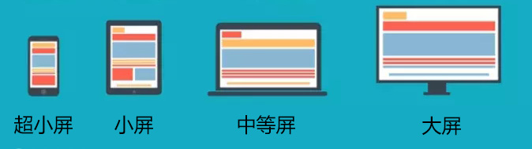

# 响应式开发

### 课前准备

---

掌握指令、less、移动端内容，因为在学习响应式的时候会用到哦~

### 课堂主题

---

一个网站我又想在电脑显示，又想在手机显示，我还希望在ipad上面显示，怎么办？？

按照传统的做法当然是不行的，今天我们来学习一个新的内容，`响应式`~ 根据不同的设备 以及 设定的不同条件，来做到显示不一样的样式~

这么神奇的操作，赶紧来看看咯~


### 本节课知识点

---

#### 什么是响应式？

一个网站，根据浏览设备的不同，屏幕尺寸的不同，显示不同的样式，做到不论是大屏，还是小屏，都可以正常显示网站内容。

一般需要考虑的设备：

- PC 笔记本和超大屏
- ipad 横竖屏
- 手机横竖屏

**运用响应式开发的网站**

UE：http://www.uedna.com/

jQuery：https://jquery.com/

当然还有很多很多的网站，都是利用响应式进行开发的，所以响应式也是我们开发网站时候，必须要掌握的一个开发技巧。


#### 响应式开发需要具备的技术栈

- @media - css3媒询（`核心内容`）

- 移动端开发知识点

  因为多设备都可以正常显示，所以在这里，需要用到移动端适配知识点（视口设置）

- less、sass（可选内容，不一定必须用，但是不用的话，写起来比较麻烦）

  --------

- 弹性盒模型

- 百分比
- rem

> 以上的三种布局方案（弹性盒模型、百分比、rem），都可以运用在响应式中。


#### 媒询

在 对应的设备 和 规定尺寸 下，才会显示该条件内的样式

**媒体设备**

- <font color="red">`all `</font>所有类型的设备
- <font color="red">`screen`</font> 彩屏设备
- handheld 手持设备
- print 打印预览
- braille 盲文触觉设备

- speech 屏幕阅读器

- tv 电视类设备

  

**关键词**

- and - 和，在多个条件的时候，可以用 and 连接，表示以上条件都满足就加载样式

  ```css
  @media screen and (max-width:1100px) and (orientation:portrait){
      div{
          background: green;
      }
  }
  ```

- not - 不，表示只要不是某一个条件的情况下，其他条件都可以加载样式

  ```css
  @media not screen and (min-width:1100px){
      div{
          background: green;
      }
  }
  ```

  这里的`not`表示的不是：不可以是screen设备

  表示：排除 **彩屏** 并且 **最小宽度符合1100px(意思就是小于1100px的不符合)** 的

- only - 只有，表示只有在某个条件下，才可以加载样式

  ```css
  @media only screen and (orientation:portrait){
      div{
          background: green;
      }
  }
  ```

- `,` - 或，表示只要满足其中一个条件，就可以加载样式

  ```css
  @media  (min-width:1000px) , (max-width:500px){
      div{
          background: green;
      }
  }
  ```

  

**媒体特征**

- 宽度
  - min / max - width 最小 / 最大宽度
  - min / max - device - width 设备最小 / 最大宽度
- 横竖屏
  - orientation
    - portrait  竖屏
    - landscape 横屏
- 像素比
  - -webkit-min-device-pixel-ratio: 2


**媒询的语法**

语法：

```css
@media screen and (orientation:landscape){
	//当满足 彩色屏幕 并且 横屏状态下，就添加这里的样式
}
```

根据上面的 媒体设备 及 媒体特征，我们可以在不同状态及不同设备下显示不同的样式


**媒询的不同引入方式**

1. 通过link设定条件引入

   ```html
   <link rel="stylesheet" href="1.css" media="screen and (min-width:1000px)">
   ```

   通过`media`设置媒询设备及媒询特征

1. 通过import 设定条件引入

   ```css
   @import url('1.css') all and (min-width:600px);
   ```

   必须是写在样式表的最前面，所以**不推荐使用**

1. 直接在写样式的时候设定条件

   ```css
   @media screen and (min-width:600px){	}
   ```


#### 响应式开发技巧

1. 根据不同分辨率设备，设置不同留白

   这里的不同分辨率设备，其实我们有一个比较通用的，分为大屏、中等屏幕、小屏幕、超小屏

   

   |          |        大屏        |    中等屏    | 小屏幕  | 超小屏 |
   | :------: | :----------------: | :----------: | :-----: | :----: |
   | 对应设备 | 大屏显示器（台机） | 笔记本显示屏 |  ipad   |  手机  |
   | 对应尺寸 |      >=1200px      |   >=992px    | >=768px | <768px |
   | 显示尺寸 |       1170px       |    970px     |  750px  |  auto  |

   在格式变化的时候，不可能是正好贴边的情况，所以这时候，我们就要预留一些空间，`对应的尺寸`和`显示尺寸`上会有一定偏差

   > 根据这四个尺寸，我们在做响应式开发的时候，就会有四个设计图，根据四个设计图，分别写出对应大屏、中等屏、小屏幕、超小屏的样式

2. 基于大屏还是小屏开发

   **从大屏开始**

   ```css
   div{
       width: 1170px;
       height: 50px;
       background: pink;
       margin: 0 auto;
   }
   
   @media screen and (max-width:1200px){
       div{
           width: 970px;
       }
   }
   @media screen and (max-width:992px){
       div{
           width: 750px;
       }
   }
   @media screen and (max-width:768px){
       div{
           width: 100%;
       }
   }
   ```

   **从小屏开始**

   ```css
   div{
       width: 100%;
       height: 80px;
       background: pink;
       margin: 0 auto;
   }
   @media screen and (min-width:768px){
       div{
           width: 750px;
       }
   }
   @media screen and (min-width:992px){
       div{
           width: 970px;
       }
   }
   @media screen and (min-width:1200px){
       div{
           width: 1170px;
       }
   }
   ```

   > - 从小屏开始的话，更亲和移动端，而且大屏幕下肯定是永远能显示小屏幕的内容的，不会出现内容超出的问题
   >
   > - 但是实际开发中，大屏幕开始会更简单一点，因为页面中不是所有的内容都需要显示，如果先写小屏幕，大屏幕在变化的时候，需要增加结构，很容易出现问题

2. 左右布局变成上下布局

   利用宽度，当父级宽度不够显示元素的时候，元素自然会掉下去


#### 开发响应式常用框架

- `bootstrap`
- Semantic-UI
- Element UI


#### 栅格系统

> 操作有点类似于移动端开发，我们把页面分成格子，只不过在这里，我们主要用于布局，并且是通过class操作，灵活性比较强

- 容器

  - container固定宽度容器 
  - container-fluid自适应宽度容器

- 行

  - row
    - 清除浮动

- 列

  - col-xx-n
    - xx 尺寸
    - n 占用位置

- 列嵌套

- 列偏移

  - col-xx-offset-n

    利用margin，让元素向后位移

- 列排序

  - col-xx-push-n 推

  - col-xx-pull-n 拉

    利用推和拉交换位置


#### 兼容

`@media`是css3新增样式，兼容到IE9+，但是并不是说，我们不能让低版本浏览器支持

这里需要引入两个文件：

```html
<script src="https://cdn.bootcss.com/html5shiv/3.7.3/html5shiv.min.js"></script>
<script src="https://cdn.bootcss.com/respond.js/1.4.2/respond.min.js"></script>
```

- html5shiv：用 JS 创建H5标签，让低版本浏览器支持
- respond：支持响应，利用JS判断屏幕尺寸是否发生变化


### 作业

----

自己写一个栅格系统


### 本节课总结

---

1. 响应式用于一个网页，适应多个尺寸的设备展示
1. 媒询：根据媒体设备以及媒体特性来控制样式是否加载显示

3. 从小屏开始开发更好

3.  不使用兼容js的情况下，可以兼容到`IE9+`

   


