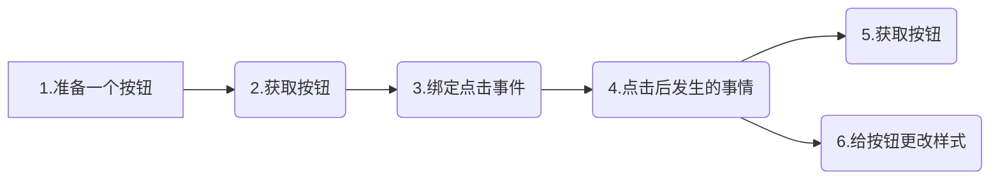
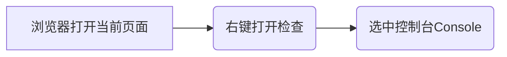
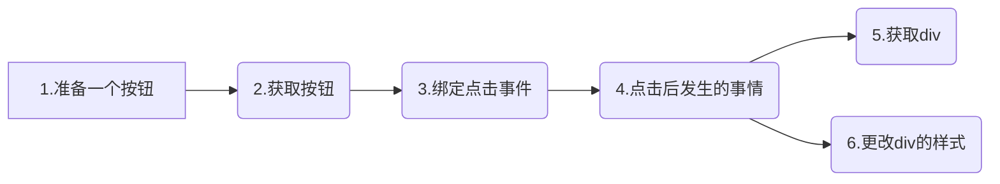

# JS基础语法

### JavaScript 应该放在什么位置？

JavaScript 是一门语言，那么如何使用就是很关键的问题！我们应该放在什么位置？

- 行间 JS

  ```html
  <div onclick="alert('我爱JavaScrip！')"></div>
  ```

  - 优势
    - 直接作用于当前元素
  - 劣势
    - 复用率低
    - 结构不够清晰

- 内部 JS 

  ```html
  <script>
  //这里放置js的代码
  </script>
  ```

  - 优势
    - 代码分离清晰
    - 较利于后期修改维护
    - 同页面可以复用
  - 劣势
    - 不同页面无法复用
    - 不同页面修改维护较麻烦

- 外部 JS

  ```html
  <script src="main.js"></script>
  ```

  - 优势
    - 代码分离彻底
    - 利于后期维护修改
    - 不同页面之间也可以复用
  - 缺点
    - 增加请求数量

> 这里我们可以看到和 css 有点像，css 中同样的也是有三种添加方式 (联想记忆更快哦～)，优缺点也


### 注释

① 单行注释

```javascript
//这里是注释内容
```

② 多行注释

```javascript
/*
	这里是多行注释内容
	第二行
	第三行
	···
*/
```


### script标签上的属性

两个我都见过，到底应该写哪个？

```html
<script type="text/javascript"></script>
```

```html
<script></script>
```

<p align="center">加一个标志，并不能改变事物的本质，依旧哪个不能踩</p>
****

**type属性**表示编写代码使用的脚本语言的内容类型（学术语：MIME 类型）。

从 Html5 开始，可以省略，如果是 script 标签，默认为 type = "text/javascript" , 同理 css 也是一样。**但是如果希望向下兼容低版本浏览器，那么建议大家还是加上**。


### 案例流程

点击一个按钮，让其成为选中状态（选中状态：背景色发生变更）；




### 获取元素

如果有一堆的元素，该如何准确的找到它？

- document.getElementById(' ID ')
  - 通过指定 ID 获取元素；
  - 返回第一个符合条件的元素；
  - 如果找不到匹配项，则返回 `null`；
  - 只有 document 下存在 getElementById ；
  
- document / box.querySelector('选择器')
  - document.querySelector('.box')    document.querySelector('#box')
  - 通过指定选择器获取元素；
  - 返回第一个符合条件的元素；
  - 如果找不到匹配项，则返回 `null`；
  - IE8 以下不可以使用；
  - 指定父级（比如：获取box下的div）
  - `document.querySelector('.box').querySelector('div')`
  - `document.querySelector('.box div')`
  
- querySelectorAll返回的是数组，querySelector返回的是对象。

- children 直接子级

  - ```JS
    li的下标数量
    ul.children.length
    ```

    

<p style="color:red;font-weight:bold;">注意！！JS是区分大小写的，所以千万大小写千万不要打错</p>
### 调试

打印/弹出-用来调试

- alert()
- console.log()

可以利用 console.log( 要打印的内容 )，以此来确认内容是否正确。

**查看console.log内容的步骤**




### script标签最合适的放置位置

页面读到 <body> 标签的时候开始解析页面。当页面结构未生成的时候，在 <head> 标签中的 JS 代码如果获取元素，将获取失败。

**两种解决方案**

1. 在 <head> 中的JS代码，放置在 window.onload（等待窗口加载完成） 事件中

   2.放在 </body> 标签前，让 HTML 结构先行加载完成。

**注意事项**

如果 JS 的代码比较庞大，需要较长的时间读取，会影响页面的加载，造成页面长时间空白。

从用户体验的角度来说，我们应该避免这样的情况，长时间空白会让用户觉得打开速度很慢，从而造成用户流失。


### 给元素绑定事件

```javascript
ele.onclick = function(){
    //点击后要做的事情
};

/*
    元素.事件 = function(){
        //点击后要做的事情
    };
*/
```

- ele —— 需要绑定事件的元素
- onclick —— 点击事件


### 操作元素的样式

```javascript
ele.style.background = 'red';

/*
	元素.样式.样式名 = '值';
*/
```

- ele —— 需要改变样式的元素
- style —— 样式
- background —— 具体的样式名背景
- red —— 样式名对应的值，<mark>需要加上 ' ' (引号) </mark>


# 三、变量

---


#### 什么是变量？

变量用于存储数据。

**如何使用变量？**

在使用变量之前，我们需要先创建变量。

**声明变量步骤**

- 使用关键字声明变量（关键字：js中定义好的有一定特殊含义的单词）
  - var
- 准备一个变量名

```javascript
var a; //声明一个名字为 a 的变量

/*
	var 变量名；
*/
```

**对变量进行赋值**

```javascript
a = 10;
/*
	变量名 = 数据   ---》  这个过程叫做赋值
	当我们需要用到 10 的时候，就可以使用 a 代替
	
	10 * 10 ---》  a * a
*/
```

**合并 声明 和 赋值 两个步骤**

```javascript
var a = 10; 
/*
	var 变量名 = 数据 ;
*/
```

<mark>当只声明变量，没有赋值的时候，默认值为undefined</mark>


#### 利用变量巧妙简化旅游地方

```javascript
var 曼谷 = "黄台甫马哈那坤弃他哇劳狄希阿由他亚马哈底陆浦欧叻辣塔尼布黎隆乌冬帕拉查尼卫马哈洒坦";
```


#### 案例


点击一个按钮，更改div的宽、高、背景色、边框，利用变量简化。




#### 变量的好处

 - 简化代码，增强可读性
 - 可以复用


#### 变量命名规则

名字也不可以随随便便取哦～，像是 id 和 class 的命名一样，变量名也有属于自己的规则。

- 不允许数字开头
- 不允许使用关键字和保留字
- 允许是字母，数字，下划线(_)，美元符($)任意组合而成

**如果不符合规范将出现如下报错信息：**

<p style="color:red;">Uncaught SyntaxError: Invalid or unexpected token</p>
语法错误：标记无效或意外


#### 关键字和保留字

- 关键字：https://developer.mozilla.org/zh-CN/docs/Web/JavaScript/Reference/Lexical_grammar#%E5%85%B3%E9%94%AE%E5%AD%97
  - 当前语法中正在使用的单词	
- 保留字：https://developer.mozilla.org/zh-CN/docs/Web/JavaScript/Reference/Lexical_grammar#%E6%9C%AA%E6%9D%A5%E4%BF%9D%E7%95%99%E5%85%B3%E9%94%AE%E5%AD%97
  - 将来可能在语法中使用的单词

####  

#### 变量的命名风格

- 具有语义化（语义化：一看就知道是什么）
- 驼峰命名
  - 大驼峰
    - JavaScript	首字母大写
  - 小驼峰
    - javaScript	从第二个单词开始首字母大写


#### 多变量同时声明

使用逗号对变量名进行间隔，只需要一个关键字var。

```javascript
var a = 10,
    b = 20,
    c = 'Hello';
```


# 四、函数

每次重复的过程是不是让你觉得很厌烦？像是html的结构，如果每次都需要一行一行手打，那可真是猿生无望。如果可以像变量一样存起来，然后复用就好了！


### 什么是函数？

可重复使用的代码块

**如何使用函数**

在使用函数之前，我们需要先创建函数。

**函数声明**

- 有名函数
- 匿名函数

**函数声明步骤**

- 使用关键词声明函数
  - function

```javascript
//有名函数
function sum(){
    // 代码块
}
/*
function 函数名(){
	//代码块
}
*/


//匿名函数
function(){
    //代码块
}

```


**匿名函数不可以直接定义，否则会报错**

<p style="color:red;">Uncaught SyntaxError: Unexpected token (</p>
语法错误：意外标记


### 函数调用

函数声明后要调用，函数不调用不会执行！

- 函数名称();		调用就是函数名加（）；
- 事件调用


```js
<script>
        /*
            函数创建完成之后，是需要调用的！！！否则呢不执行
            调用有名函数：函数名();
        */
        function fn() {
            alert(1);
        }

        // fn();

        var box = document.getElementById('box');
        box.onclick = function(){
            //放置代码块
            alert(2);
        }

    </script>
```

```js
<script>
        var btn1 = document.getElementById('btn1');
        var btn2 = document.getElementById('btn2');
        var box = document.getElementById('box');

        // btn1.onclick = function(){
        //     box.style.width = '200px';
        //     box.style.height = '200px';
        // }
        // btn2.onclick = function(){
        //     box.style.width = '200px';
        //     box.style.height = '200px';
        // }


        btn1.onclick = fn;
        btn2.onclick = fn;


        function fn(){
            box.style.width = '200px';
            box.style.height = '200px';
        }
    </script>
```


### 标识符

之前学习变量的时候，我们说变量的命名有规范，其实函数名也是一样有规范的，并且函数名的规范和变量也是一样的。

我们把这类统称为标识符，这些规范对于所有的标识符都有效。那么标识符具体指哪些呢？

- 变量名
- 函数名（函数参数）
- 属性名


# 五、JS属性操作


#### 两种属性操作方式

- 点 .
  - 元素.属性
- 方括号 [ ]
  - 元素['属性']

```js
<script>
        var box = document.getElementById('box');
        // box.onclick = function(){
        //     box.style.width = '300px';
        // }

        // box['onclick'] = function(){
        //     box['style']['width'] = '300px';
        // }

        // box['on' + 'click'] = function(){
        //     box['style']['width'] = '300px';
        // }


        //两种属性操作可以一起使用
        // box.onclick = function(){
        //     box['style'].width = '300px';
        // }

        box.onclick = function(){
            // box.style.fontSize = '36px';
            box.style['font-size'] = '36px'
        }
    </script>
```


#### 属性的读写

```js
box.style.background;		读、获取
box.style.background = 'red';		写、添加
```


#### 常用属性

- 常用 JS 属性

  - id
  - className
  - value   常用在表单标签
  - style
    - background
    - color
    - width
    - height
    - ……
  - cssText

  ```js
  box.onclick = function(){
              // box.style.width = '300px';
              // box.style.height = '300px';
              // box.style.background = 'green';
              box.style.cssText = 'width:300px;height:300px;background:green;'
          }
  ```

  

  - innerHTML
  - href

  - src

  - tagName    

- 属性操作时的注意事项及常见问题

  - href 值和 src 值获取到的是绝对路径（盘符）

  ```js
  <a id="link" href="1.属性操作一.html">链接</a>
  
  ```

  - style 是行间属性（内部和外部引入的获取不到）
  - cssText 会替换掉当前所有的行间属性
  - class 是关键字，改成 className
  - tagName 获取到的是 大写字母的标签名

  ```js
  <a id="link" href="1.属性操作一.html">链接</a>
      
      <script>
          var link = document.getElementById('link');
          var img = document.getElementById('img');
          console.log(link.tagName);
          console.log(img.tagName);
  ```


# 六、字符串

#### 加号

（1 + 1）；	2

（'1' + 1）；	11

（'1' + '1'）;	11

```js
'1' + 1
            + 号的作用
                1. 作为计算的加法运算符使用  加号的左右两侧必须都是数字
                2. 作为连接符进行使用，把加号左右两边的内容拼接到一起
```

#### 字符串

由一对双引号或单引号包起来的0个或多个字符组成的串

#### 检测数据类型 typeof

```js
<script>
        var a = '123';
        console.log(typeof a)
    </script>
```


# 七、总结


1. 变量的命名规则
2. value: 表单元素要获取值获取的value
3. innerHTML：元素内容(包含标签)  
4. if 流程
5. 字符串：在js由一对引号包起来0到多个字符符
6. 字符串拼接：+ 在JS 碰到字符串就会执行字符串拼接
7. 特效的实现简单来说：就是通过JS来操作元素属性和内容的实现的

